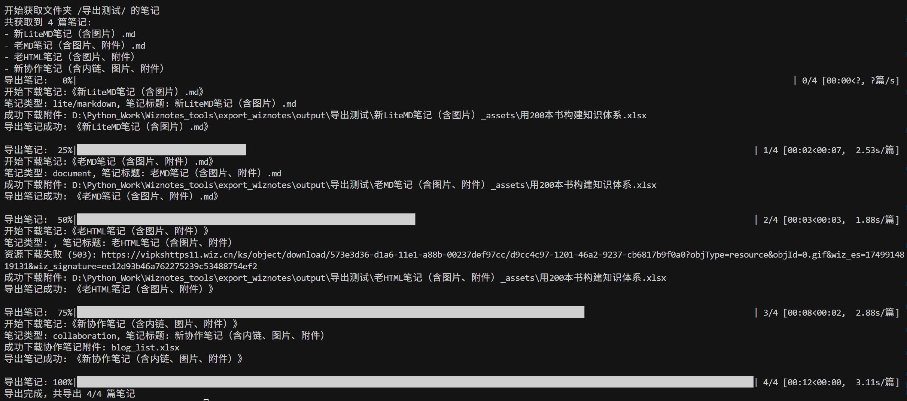

# Wiznotes_tools 为知笔记批量操作脚本

## 批量导出为知笔记为markdown文件

### 写在前面

作为一个从2012年开始使用、积累了上万篇笔记的老用户，我最终还是下定了决心，告别为知笔记——哪怕我的VIP会员已经续费到了2030年。

我曾为重构版为知笔记支持即时渲染Markdown和初级双链功能而兴奋，那是它为数不多的高光时刻。但接踵而至的，是长达数年的缓慢更新与基础功能的持续缺失，硬生生把我逼成了一位不得不同时使用新旧两个版本的“双枪用户”。平心而论，为知笔记的基础功底尚在，网页剪藏、Markdown支持和API都还堪用，这或许也是我即便在漫长的等待中，也依然坚持至今的原因。

然而，压垮骆驼的最后一根稻草终究还是来了。近期反馈给客服的几个体验问题长时间没有进展，产品近两年几乎没有更新，让我彻底失去了信心。加之今年更换鸿蒙手机后糟糕的网页版体验，近期微信公众号文章剪藏连图片都无法正常显示，我终于下定决心从为知笔记迁出了。

所幸，当初选择为知，很重要的一点就是看中了它的开放与数据可迁移性。趁这个周末有空，花时间写了批量导出脚本，基本可以完美的将历史笔记导出，也算是好聚好散。

再见了，为知笔记。感谢13年相伴！

### **get_wiz_notes.py:** 通过Web API批量导出为知笔记

由于为知笔记官方客户端不支持批量导出功能，此脚本通过调用为知笔记Web API实现批量导出笔记（支持导出图片及附件）。

**主要功能**

- **支持按文件夹批量导出笔记，统一转换为Markdown格式；**
- **全面支持老版HTML笔记、新版Lite Markdown笔记、新版协作笔记导出；**
- 支持导出笔记元数据：创建时间、修改时间、标签等；
- 支持断点续传，可随时中断后继续导出；
- 详细的日志记录，方便追踪导出过程；

**使用方法**

1. 在配置文件 "../account/web_accounts.json" 中配置为知笔记账号信息，格式如下：
{
    "wiz": {
        "username": "your_email@example.com",
        "password": "your_password"
    }
}

2. 运行脚本：
在 get_wiz_notes.py 中配置要批量导出的笔记目录并运行，默认导出到"export_wiznotes/output"子目录；

参数说明：
- config_path: 配置文件路径，默认为 "../account/web_accounts.json"
- export_dir: 导出目录，默认为 "./export_wiznotes/output"
- max_notes: 每个文件夹最大获取笔记数量

注意事项：
1. 为知笔记API限制单次最多获取1000篇笔记，超过1000篇笔记的文件夹会自动进行两次查询；
2. 导出过程支持断点续传，可以随时中断后继续；如果需要覆盖已导出文件，请删除导出目录下checkpoint文件；
3. 协作笔记使用WebSocket通信，需要确保网络连接稳定；

## **clipboard_wxnotes_yagmail_wiz:** 从剪贴板文本中分离提取出微信公众号、头条号、小红书、网页文章链接和其他内容，批量保存到为知笔记

由于微信API接口变更，现在要将微信公众号文章分享保存到为知笔记，要麻烦很多。为此我写了这个自动化脚本来提高操作效率。

我现在保存微信文章（或头条号等来源文章）的步骤如下：

1、在手机后台长期运行一个剪贴板增强app，比如：“剪纸堆”；

2、看到有意思的微信公众号文章，从菜单选择“复制链接”；

3、如果不想保存整篇文章，可以在文章中选择段落并复制；当然这一步操作不限于微信公众号文章内容，在任意阅读app上看到的文本都可以复制保存到剪贴板；

4、隔一段时间（比如一周），在“剪纸堆”app将所有在后台保存的剪贴板内容聚合并导出为文本文件；

5、运行该自动化脚本，将自动提取文本中微信公众号文章链接，通过发送邮件方式将所有文章批量保存到为知笔记；其余非微信链接内容合并后单独保存到为知笔记；

**clipboard_wxnotes_yagmail_wiz（新）:** 借助yagmail模块重写脚本，直接从系统剪贴板提取内容并发送到为知笔记，更简洁更方便

**wxnotes_mail_wiz.py:（旧）** 从文本文件中提取微信公众号文章链接，批量保存到为知笔记

## **image2wiz_by_yagmail.py:** 将图片和对应OCR文本批量发送到为知笔记

我有时会将手机上看到的有意思的内容截图保存，但问题就是后续无法通过搜索来找到相关截图。印象笔记支持搜索图片文字，为知笔记不支持。

于是，我就先用百度AI OCR服务将截图文件批量识别成文本，然后再用这个脚本将截图和对应OCR文本批量发送到为知笔记，自动生成一个笔记。这样就可以通过文字方式搜索了。截图保存下来的内容，后续也不至于石沉大海，可以在有需要时检索回顾了。

**check_undone_imgs.py:** 找到未成功发送到为知笔记的文件，重新移入待处理文件夹

我历史积累了数千张图文件，通过批量发邮件方式保存到为知笔记，由于邮箱服务商会对每日发送邮件数量做限制，所以有些邮件好像发送成功，实际未发出去。因此，我写了这个脚本来检查哪些其实没发送成功，隔日再重新发送。

