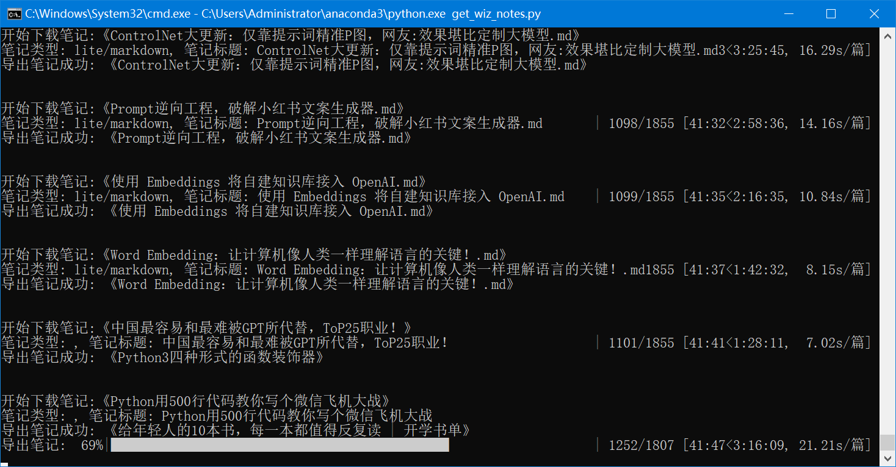
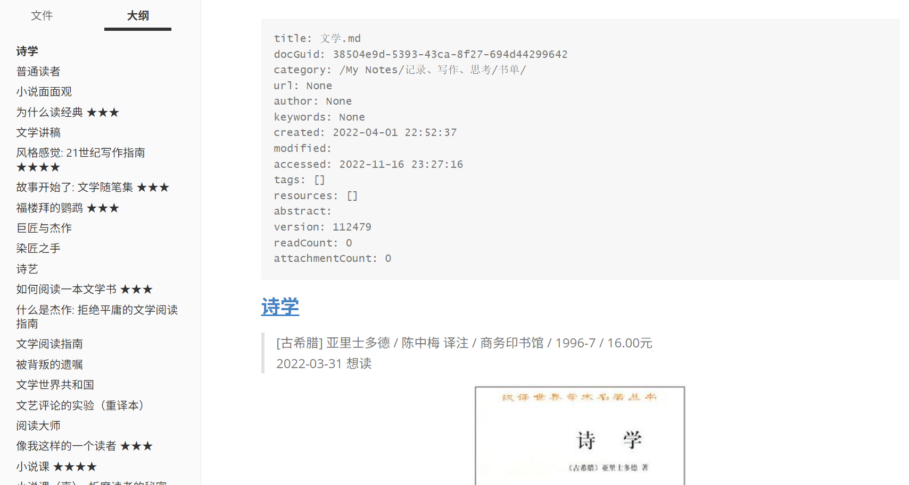
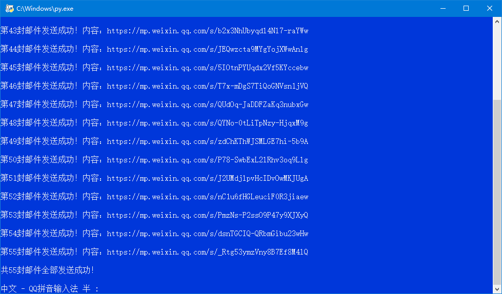
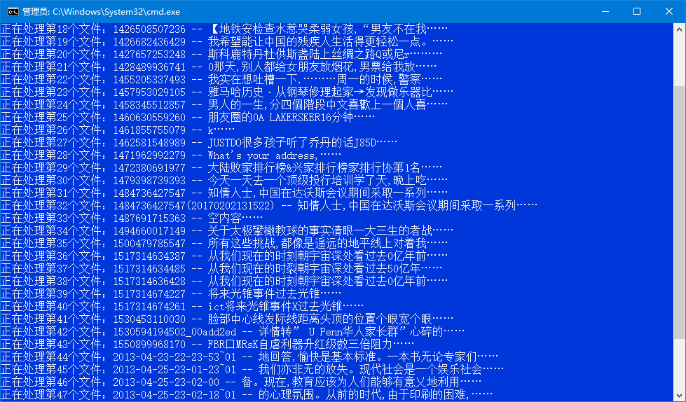

# Wiznotes_tools 为知笔记批量操作脚本

## 写在前面

作为一个从2012年开始使用、积累了上万篇笔记的老用户，我最终还是下定了决心，告别为知笔记——哪怕我的VIP会员已经续费到了2030年。

我曾为重构版为知笔记支持即时渲染 Markdown 和初级双链功能而兴奋，那是它为数不多的高光时刻。但接踵而至的，是长达数年的缓慢更新与基础功能的持续缺失，硬生生把我逼成了一位不得不同时使用新旧两个版本的"双枪用户"。平心而论，为知笔记的基础功底尚在，网页剪藏、Markdown支持和 API 都还堪用，这或许是我即便在漫长的等待中依然坚持至今的原因。

然而，压垮骆驼的最后一根稻草终究还是来了。近期反馈给客服的几个体验问题长期没有进展，产品近两年几乎没有更新，让我彻底失去了信心。加之今年更换鸿蒙手机后糟糕的网页版体验，近期微信公众号文章剪藏连图片都无法正常显示，我终于下定决心从为知笔记迁出了。

所幸，当初选择为知笔记很重要的一点就是看中了它的开放与数据可迁移性。趁这个周末有空，写了批量导出脚本，基本可以完美的将历史笔记导出，也算是好聚好散。

别了，为知笔记。感谢13年相伴！

## 主要功能：get_wiz_notes.py - 通过Web API批量导出为知笔记

由于为知笔记官方客户端不支持批量导出功能，此脚本通过调用为知笔记Web API实现批量导出笔记（支持导出图片及附件）。

### 🎯 核心功能特性

- **🚀 自动处理超大文件夹**: 自动检测并处理超过1000条笔记的文件夹，通过双向查询和智能去重获取完整笔记列表
- **📂 按文件夹批量导出**: 支持按文件夹批量导出笔记，统一转换为Markdown格式
- **🔄 全面格式支持**: 支持老版HTML笔记、新版Lite Markdown笔记、新版协作笔记导出
- **📝 完整元数据**: 导出笔记元数据包括创建时间、修改时间、标签等信息
- **⏸️ 断点续传**: 支持断点续传，可随时中断后继续导出
- **📊 详细日志**: 提供详细的日志记录，方便追踪导出过程
- **🔗 资源完整性**: 自动下载并保存笔记中的图片、附件等资源文件
- **⚡ 并行处理**: 支持多线程并行导出（默认10线程，操作记录交叉出现是正常现象），提高导出效率

### 🏗️ 项目结构

```
Wiznotes_tools/
├── get_wiz_notes.py                    # 主程序入口
├── export_wiznotes/                    # 导出模块
│   ├── __init__.py                     # 包初始化文件
│   ├── wiz_client.py                   # 为知笔记客户端核心类
│   ├── note_exporter.py                # 笔记导出模块
│   ├── collaboration_parser.py         # 协作笔记解析模块
│   ├── utils.py                        # 工具函数模块
│   ├── get_folders_and_notes_list.py   # 文件夹和笔记列表获取
│   ├── requirements.txt                # 依赖包列表
│   ├── output/                         # 默认导出目录
│   │   ├── folders & notes.txt         # 详细笔记清单
│   │   └── 为知笔记目录.log            # 文件夹列表
│   └── logs/                           # 日志文件目录

account/                            # 配置文件目录（父目录下）
   └── web_accounts.json               # 账号配置文件
```

### 🚀 使用方法

#### 1. 安装依赖
```bash
pip install -r export_wiznotes/requirements.txt
```

#### 2. 配置账号信息
在 `../account/web_accounts.json` 中配置为知笔记账号：

```json
{
    "wiz": {
        "username": "your_email@example.com",
        "password": "your_password"
    }
}
```

#### 3. 生成文件夹列表
```bash
cd export_wiznotes
python get_folders_and_notes_list.py
```
通过参数配置，可以生成：
- `./output/为知笔记目录.log` - 文件夹列表（默认）
- `./output/folders & notes.txt` - 详细笔记清单

#### 4. 批量导出笔记

读取文件夹列表`./output/为知笔记目录.log` （可以手工编辑此文件来控制导出目录范围），批量导出笔记。

```bash
cd ..  # 回到主目录
python get_wiz_notes.py
```

**批量导出笔记示例：**





### ⚙️ 高级配置

#### 自定义使用示例
```python
from export_wiznotes import WizNoteClient, NoteExporter, setup_logging

# 设置日志
setup_logging("./export_wiznotes/output")

# 创建客户端
client = WizNoteClient("./account/web_accounts.json")
client.login()

# 创建导出器
exporter = NoteExporter(client)

# 导出指定文件夹的笔记
exporter.export_notes(
    folder="/My Drafts/",
    export_dir="./export_wiznotes/output",
    resume=True  # 启用断点续传
)
```

#### 并行处理配置
在 `get_wiz_notes.py` 中可以调整并行处理参数：
```python
max_workers = 10  # 并行线程数，可根据网络情况调整
```


### 🎉 感谢

 - **Cursor**：相比手写代码为我节省了很多时间；
 - **[wiz2obsidian](https://github.com/awaken233/wiz2obsidian)** 项目：为如何导出协作笔记提供了参考；
 - **为知笔记**：虽然我离开了，但它不失为一款功能齐全的经典笔记软件；


## 其他历史脚本

### **clipboard_wxnotes_yagmail_wiz:** 从剪贴板文本中分离提取出微信公众号、头条号、小红书、网页文章链接和其他内容，批量保存到为知笔记

由于微信API接口变更，现在要将微信公众号文章分享保存到为知笔记，要麻烦很多。为此我写了这个自动化脚本来提高操作效率。

我现在保存微信文章（或头条号等来源文章）的步骤如下：

1、在手机后台长期运行一个剪贴板增强app，比如："剪纸堆"；

2、看到有意思的微信公众号文章，从菜单选择"复制链接"；

3、如果不想保存整篇文章，可以在文章中选择段落并复制；当然这一步操作不限于微信公众号文章内容，在任意阅读app上看到的文本都可以复制保存到剪贴板；

4、隔一段时间（比如一周），在"剪纸堆"app将所有在后台保存的剪贴板内容聚合并导出为文本文件；

5、运行该自动化脚本，将自动提取文本中微信公众号文章链接，通过发送邮件方式将所有文章批量保存到为知笔记；其余非微信链接内容合并后单独保存到为知笔记；



**clipboard_wxnotes_yagmail_wiz（新）:** 借助yagmail模块重写脚本，直接从系统剪贴板提取内容并发送到为知笔记，更简洁更方便

**wxnotes_mail_wiz.py:（旧）** 从文本文件中提取微信公众号文章链接，批量保存到为知笔记

### **image2wiz_by_yagmail.py:** 将图片和对应OCR文本批量发送到为知笔记

我有时会将手机上看到的有意思的内容截图保存，但问题就是后续无法通过搜索来找到相关截图。印象笔记支持搜索图片文字，为知笔记不支持。

于是，我就先用百度AI OCR服务将截图文件批量识别成文本，然后再用这个脚本将截图和对应OCR文本批量发送到为知笔记，自动生成一个笔记。这样就可以通过文字方式搜索了。截图保存下来的内容，后续也不至于石沉大海，可以在有需要时检索回顾了。



**check_undone_imgs.py:** 找到未成功发送到为知笔记的文件，重新移入待处理文件夹

我历史积累了数千张图文件，通过批量发邮件方式保存到为知笔记，由于邮箱服务商会对每日发送邮件数量做限制，所以有些邮件好像发送成功，实际未发出去。因此，我写了这个脚本来检查哪些其实没发送成功，隔日再重新发送。

