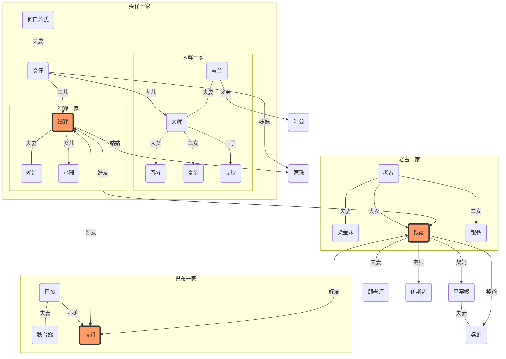

```mermaid
flowchart TD;
    classDef keyperson fill:#f96,stroke:#333,stroke-width:4px;

    subgraph 奀仔一家
        direction LR
        HMF(何门芳氏)---|夫妻|EZ(奀仔);
        EZ(奀仔)-->|大儿|DH(大辉);
        EZ(奀仔)-->|二儿|XH(细辉):::keyperson;
        subgraph 大辉一家
            direction LR
            HL(蕙兰)---|夫妻|DH(大辉);
            DH(大辉)-->|大女|CF(春分);
            DH(大辉)-->|二女|XZ(夏至);
            DH(大辉)-->|三子|LQ(立秋);
        end
        subgraph 细辉一家
            direction LR
            XH(细辉)---|夫妻|CJ(婵娟);
            XH(细辉)-->|女儿|XS(小珊);
        end
    end
    subgraph 老古一家
        direction LR
        LG(老古)---|夫妻|LJM(梁金妹);
        LG(老古)-->|大女|YX(银霞):::keyperson;
        LG(老古)-->|二女|YL(银铃);
    end
    subgraph 巴布一家
        direction LR
        BB(巴布)---|夫妻|DPD(狄普娣);
        BB(巴布)-->|儿子|LaZ(拉祖):::keyperson;
    end

    XH<--->|好友|YX(银霞);
    XH<--->|好友|LaZ(拉祖);
    YX(银霞)<--->|好友|LaZ(拉祖);

    EZ(奀仔)-->|妹妹|LZ(莲珠);
    XH(细辉)-->|姑姑|LZ(莲珠);

    YX---|夫妻|GLS(顾老师)
    YX-->|契妈|MPS(马票嫂)
    MPS---|夫妻|LX(梁虾)
    YX-->|契爸|LX
    YX-->|老师|YSM(伊斯迈)

    HL(蕙兰)-->|父亲|YG(叶公);

```

