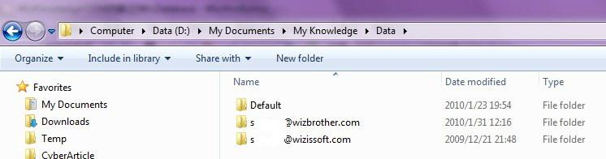
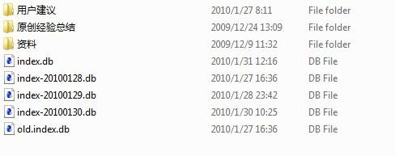
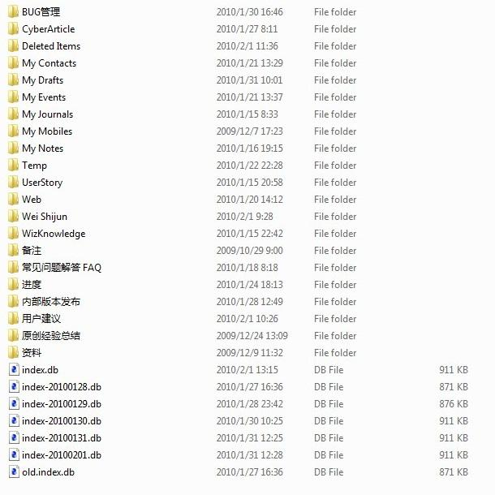

# WizNote客户端API 说明文档
## WizNote | API 说明文档
API 说明文档

2019/9/12

为知笔记Windows客户端开放了大量的API，其中绝大部分，都通过COM提供，可以在javascript, C#, C++, Delphi等语言中使用。

接口通过IDL(Interface description language)语言描述。

IDL语言，可以参考： [Interface\_description\_language · Wiki](http://en.wikipedia.org/wiki/Interface_description_language)

[IDL\_百度百科](http://baike.baidu.com/view/160644.htm)

1. [WizKMCore.idl](https://www.wiz.cn/m/api/WizKMCore-idl-html) 描述了为知笔记内部对象的接口
2. [WizKMControls.idl](https://www.wiz.cn/m/api/WizKMControls-dl-html) 描述了为知笔记主要的界面控件接口
   1. [IWizDocumentListCtrl](https://www.wiz.cn/m/api/descriptions/IWizDocumentListCtrl.html)
   2. [IWizDocumentAttachmentListCtrl](https://www.wiz.cn/m/api/descriptions/IWizDocumentAttachmentListCtrl.html)
   3. [IWizCommonUI](https://www.wiz.cn/m/api/descriptions/IWizCommonUI.html)
   4. [IWizBatchDownloader](https://www.wiz.cn/m/api/descriptions/IWizBatchDownloader.html)
   5. [IWizCategoryCtrl](https://www.wiz.cn/m/api/descriptions/IWizCategoryCtrl.html)
3. [Wiz.idl](https://www.wiz.cn/m/api) 描述了为知笔记主程序的一些接口
   1. [IWizExplorerApp](https://www.wiz.cn/m/api/descriptions/IWizExplorerApp.html)
   2. [IWizExplorerWindow](https://www.wiz.cn/m/api/descriptions/IWizExplorerWindow.html)
4. [WizTools.idl](https://www.wiz.cn/m/api/definitions/WizTools.html) 描述了为知笔记一些通用功能的接口
5. [WizWebCapture.idl](https://www.wiz.cn/m/api/definitions/WizWebCapture.html) 描述了为知笔记网页捕捉功能的接口
6. [WizWebCaptureResourceToDocument.idl](https://www.wiz.cn/m/api/definitions/WizWebCaptureResourceToDocument.html) 描述了为知笔记网页捕捉的一些接口

适用于为知笔记3.0.22以及以上版本


## WizNote | 接口定义文件
接口定义文件

2019/9/12

```Plain Text
// TestCom.idl : IDL source for TestCom.exe
//

// This file will be processed by the MIDL tool to
// produce the type library (TestCom.tlb) and marshalling code.

import "oaidl.idl";
import "ocidl.idl";

[
    object,
    uuid(43C4CF61-5D88-4beb-B593-793A2251A491),
    dual,
    nonextensible,
    helpstring("IWizExplorerApp Interface"),
    pointer_default(unique)
]
interface IWizExplorerApp : IDispatch{
    [propget, id(1), helpstring("property Database")] HRESULT Database([out, retval] IDispatch** pVal);
    [propget, id(2), helpstring("property Window")] HRESULT Window([out, retval] IDispatch** pVal);
    [propget, id(3), helpstring("property AppPath")] HRESULT AppPath([out, retval] BSTR* pVal);
    [propget, id(4), helpstring("property DataStore")] HRESULT DataStore([out, retval] BSTR* pVal);
    [propget, id(5), helpstring("property SettingsFileName")] HRESULT SettingsFileName([out, retval] BSTR* pVal);
    [propget, id(6), helpstring("property LogFileName")] HRESULT LogFileName([out, retval] BSTR* pVal);
    [id(7), helpstring("method LoadPluginString")] HRESULT LoadPluginString([in] BSTR bstrPluginAppGUID, [in] BSTR bstrStringName, [out, retval] BSTR* pVal);
    [id(8), helpstring("method LoadPluginString2")] HRESULT LoadPluginString2([in] IDispatch* pHtmlDocumentDisp, [in] BSTR bstrStringName, [out, retval] BSTR* pVal);
    [id(9), helpstring("method TranslateString")] HRESULT TranslateString([in] BSTR bstrString, [out,retval] BSTR* pbstrRet);
    [id(10), helpstring("method PluginLocalizeHtmlDialog")] HRESULT PluginLocalizeHtmlDialog([in] IDispatch* pHtmlDocumentDisp);
    [id(11), helpstring("method GetPluginAppGUID")] HRESULT GetPluginAppGUID([in] IDispatch* pHtmlDocumentDisp, [out,retval] BSTR* pVal);
    [id(12), helpstring("method GetPluginAppPath")] HRESULT GetPluginAppPath([in] IDispatch* pHtmlDocumentDisp, [out,retval] BSTR* pVal);
    [id(13), helpstring("method CreateWizObject")] HRESULT CreateWizObject([in] BSTR bstrObjectName, [out,retval] IDispatch** ppVal);
    [id(14), helpstring("method CreateActiveXObject")] HRESULT CreateActiveXObject([in] BSTR bstrObjectName, [out,retval] IDispatch** ppVal);
    [propget, id(15), helpstring("property CurPluginAppGUID")] HRESULT CurPluginAppGUID([out, retval] BSTR* pVal);
    [propget, id(16), helpstring("property CurPluginGUID")] HRESULT CurPluginGUID([out, retval] BSTR* pVal);
    [propget, id(17), helpstring("property CurPluginAppPath")] HRESULT CurPluginAppPath([out, retval] BSTR* pVal);
    [id(18), helpstring("method LoadString")] HRESULT LoadString([in] BSTR bstrStringName, [out, retval] BSTR* pVal);
    [id(19), helpstring("method RunScriptCode")] HRESULT RunScriptCode([in] BSTR bstrScriptCode, [in] BSTR bstrScriptLanguage);
    [id(20), helpstring("method RunScriptFile")] HRESULT RunScriptFile([in] BSTR bstrScriptFileName, [in] BSTR bstrScriptLanguage);
    [id(21), helpstring("method LoadStringFromFile")] HRESULT LoadStringFromFile([in] BSTR bstrFileName, [in] BSTR bstrStringName, [out, retval] BSTR* pVal);
    [id(22), helpstring("method LocalizeHtmlDocument")] HRESULT LocalizeHtmlDocument([in] BSTR bstrLanguageFileName, [in] IDispatch* pHtmlDocumentDisp);
    [id(23), helpstring("method GetHtmlDocumentPath")] HRESULT GetHtmlDocumentPath([in] IDispatch* pHtmlDocumentDisp, [out,retval] BSTR* pVal);
    [id(24), helpstring("method GetPluginPathByScriptFileName")] HRESULT GetPluginPathByScriptFileName([in] BSTR bstrScriptFileName, [out,retval] BSTR* pbstrPluginPath);
    [id(25), helpstring("method AddGlobalScript")] HRESULT AddGlobalScript([in] BSTR bstrScriptFileName);
    [id(26), helpstring("method ExecutePlugin")] HRESULT ExecutePlugin([in] BSTR bstrPluginGUID, [in] BSTR bstrURLParams);
    [id(27), helpstring("method ExecuteCommand")] HRESULT ExecuteCommand([in] BSTR bstrCommandName, [in] VARIANT* pvInParam1, [in] VARIANT* pvInParam2, [out, retval] VARIANT* pvretResult);
    [id(28), helpstring("method InsertPluginMenu")] HRESULT InsertPluginMenu([in] LONGLONG nMenuHandle, [in] LONG nInsertPos, [in] BSTR bstrMenuType, [in] LONG nPluginBeginCommand, [out, retval] BSTR* pbstrCommandPluginGUID);
    [propget, id(29), helpstring("property SyncProgress")] HRESULT SyncProgress([out, retval] IDispatch** pVal);
    [id(30), helpstring("method GetGroupDatabase")] HRESULT GetGroupDatabase([in] BSTR bstrKbGUID, [out, retval] IDispatch** pVal);
};

[
    object,
    uuid(B15879A3-8647-4d6f-84D8-3A24709EC962),
    dual,
    nonextensible,
    helpstring("IWizExplorerWindow Interface"),
    pointer_default(unique)
]
interface IWizExplorerWindow : IDispatch{
    [propget, id(1), helpstring("property CategoryCtrl")] HRESULT CategoryCtrl([out, retval] IDispatch** pVal);
    [propget, id(2), helpstring("property DocumentsCtrl")] HRESULT DocumentsCtrl([out, retval] IDispatch** pVal);
    [propget, id(3), helpstring("property HWND")] HRESULT HWND([out, retval] OLE_HANDLE* pVal);
    [propget, id(4), helpstring("property CurrentDocument")] HRESULT CurrentDocument([out, retval] IDispatch** pVal);
    [propget, id(5), helpstring("property CurrentDocumentHtmlDocument")] HRESULT CurrentDocumentHtmlDocument([out, retval] IDispatch** pVal);
    [propget, id(6), helpstring("property CurrentDocumentAttachmentCtrl")] HRESULT CurrentDocumentAttachmentCtrl([out, retval] IDispatch** pVal);
    [id(7), helpstring("method ShowHtmlDialog")] HRESULT ShowHtmlDialog([in] BSTR bstrTitle, [in] BSTR bstrURL, [in] LONG nWidth, [in] LONG nHeight, [in] BSTR bstrExtOptions, [in] VARIANT vParam, [out, retval] VARIANT* pvRet);
    [id(8), helpstring("method CloseHtmlDialog")] HRESULT CloseHtmlDialog([in] IDispatch* pHtmlDocumentDisp, [in] VARIANT vRet);
    [id(9), helpstring("method GetHtmlDialogParam")] HRESULT GetHtmlDialogParam([in] IDispatch* pHtmlDocumentDisp, [out, retval] VARIANT* pvParam);
    [id(12), helpstring("method ViewDocument")] HRESULT ViewDocument([in] IDispatch* pDocumentDisp, [in] VARIANT_BOOL vbOpenInNewTab);
    [id(13), helpstring("method ViewHtml")] HRESULT ViewHtml([in] BSTR bstrURL, [in] VARIANT_BOOL vbOpenInNewTab);
    [id(14), helpstring("method GetHtmlDialogHWND")] HRESULT GetHtmlDialogHWND([in] IDispatch* pHtmlDocumentDisp, [out,retval] OLE_HANDLE* phHWND);
    [id(15), helpstring("method ShowMessage")] HRESULT ShowMessage([in] BSTR bstrText, [in] BSTR bstrTitle, [in] LONG nType, [out,retval] LONG* pnRet);
    [id(16), helpstring("method ShowSelectorWindow")] HRESULT ShowSelectorWindow([in] BSTR bstrURL, [in] LONG left, [in] LONG top, [in] LONG width, [in] LONG height, [in] BSTR bstrExtOptions);
    [id(17), helpstring("method CloseSelectorWindow")] HRESULT CloseSelectorWindow([in] IDispatch* pdispSelectorHtmlDocument);
    [id(18), helpstring("method AddToolButton")] HRESULT AddToolButton([in] BSTR bstrType, [in] BSTR bstrButtonID, [in] BSTR bstrButtonText, [in] BSTR bstrIconFileName, [in] BSTR bstrClickEventFunction);
    [id(19), helpstring("method RemoveToolButton")] HRESULT RemoveToolButton([in] BSTR bstrType, [in] BSTR bstrButtonID);
    [id(20), helpstring("method SetToolButtonState")] HRESULT SetToolButtonState([in] BSTR bstrType, [in] BSTR bstrButtonID, [in] BSTR bstrState);
    [id(21), helpstring("method GetToolButtonRect")] HRESULT GetToolButtonRect([in] BSTR bstrType, [in] BSTR bstrButtonID, [out,retval] BSTR* pbstrRect);
    [id(22), helpstring("method AddTimer")] HRESULT AddTimer([in] BSTR bstrCallback, [in] LONG nElapse);
    [id(23), helpstring("method RemoveTimer")] HRESULT RemoveTimer([in] BSTR bstrCallback);
    [id(24), helpstring("method ExecCommand")] HRESULT ExecCommand([in] BSTR bstrCommandName, [in] BSTR bstrParams);
};

[
    uuid(CA4A7BC1-2FB5-41ad-A2DD-12A1EDED6F28),
    version(1.0),
    helpstring("WizExplorer 1.0 Type Library")
]
library WizExplorerLib
{
    importlib("stdole32.tlb");
    importlib("stdole2.tlb");
    [
        uuid(BB2A9D7C-459A-486e-90EC-A8C80727FDD9),
        helpstring("WizExplorerApp Class")
    ]
    coclass WizExplorerApp
    {
        [default] interface IWizExplorerApp;
    };
    [
        uuid(C428B079-7D18-4ca3-BE64-E3F4A25300C5),
        helpstring("WizExplorerWindow Class")
    ]
    coclass WizExplorerWindow
    {
        [default] interface IWizExplorerWindow;
    };

};
```
## WizNote | WizKMControls.idl
WizKMControls.idl

2019/9/12

```Plain Text
// WizKMControls.idl : IDL source for WizKMControls
//

// This file will be processed by the MIDL tool to
// produce the type library (WizKMControls.tlb) and marshalling code.

#include "olectl.h"
#include "olectl.h"
#include "olectl.h"
#include "olectl.h"
import "oaidl.idl";
import "ocidl.idl";


[
    object,
    uuid(C128ECE0-A006-4E57-8054-4CBC49818231),
    dual,
    nonextensible,
    helpstring("IWizDocumentListCtrl Interface"),
    pointer_default(unique)
]interface IWizDocumentListCtrl : IDispatch{
    [propget, id(1), helpstring("property EventsListener")] HRESULT EventsListener([out, retval] VARIANT* pVal);
    [propput, id(1), helpstring("property EventsListener")] HRESULT EventsListener([in] VARIANT newVal);
    [propget, id(2), helpstring("property App")] HRESULT App([out, retval] IDispatch** pVal);
    [propput, id(2), helpstring("property App")] HRESULT App([in] IDispatch* newVal);
    [propget, id(3), helpstring("property Database")] HRESULT Database([out, retval] IDispatch** pVal);
    [propput, id(3), helpstring("property Database")] HRESULT Database([in] IDispatch* newVal);
    [propget, id(4), helpstring("property SelectedDocuments")] HRESULT SelectedDocuments([out, retval] IDispatch** pVal);
    [propput, id(4), helpstring("property SelectedDocuments")] HRESULT SelectedDocuments([in] IDispatch* newVal);
    [propget, id(5), helpstring("property StateSection")] HRESULT StateSection([out, retval] BSTR* pVal);
    [propput, id(5), helpstring("property StateSection")] HRESULT StateSection([in] BSTR newVal);
    [propget, id(6), helpstring("property Border")] HRESULT Border([out, retval] VARIANT_BOOL* pVal);
    [propput, id(6), helpstring("property Border")] HRESULT Border([in] VARIANT_BOOL newVal);
    [propget, id(7), helpstring("property DisableContextMenu")] HRESULT DisableContextMenu([out, retval] VARIANT_BOOL* pVal);
    [propput, id(7), helpstring("property DisableContextMenu")] HRESULT DisableContextMenu([in] VARIANT_BOOL newVal);
    [propget, id(8), helpstring("property SortBy")] HRESULT SortBy([out, retval] BSTR* pVal);
    [propput, id(8), helpstring("property SortBy")] HRESULT SortBy([in] BSTR newVal);
    [propget, id(9), helpstring("property SortOrder")] HRESULT SortOrder([out, retval] BSTR* pVal);
    [propput, id(9), helpstring("property SortOrder")] HRESULT SortOrder([in] BSTR newVal);
    [propget, id(10), helpstring("property ParentFolder")] HRESULT ParentFolder([out, retval] IDispatch** pVal);
    [id(11), helpstring("method SetDocuments")] HRESULT SetDocuments([in] IDispatch* pDisp);
    [id(12), helpstring("method SetDocuments2")] HRESULT SetDocuments2([in] IDispatch* pDisp, [in] BSTR bstrSortBy, [in] BSTR bstrSortOrder);
    [id(13), helpstring("method Refresh")] HRESULT Refresh();
    [id(14), helpstring("method GetDocuments")] HRESULT GetDocuments([out, retval] IDispatch** pVal);
    [propget, id(15), helpstring("property Options")] HRESULT Options([out, retval] LONG* pVal);
    [propput, id(15), helpstring("property Options")] HRESULT Options([in] LONG newVal);
    [propget, id(16), helpstring("property SecondLineType")] HRESULT SecondLineType([out, retval] LONG* pVal);
    [propput, id(16), helpstring("property SecondLineType")] HRESULT SecondLineType([in] LONG newVal);
    [id(17), helpstring("method SetFilter")] HRESULT SetFilter([in] IUnknown* pFilterUnk);
    [id(18), helpstring("method RefreshDocuments")] HRESULT RefreshDocuments();
    [propget, id(19), helpstring("property ViewType")] HRESULT ViewType([out, retval] LONG* pVal);
    [propput, id(19), helpstring("property ViewType")] HRESULT ViewType([in] LONG newVal);
};

[
    object,
    uuid(39B2717D-7FDA-4EDD-91A4-0173FD35B871),
    dual,
    nonextensible,
    helpstring("IWizDocumentAttachmentListCtrl Interface"),
    pointer_default(unique)
]
interface IWizDocumentAttachmentListCtrl : IDispatch{
    [propget, id(1), helpstring("property EventsListener")] HRESULT EventsListener([out, retval] VARIANT* pVal);
    [propput, id(1), helpstring("property EventsListener")] HRESULT EventsListener([in] VARIANT newVal);
    [propget, id(2), helpstring("property App")] HRESULT App([out, retval] IDispatch** pVal);
    [propput, id(2), helpstring("property App")] HRESULT App([in] IDispatch* newVal);
    [propget, id(3), helpstring("property Database")] HRESULT Database([out, retval] IDispatch** pVal);
    [propput, id(3), helpstring("property Database")] HRESULT Database([in] IDispatch* newVal);
    [propget, id(4), helpstring("property Document")] HRESULT Document([out, retval] IDispatch** pVal);
    [propput, id(4), helpstring("property Document")] HRESULT Document([in] IDispatch* newVal);
    [propget, id(5), helpstring("property SelectedAttachments")] HRESULT SelectedAttachments([out, retval] IDispatch** pVal);
    [propput, id(5), helpstring("property SelectedAttachments")] HRESULT SelectedAttachments([in] IDispatch* newVal);
    [propget, id(6), helpstring("property Border")] HRESULT Border([out, retval] VARIANT_BOOL* pVal);
    [propput, id(6), helpstring("property Border")] HRESULT Border([in] VARIANT_BOOL newVal);
    [id(7), helpstring("method AddAttachments")] HRESULT AddAttachments(void);
    [id(8), helpstring("method AddAttachments2")] HRESULT AddAttachments2([in] VARIANT* pvFiles);
    [id(9), helpstring("method GetMinSize")] HRESULT GetMinSize([out, retval] ULONG* pnsize);
};

[
    object,
    uuid(B671315F-B6FE-4799-AE50-AEA0848FBA05),
    dual,
    nonextensible,
    helpstring("IWizCommonUI Interface"),
    pointer_default(unique)
]
interface IWizCommonUI : IDispatch{
    [id(1), helpstring("method QueryUserAccount")] HRESULT QueryUserAccount([in] LONGLONG hWnd, [in, out] BSTR* pbstrUserName, [in, out] BSTR* pbstrPassword);
    [id(2), helpstring("method AddDocumentToCalendar")] HRESULT AddDocumentToCalendar([in] IDispatch* pDocumentDisp, [out,retval] VARIANT_BOOL* pbRet);
    [id(3), helpstring("method CreateCalendarEvent")] HRESULT CreateCalendarEvent([in] IDispatch* pDatabaseDisp, [in] DATE dtEvent, [out,retval] IDispatch** ppDocumentDisp);
    [id(4), helpstring("method EditCalendarEvent")] HRESULT EditCalendarEvent([in] IDispatch* pDocumentDisp, [out,retval] VARIANT_BOOL* pbRet);
    [id(5), helpstring("method AboutBox")] HRESULT AboutBox([in] BSTR bstrModuleName);
    [id(6), helpstring("method OptionsDlg")] HRESULT OptionsDlg([in] LONG nFlags);
    [id(7), helpstring("method BackupDlg")] HRESULT BackupDlg([in] LONG nFlags);
    [id(8), helpstring("method AccountsManagerDlg")] HRESULT AccountsManagerDlg([in] LONG nFlags);
    [id(9), helpstring("method ChooseAccount")] HRESULT ChooseAccount([in] LONG nFlags, [out,retval] BSTR* pbstrDatabasePath);
    [id(10), helpstring("method GetIntValue")] HRESULT GetIntValue([in] BSTR bstrTitle, [in] BSTR bstrDescription, [in] LONG nInitValue, [out] VARIANT_BOOL* pvbOK, [out,retval] LONG* pnRet);
    [id(11), helpstring("method GetIntValue2")] HRESULT GetIntValue2([in] BSTR bstrTitle, [in] BSTR bstrDescription, [in] LONG nInitValue, [in] LONG nMin, [in] LONG nMax, [out] VARIANT_BOOL* pvbOK, [out,retval] LONG* pnRet);
    [id(12), helpstring("method CheckNewVersion")] HRESULT CheckNewVersion([in] VARIANT_BOOL vbPrompt, [in] VARIANT_BOOL vbSilent);
    [id(13), helpstring("method InputBox")] HRESULT InputBox([in] BSTR bstrTitle, [in] BSTR bstrDescription, [in] BSTR bstrInitValue, [out,retval] BSTR* pbstrText);
    [id(14), helpstring("method InputMultiLineText")] HRESULT InputMultiLineText([in] BSTR bstrTitle, [in] BSTR bstrDescription, [in] BSTR bstrInitValue, [out,retval] BSTR* pbstrText);
    [id(15), helpstring("method SelectWindowsFile")] HRESULT SelectWindowsFile([in] VARIANT_BOOL vbOpen, [in] BSTR bstrFilter, [out,retval] BSTR* pbstrResultFileName);
    [id(16), helpstring("method SelectWindowsFolder")] HRESULT SelectWindowsFolder([in] BSTR bstrDescription, [out,retval] BSTR* pbtrFolderPath);
    [id(17), helpstring("method SelectWizFolder")] HRESULT SelectWizFolder([in] BSTR bstrDatabasePath, [in] BSTR bstrDescription, [out,retval] IDispatch** ppFolderDisp);
    [id(18), helpstring("method SelectWizDocument")] HRESULT SelectWizDocument([in] BSTR bstrDatabasePath, [in] BSTR bstrDescription, [out,retval] IDispatch** ppDocumentDisp);
    [id(19), helpstring("method LoadTextFromFile")] HRESULT LoadTextFromFile([in] BSTR bstrFileName, [out,retval] BSTR* pbstrText);
    [id(20), helpstring("method SaveTextToFile")] HRESULT SaveTextToFile([in] BSTR bstrFileName, [in] BSTR bstrText, [in] BSTR bstrCharset);
    [id(21), helpstring("method GetValueFromIni")] HRESULT GetValueFromIni([in] BSTR bstrFileName, [in] BSTR bstrSection, [in] BSTR bstrKey, [out,retval] BSTR* pbstrValue);
    [id(22), helpstring("method SetValueToIni")] HRESULT SetValueToIni([in] BSTR bstrFileName, [in] BSTR bstrSection, [in] BSTR bstrKey, [in] BSTR bstrValue);
    [id(23), helpstring("method GetATempFileName")] HRESULT GetATempFileName([in] BSTR bstrFileExt, [out,retval] BSTR* pbstrFileName);
    [id(24), helpstring("method GetSpecialFolder")] HRESULT GetSpecialFolder([in] BSTR bstrFolderName, [out,retval] BSTR* pbstrPath);
    [id(26), helpstring("method EnumFiles")] HRESULT EnumFiles([in] BSTR bstrPath, [in] BSTR bstrFileExt, [in] VARIANT_BOOL vbIncludeSubFolders, [out,retval] VARIANT* pvFiles);
    [id(27), helpstring("method EnumFolders")] HRESULT EnumFolders([in] BSTR bstrPath, [out,retval] VARIANT* pvFolders);
    [id(28), helpstring("method CreateActiveXObject")] HRESULT CreateActiveXObject([in] BSTR bstrProgID, [out,retval] IDispatch** ppObjDisp);
    [id(29), helpstring("method GetValueFromReg")] HRESULT GetValueFromReg([in] BSTR bstrRoot, [in] BSTR bstrKey, [in] BSTR bstrValueName, [out,retval] BSTR* pbstrData);
    [id(30), helpstring("method SetValueToReg")] HRESULT SetValueToReg([in] BSTR bstrRoot, [in] BSTR bstrKey, [in] BSTR bstrValueName, [in] BSTR bstrData, [in] BSTR bstrDataType);
    [id(31), helpstring("method EnumRegValues")] HRESULT EnumRegValues([in] BSTR bstrRoot, [in] BSTR bstrKey, [out, retval] VARIANT* pvValueNames);
    [id(32), helpstring("method EnumRegKeys")] HRESULT EnumRegKeys([in] BSTR bstrRoot, [in] BSTR bstrKey, [out, retval] VARIANT* pvKeys);
    [id(33), helpstring("method SelectTemplate")] HRESULT SelectTemplate([in] BSTR bstrTemplateType, [out, retval] BSTR* pbstrResultTemplateFileName);
    [id(34), helpstring("method HtmlTagGetAttributeValue")] HRESULT HtmlTagGetAttributeValue([in] BSTR bstrHtmlTag, [in] BSTR bstrTagAttributeName, [out, retval] BSTR* pbstrAttributeValue);
    [id(35), helpstring("method HtmlExtractTags")] HRESULT HtmlExtractTags([in] BSTR bstrHtmlText, [in] BSTR bstrTagName, [in] BSTR bstrTagAttributeName, [in] BSTR bstrTagAttributeValue, [out, retval] VARIANT* pvTags);
    [id(36), helpstring("method HtmlEnumLinks")] HRESULT HtmlEnumLinks([in] BSTR bstrHtmlText, [in] BSTR bstrURL, [out, retval] VARIANT* pvLinks);
    [id(37), helpstring("method HtmlGetContent")] HRESULT HtmlGetContent([in] BSTR bstrHtmlText, [in] BSTR bstrURL, [out, retval] BSTR* pbstrContent);
    [id(38), helpstring("method HtmlConvertFileToHtmlFile")] HRESULT HtmlConvertFileToHtmlFile([in] BSTR bstrSrcFileName, [out, retval] BSTR* pbstrHtmlFileName);
    [id(39), helpstring("method HtmlConvertZipFileToHtmlFile")] HRESULT HtmlConvertZipFileToHtmlFile([in] BSTR bstrSrcZipFileName, [in] BSTR bstrDestHtmlFileName, [in] BSTR bstrHtmlTitle);
    [id(40), helpstring("method OptionsDlg2")] HRESULT OptionsDlg2([in] IDispatch* pDisp, [in] LONG nFlags);
    [id(41), helpstring("method SelectDay")] HRESULT SelectDay([in] DATE dtDefault, [out, retval] DATE* pRet);
    [id(42), helpstring("method ReportSyncResult")] HRESULT ReportSyncResult([in] LONGLONG hWnd, [in] VARIANT vDownloaded, [in] VARIANT vUploaded, [in] VARIANT vSkipped, [in] VARIANT vFailed);
    [id(43), helpstring("method CopyTextToClipboard")] HRESULT CopyTextToClipboard([in] BSTR bstrText);
    [id(44), helpstring("method PromptTrafficLimit")] HRESULT PromptTrafficLimit([in] IDispatch* pDatabaseDisp, [in] LONGLONG hWnd, [in] LONGLONG nLimit);
    [id(45), helpstring("method AccountSecurityDlg")] HRESULT AccountSecurityDlg([in] IDispatch* pDisp, [in] LONG nFlags);
    [id(46), helpstring("method InitEncryptionDlg")] HRESULT InitEncryptionDlg([in] IDispatch* pDisp, [in] LONG nFlags);
    [id(47), helpstring("method ImportCertDlg")] HRESULT ImportCertDlg([in] IDispatch* pDisp, [in] LONG nFlags);
    [id(48), helpstring("method EnterPasswordDlg")] HRESULT EnterPasswordDlg([in] BSTR bstrTitle, [in] BSTR bstrInfo, [in] VARIANT_BOOL vbShowRememberPasswordButton, [out] VARIANT_BOOL* pvbRememberPassword, [out, retval] BSTR* pbstrPassword);
    [id(49), helpstring("method QueryUserAccount2")] HRESULT QueryUserAccount2([in] IDispatch* pDatabaseDisp, [in] LONGLONG hWnd, [in, out] BSTR* pbstrUserName, [in, out] BSTR* pbstrPassword);
    [id(50), helpstring("method ClipboardToImage")] HRESULT ClipboardToImage([in] OLE_HANDLE hwnd, [in] BSTR bstrOptions, [out,retval] BSTR* pbstrImageFileName);
    [id(51), helpstring("method CaptureScreen")] HRESULT CaptureScreen([in] BSTR bstrOptions, [out,retval] BSTR* pbstrImageFileName);
    [id(52), helpstring("method DumpCHM")] HRESULT DumpCHM([in] BSTR bstrCHMFileName, [in] BSTR bstrTempPath, [in] BSTR bstrOptions, [out,retval] VARIANT* pvRet);
    [id(53), helpstring("method HyperlinkDlg")] HRESULT HyperlinkDlg([in] IDispatch* pdispDatabase, [in] IDispatch* pdispDocument, [in] IDispatch* pdispHtmlDocument, [in] BSTR bstrInitURL, [out,retval] BSTR* pbstrResultURL);
    [id(54), helpstring("method SelectColor")] HRESULT SelectColor([in] BSTR bstrInitColor, [out,retval] BSTR* pbstrRetColor);
    [id(55), helpstring("method GetFontNames")] HRESULT GetFontNames([out,retval] VARIANT* pvNames);
    [id(56), helpstring("method SelectFont")] HRESULT SelectFont([in] BSTR bstrInit, [out,retval] BSTR* pbstrRet);
    [id(57), helpstring("method CreateWizObject")] HRESULT CreateWizObject([in] BSTR bstrObjectName, [out,retval] IDispatch** ppVal);
    [id(58), helpstring("method GetScriptParamValue")] HRESULT GetScriptParamValue([in] BSTR bstrParamName, [out,retval] BSTR* pbstrVal);
    [id(59), helpstring("method LoadStringFromFile")] HRESULT LoadStringFromFile([in] BSTR bstrFileName, [in] BSTR bstrStringName, [out, retval] BSTR* pVal);
    [id(60), helpstring("method URLDownloadToText")] HRESULT URLDownloadToText([in] BSTR bstrURL, [out, retval] BSTR* pbstrText);
    [id(61), helpstring("method SelectWizTags")] HRESULT SelectWizTags([in] BSTR bstrDatabasePath, [in] BSTR bstrTitle, [in] LONG nFlags, [out,retval] IDispatch** ppTagCollectionDisp);
    [id(62), helpstring("method CalendarDlg")] HRESULT CalendarDlg([in] LONG nFlags);
    [id(63), helpstring("method AccountInfoDlg")] HRESULT AccountInfoDlg([in] IDispatch* pDatabaseDisp, [in] LONG nFlags);
    [id(64), helpstring("method GetIniSections")] HRESULT GetIniSections([in] BSTR bstrFileName, [out, retval] VARIANT* pvValueNames);
    [id(65), helpstring("method LoadStringFromFile2")] HRESULT LoadStringFromFile2([in] BSTR bstrFileName, [in] BSTR bstrSectionName, [in] BSTR bstrStringName, [out, retval] BSTR* pVal);
    [id(66), helpstring("method ShowHtmlDialog")] HRESULT ShowHtmlDialog([in] BSTR bstrTitle, [in] BSTR bstrURL, [in] LONG nWidth, [in] LONG nHeight, [in] BSTR bstrExtOptions, [in] VARIANT vParam, [out,retval] VARIANT* pvRet);
    [id(67), helpstring("method CloseHtmlDialog")] HRESULT CloseHtmlDialog([in] IDispatch* pdispHtmlDialogDocument, [in] VARIANT vRet);
    [id(68), helpstring("method ShowMessage")] HRESULT ShowMessage([in] BSTR bstrText, [in] BSTR bstrTitle, [in] LONG nType, [out,retval] LONG* pnRet);
    [id(69), helpstring("method CombineURL")] HRESULT CombineURL([in] BSTR bstrBase, [in] BSTR bstrPart, [out,retval] BSTR* pbstrResult);
    [id(70), helpstring("method URLDownloadToTempFile")] HRESULT URLDownloadToTempFile([in] BSTR bstrURL, [out,retval] BSTR* pbstrTempFileName);
    [id(71), helpstring("method EditDocument")] HRESULT EditDocument([in] IDispatch* pApp, [in] IDispatch* pEvents, [in] IDispatch* pDocumentDisp, [in] BSTR bstrOptions, [out,retval] LONGLONG* pnWindowHandle);
    [id(72), helpstring("method NewDocument")] HRESULT NewDocument([in] IDispatch* pApp, [in] IDispatch* pEvents, [in] IDispatch* pFolderDisp, [in] BSTR bstrOptions, [out,retval] LONGLONG* pnWindowHandle);
    [id(73), helpstring("method ClearDocumentWindow")] HRESULT ClearDocumentWindow();
    [id(74), helpstring("method CreateAccountDlg")] HRESULT CreateAccountDlg([in] BSTR bstrOptions, [out,retval] BSTR* pbstrRetDatabasePath);
    [id(75), helpstring("method AddExistingAccountDlg")] HRESULT AddExistingAccountDlg([in] BSTR bstrOptions, [out,retval] BSTR* pbstrRetDatabasePath);
    [id(76), helpstring("method ChangePasswordDlg")] HRESULT ChangePasswordDlg([in] IDispatch* pDatabaseDisp);
    [id(77), helpstring("method ProtectAccountDlg")] HRESULT ProtectAccountDlg([in] IDispatch* pDatabaseDisp);
    [id(78), helpstring("method RefreshDatabaseIndex")] HRESULT RefreshDatabaseIndex([in] LONGLONG nWindowHandle, [in] IDispatch* pDatabaseDisp);
    [id(79), helpstring("method ShareDocument")] HRESULT ShareDocument([in] LONGLONG nWindowHandle, [in] IDispatch* pDocumentDisp, [in] BSTR bstrParams);
    [id(80), helpstring("method ShareDocumentDlg")] HRESULT ShareDocumentDlg([in] IDispatch* pDocumentDisp, [in] BSTR bstrParams);
    [id(81), helpstring("method RefreshAccountInfo")] HRESULT RefreshAccountInfo([in] IDispatch* pDatabaseDisp);
    [id(82), helpstring("method PathFileExists")] HRESULT PathFileExists([in] BSTR bstrPath, [out,retval] VARIANT_BOOL* pvbExists);
    [id(83), helpstring("method ExtractFilePath")] HRESULT ExtractFilePath([in] BSTR bstrFileName, [out,retval] BSTR* pbstrFilePath);
    [id(84), helpstring("method ExtractFileName")] HRESULT ExtractFileName([in] BSTR bstrFileName, [out,retval] BSTR* pbstrName);
    [id(85), helpstring("method ExtractFileExt")] HRESULT ExtractFileExt([in] BSTR bstrFileName, [out,retval] BSTR* pbstrExt);
    [id(86), helpstring("method ExtractFileTitle")] HRESULT ExtractFileTitle([in] BSTR bstrFileName, [out,retval] BSTR* pbstrTitle);
    [id(88), helpstring("method CreateDirectory")] HRESULT CreateDirectory([in] BSTR bstrPath);
    [id(89), helpstring("method CopyFile")] HRESULT CopyFile([in] BSTR bstrExistingFile, [in] BSTR bstrNewFileName);
    [id(90), helpstring("method EnumFiles2")] HRESULT EnumFiles2([in] BSTR bstrPath, [in] BSTR bstrFileExt, [in] VARIANT_BOOL vbIncludeSubFolders, [out,retval] BSTR* pvFiles);
    [id(91), helpstring("method EnumFolders2")] HRESULT EnumFolders2([in] BSTR bstrPath, [out,retval] BSTR* pvFolders);
    [id(92), helpstring("method EnumRegValues2")] HRESULT EnumRegValues2([in] BSTR bstrRoot, [in] BSTR bstrKey, [out, retval] BSTR* pvValueNames);
    [id(93), helpstring("method EnumRegKeys2")] HRESULT EnumRegKeys2([in] BSTR bstrRoot, [in] BSTR bstrKey, [out, retval] BSTR* pvKeys);
    [id(94), helpstring("method HtmlExtractTags2")] HRESULT HtmlExtractTags2([in] BSTR bstrHtmlText, [in] BSTR bstrTagName, [in] BSTR bstrTagAttributeName, [in] BSTR bstrTagAttributeValue, [out, retval] BSTR* pvTags);
    [id(95), helpstring("method HtmlEnumLinks2")] HRESULT HtmlEnumLinks2([in] BSTR bstrHtmlText, [in] BSTR bstrURL, [out, retval] BSTR* pvLinks);
    [id(96), helpstring("method GetFontNames2")] HRESULT GetFontNames2([out,retval] BSTR* pvNames);
VARIANT_BOOL vbWait, [out,retval] long* pnRet);
    [id(98), helpstring("method GetLongPathName")] HRESULT GetLongPathName([in] BSTR bstrPath, [out, retval] BSTR* pbstrRet);
    [id(99), helpstring("method GetLongPathName")] HRESULT GetShortPathName([in] BSTR bstrPath, [out, retval] BSTR* pbstrRet);
    [id(100), helpstring("method SelectWizFolder2")] HRESULT SelectWizFolder2([in] BSTR bstrDatabasePath, [in] BSTR bstrPassword, [in] BSTR bstrDescription, [out,retval] IDispatch** ppFolderDisp);
    [id(101), helpstring("method UserIdToDatabasePath")] HRESULT UserIdToDatabasePath([in] BSTR bstrUserId, [out,retval] BSTR* ppbstrDatabasePath);
    [id(102), helpstring("method InputBox2")] HRESULT InputBox2([in] OLE_HANDLE hwndParent, [in] VARIANT_BOOL vbPassword, [in] BSTR bstrIconFileName, [in] BSTR bstrTitle, [in] BSTR bstrDescription, [in] BSTR bstrInitValue, [out,retval] BSTR* pbstrText);
    [id(103), helpstring("method ShareDocument2")] HRESULT ShareDocument2([in] IDispatch* pApp, [in] IDispatch* pDocumentDisp, [in] BSTR bstrParams);
    [id(104), helpstring("method GetFileSize")] HRESULT GetFileSize([in] BSTR bstrFileName, [out, retval] LONGLONG* pnSize);
    [id(105), helpstring("method IntToByteSizeString")] HRESULT IntToByteSizeString([in] LONG nSize, [out, retval] BSTR* pbstr);
    [id(106), helpstring("method ShowLastInputWindow")] HRESULT ShowLastInputWindow();
    [id(107), helpstring("method AccountInfoDlg2")] HRESULT AccountInfoDlg2([in] IDispatch* pApp, [in] IDispatch* pDatabaseDisp, [in] LONG nFlags);
};
[
    object,
    uuid(49C2236A-6DA1-4AA9-BAD7-BF0DA94535A4),
    dual,
    nonextensible,
    helpstring("IWizBatchDownloader Interface"),
    pointer_default(unique)
]
interface IWizBatchDownloader : IDispatch{
    [id(1), helpstring("method AddJob")] HRESULT AddJob([in] BSTR bstrDatabasePath, [in] BSTR bstrLocation, [in] BSTR bstrURL, [in] BSTR bstrLinkText, [in] LONG nUpdateDocumentFlags, [in] VARIANT_BOOL vbLinkTextAsTitle, [in] VARIANT_BOOL vbExecuteScript);
    [id(2), helpstring("method AddJobsFromTextFile")] HRESULT AddJobsFromTextFile([in] BSTR bstrDatabasePath, [in] BSTR bstrLocation, [in] BSTR bstrTextFileName, [in] LONG nUpdateDocumentFlags, [in] VARIANT_BOOL vbExecuteScript);
    [id(3), helpstring("method ShowWindow")] HRESULT ShowWindow(VARIANT_BOOL vbStartDownload);
    [propget, id(4), helpstring("property CombineDocuments")] HRESULT CombineDocuments([out, retval] VARIANT_BOOL* pVal);
    [propput, id(4), helpstring("property CombineDocuments")] HRESULT CombineDocuments([in] VARIANT_BOOL newVal);
    [id(5), helpstring("method AddJob2")] HRESULT AddJob2([in] BSTR bstrDatabasePath, [in] BSTR bstrLocation, [in] BSTR bstrURL, [in] BSTR bstrLinkText, [in] LONG nUpdateDocumentFlags, [in] LONG nJobFlags);
    [id(6), helpstring("method AddJob3")] HRESULT AddJob3([in] BSTR bstrDatabasePath, [in] BSTR bstrOverwriteDocumentGUID, [in] BSTR bstrURL, [in] BSTR bstrTitle, [in] LONG nUpdateDocumentFlags, [in] LONG nJobFlags);
    [propget, id(7), helpstring("property Title")] HRESULT Title([out, retval] BSTR* pVal);
    [propput, id(7), helpstring("property Title")] HRESULT Title([in] BSTR newVal);
    [id(8), helpstring("method SaveJobsToFile")] HRESULT SaveJobsToFile([in] BSTR bstrFileName);
    [id(9), helpstring("method LoadJobsFromFile")] HRESULT LoadJobsFromFile([in] BSTR bstrFileName);
    [id(10), helpstring("method AddJob")] HRESULT AddJob4([in] BSTR bstrDatabasePath, [in] BSTR bstrLocation, [in] BSTR bstrURL, [in] BSTR bstrLinkText, [in] LONG nUpdateDocumentFlags, [in] VARIANT_BOOL vbLinkTextAsTitle, [in] VARIANT_BOOL vbExecuteScript, [in] BSTR bstrKbGUID, [in] BSTR bstrTagGUIDs);
};
[
    object,
    uuid(FF5BCE34-5FC1-4337-80D3-87747643CB15),
    dual,
    nonextensible,
    helpstring("IWizProgressWindow Interface"),
    pointer_default(unique)
]
interface IWizProgressWindow : IDispatch{
    [propget, id(1), helpstring("property Title")] HRESULT Title([out, retval] BSTR* pVal);
    [propput, id(1), helpstring("property Title")] HRESULT Title([in] BSTR newVal);
    [propget, id(2), helpstring("property Max")] HRESULT Max([out, retval] LONG* pVal);
    [propput, id(2), helpstring("property Max")] HRESULT Max([in] LONG newVal);
    [propget, id(3), helpstring("property Pos")] HRESULT Pos([out, retval] LONG* pVal);
    [propput, id(3), helpstring("property Pos")] HRESULT Pos([in] LONG newVal);
    [propget, id(4), helpstring("property Text")] HRESULT Text([out, retval] BSTR* pVal);
    [propput, id(4), helpstring("property Text")] HRESULT Text([in] BSTR newVal);
    [id(5), helpstring("method Show")] HRESULT Show(void);
    [id(6), helpstring("method Hide")] HRESULT Hide(void);
    [id(7), helpstring("method Destroy")] HRESULT Destroy(void);
    [id(8), helpstring("method SetParent")] HRESULT SetParent([in] OLE_HANDLE hwnd);
};
[
    object,
    uuid(476F255C-8032-42A4-AA36-4EBB25C36BAB),
    dual,
    nonextensible,
    helpstring("IWizSyncProgressDlg Interface"),
    pointer_default(unique)
]
interface IWizSyncProgressDlg : IDispatch{
    [id(1), helpstring("method Show")] HRESULT Show(void);
    [id(2), helpstring("method Hide")] HRESULT Hide(void);
    [id(3), helpstring("method SetDatabasePath")] HRESULT SetDatabasePath([in] BSTR bstrDatabasePath);
    [id(4), helpstring("method AutoShow")] HRESULT AutoShow(void);
    [id(5), helpstring("method Reset")] HRESULT Reset(void);
    [propget, id(6), helpstring("property Background")] HRESULT Background([out, retval] VARIANT_BOOL* pVal);
    [propput, id(6), helpstring("property Background")] HRESULT Background([in] VARIANT_BOOL newVal);
    [propget, id(7), helpstring("property Window")] HRESULT Window([out, retval] LONGLONG* pVal);

};
[
    object,
    uuid(9A7BFBD0-65CE-4F73-A819-BAE5819C1127),
    dual,
    nonextensible,
    helpstring("IWizHtmlDialogExternal Interface"),
    pointer_default(unique)
]
interface IWizHtmlDialogExternal : IDispatch{
    [propget, id(1), helpstring("property HtmlDialogParam")] HRESULT HtmlDialogParam([out, retval] VARIANT* pVal);
    [propget, id(2), helpstring("property CommonUIObject")] HRESULT CommonUIObject([out, retval] IDispatch** pVal);
};
[
    object,
    uuid(C163AE7B-E5B1-4789-A61B-27AFC8C9E17D),
    dual,
    nonextensible,
    helpstring("IWizCategoryCtrl Interface"),
    pointer_default(unique)
]
interface IWizCategoryCtrl : IDispatch{
    [propget, id(1), helpstring("property EventsListener")] HRESULT EventsListener([out, retval] VARIANT* pVal);
    [propput, id(1), helpstring("property EventsListener")] HRESULT EventsListener([in] VARIANT newVal);
    [propget, id(2), helpstring("property App")] HRESULT App([out, retval] IDispatch** pVal);
    [propput, id(2), helpstring("property App")] HRESULT App([in] IDispatch* newVal);
    [propget, id(3), helpstring("property Database")] HRESULT Database([out, retval] IDispatch** pVal);
    [propput, id(3), helpstring("property Database")] HRESULT Database([in] IDispatch* newVal);
    [propget, id(4), helpstring("property SelectedType")] HRESULT SelectedType([out, retval] LONG* pVal);
    [propget, id(5), helpstring("property SelectedFolder")] HRESULT SelectedFolder([out, retval] IDispatch** pVal);
    [propput, id(5), helpstring("property SelectedFolder")] HRESULT SelectedFolder([in] IDispatch* newVal);
    [propget, id(6), helpstring("property SelectedTags")] HRESULT SelectedTags([out, retval] IDispatch** pVal);
    [propput, id(6), helpstring("property SelectedTags")] HRESULT SelectedTags([in] IDispatch* newVal);
    [propget, id(7), helpstring("property SelectedStyle")] HRESULT SelectedStyle([out, retval] IDispatch** pVal);
    [propput, id(7), helpstring("property SelectedStyle")] HRESULT SelectedStyle([in] IDispatch* newVal);
    [propget, id(8), helpstring("property SelectedDocument")] HRESULT SelectedDocument([out, retval] IDispatch** pVal);
    [propput, id(8), helpstring("property SelectedDocument")] HRESULT SelectedDocument([in] IDispatch* newVal);
    [propget, id(9), helpstring("property StateSection")] HRESULT StateSection([out, retval] BSTR* pVal);
    [propput, id(9), helpstring("property StateSection")] HRESULT StateSection([in] BSTR newVal);
    [propget, id(10), helpstring("property Options")] HRESULT Options([out, retval] LONG* pVal);
    [propput, id(10), helpstring("property Options")] HRESULT Options([in] LONG newVal);
    [propget, id(11), helpstring("property ShowDocuments")] HRESULT ShowDocuments([out, retval] VARIANT_BOOL* pVal);
    [propput, id(11), helpstring("property ShowDocuments")] HRESULT ShowDocuments([in] VARIANT_BOOL newVal);
    [propget, id(12), helpstring("property Border")] HRESULT Border([out, retval] VARIANT_BOOL* pVal);
    [propput, id(12), helpstring("property Border")] HRESULT Border([in] VARIANT_BOOL newVal);
    [id(13), helpstring("method Refresh")] HRESULT Refresh([in] LONG nFlags);
    [id(14), helpstring("method ExecuteCommand")] HRESULT ExecuteCommand([in] BSTR bstrCommandName, [in] VARIANT* pvParam1, [in] VARIANT* pvParam2, [out, retval] VARIANT* pvRetValue);
    [id(15), helpstring("method GetSelectedDocuments2")] HRESULT GetSelectedDocuments2([out] BSTR* pbstrSortBy, [out] BSTR* pbstrSortOrder, [out, retval] IDispatch** pVal);
    [id(16), helpstring("method SaveState")] HRESULT SaveState();
    [id(17), helpstring("method GetSelectedItemCustomData")] HRESULT GetSelectedItemCustomData([out, retval] BSTR* pbstrData);
    [propget, id(18), helpstring("property CurrentDatabase")] HRESULT CurrentDatabase([out, retval] IDispatch** pVal);
    [id(19), helpstring("method SetSearchResult")] HRESULT SetSearchResult([in] IDispatch* pDatabaseDisp, [in] BSTR bstrKeywords, [in] IDispatch* pDocumentDisp, [in] VARIANT_BOOL vbForceSelect);
};

[
    object,
    uuid(140D38EC-AE4A-4AFE-94CD-FAEEEAB7D1B6),
    dual,
    nonextensible,
    helpstring("IWizStatusWindow Interface"),
    pointer_default(unique)
]
interface IWizStatusWindow : IDispatch{
    [propget, id(1), helpstring("property Text")] HRESULT Text([out, retval] BSTR* pVal);
    [propput, id(1), helpstring("property Text")] HRESULT Text([in] BSTR newVal);
    [id(2), helpstring("method Show")] HRESULT Show(void);
    [id(3), helpstring("method Hide")] HRESULT Hide(void);
};
[
    uuid(89FE0B90-C336-4BDF-A931-7CA8DCD7E002),
    version(1.0),
    helpstring("WizKMControls 1.0 Type Library")
]
library WizKMControlsLib
{
    importlib("stdole2.tlb");

    [
        uuid(D30F2928-D136-4F2D-98C4-080E3CB1C92C),
        control,
        helpstring("WizDocumentListCtrl Class")
    ]
    coclass WizDocumentListCtrl
    {
        [default] interface IWizDocumentListCtrl;
    };

    [
        uuid(A74098CA-0E98-40D6-92BF-06AAAE1B2EB8),
        control,
        helpstring("WizDocumentAttachmentListCtrl Class")
    ]
    coclass WizDocumentAttachmentListCtrl
    {
        [default] interface IWizDocumentAttachmentListCtrl;
    };
    [
        uuid(5EABDAD8-A056-4445-AC98-E66885B0935F),
        helpstring("WizCommonUI Class")
    ]
    coclass WizCommonUI
    {
        [default] interface IWizCommonUI;
    };
    [
        uuid(8C43A23A-11CD-4BFA-A3FA-CBC4A586F666),
        helpstring("WizBatchDownloader Class")
    ]
    coclass WizBatchDownloader
    {
        [default] interface IWizBatchDownloader;
    };

    enum WizCategorySelectedType
    { 
        [helpstring("None")]        wizCategorySelectedTypeNone =            0,
        [helpstring("Folder")]        wizCategorySelectedTypeFolder =            1,
        [helpstring("Document")]        wizCategorySelectedTypeDocument =    2,
        [helpstring("Tag")]        wizCategorySelectedTypeTag =                3,
        [helpstring("Style")]        wizCategorySelectedTypeStyle =            4,
        [helpstring("AllFolders")]        wizCategorySelectedTypeAllFolders = 5,
        [helpstring("AllTags")]        wizCategorySelectedTypeAllTags =        6,
        [helpstring("AllStyles")]        wizCategorySelectedTypeAllStyles =  7,
        [helpstring("AllQuickSearches")]        wizCategorySelectedTypeAllQuickSearches =  8,
        [helpstring("QuickSearchGroup")]        wizCategorySelectedTypeQuickSearchGroup =  9,
        [helpstring("QuickSearch")]        wizCategorySelectedTypeQuickSearch =  10,
        [helpstring("FavoriteFolder")]        wizCategorySelectedTypeFavoriteFolder =            11,
        [helpstring("AllFavoriteFolders")]        wizCategorySelectedTypeAllFavoriteFolders =            12,
        [helpstring("AllOEMFolders")]        wizCategorySelectedTypeAllOEMFolders =            13,
        [helpstring("OEMFolder")]        wizCategorySelectedTypeOEMFolder =            14,
        [helpstring("Groups")]        wizCategorySelectedTypeGroups =            15,
        [helpstring("Group")]        wizCategorySelectedTypeGroup =            16,
        [helpstring("GroupUnread")]        wizCategorySelectedTypeGroupUnread =            17,
        [helpstring("GroupRecent")]        wizCategorySelectedTypeGroupRecent =            18,
        [helpstring("GroupTag")]        wizCategorySelectedTypeGroupTag =            19,
        [helpstring("GroupDeleted")]        wizCategorySelectedTypeGroupDeleted =            20,
        [helpstring("Info")]        wizCategorySelectedTypeInfo =            100,
        [helpstring("Link")]        wizCategorySelectedTypeLink =            101,
    };

    enum WizBatchDownloaderJobFlags
    { 
        [helpstring("LinkTextAsTitle")]        wizWizBatchDownloaderJobLinkTextAsTitle =   0x0001,
        [helpstring("ExecuteScript")]        wizWizBatchDownloaderJobExecuteScript =        0x0002,
        [helpstring("URLAsCustomID")]        wizWizBatchDownloaderJobURLAsCustomID =        0x0004,
    };
    enum WizCommandID
    { 
        [helpstring("DocumentListCtrl Select Prev Document")]        wizCommandSelectPrevDocument =   0x0001,
        [helpstring("DocumentListCtrl Select Next Document")]        wizCommandSelectNextDocument =   0x0002,
    };

    enum WizCategoryCtrlOptions
    {
        [helpstring("ShowDocuments")]                    wizCategoryShowDocuments                =   0x0001,
        [helpstring("DisplaySubFolderDocuments")]        wizCategoryDisplaySubFolderDocuments    =   0x0002,
        [helpstring("DisplayChildTagDocuments")]        wizCategoryDisplayChildTagDocuments        =   0x0004,
        [helpstring("ShowFolders")]                        wizCategoryShowFolders                    =   0x0008,
        [helpstring("ShowTags")]                        wizCategoryShowTags                        =   0x0010,
        [helpstring("ShowStyles")]                        wizCategoryShowStyles                    =   0x0020,
        [helpstring("ShowQuickSearches")]                wizCategoryShowQuickSearches            =   0x0040,
        [helpstring("ShowFavoriteFolders")]                wizCategoryShowFavoriteFolders            =   0x0080,
        [helpstring("NoSkin")]                            wizCategoryNoSkin                        =   0x0100,
        [helpstring("NoMenu")]                            wizCategoryNoMenu                        =   0x0200,
        [helpstring("ForceBorder")]                        wizCategoryForceBorder                    =   0x0400,
        [helpstring("ShowGroups")]                        wizCategoryShowGroups                    =   0x0800,
    };
    enum WizCategoryCtrlRefreshFlags
    {
        [helpstring("RefreshAll")]                        wizCategoryRefreshAll                    =   0x0000,
        [helpstring("RefreshFolders")]                    wizCategoryRefreshFolders                =   0x0001,
        [helpstring("RefreshTags")]                        wizCategoryRefreshTags                    =   0x0002,
        [helpstring("RefreshStyles")]                    wizCategoryRefreshStyles                =   0x0004,
        [helpstring("RefreshQuickSearches")]            wizCategoryRefreshQuickSearches            =   0x0008,
        [helpstring("RefreshFavoriteFolders")]            wizCategoryRefreshFavoriteFolders        =   0x0010,
    };

    enum WizDocumentListCtrlViewStyle
    {
        [helpstring("SingleLine")]                        wizDocumentCtrlSingleLine                =   0x0001,
        [helpstring("DoubleLine")]                        wizDocumentCtrlDoubleLine                =   0x0002,
        [helpstring("MultiLine")]                        wizDocumentCtrlMultiLine                =   0x0003,
    };

    enum WizDocumentListCtrlSecondLineType
    {
        [helpstring("Auto")]                    wizDocumentCtrlSecondLineAuto                    =   0x0000,
        [helpstring("Star")]                    wizDocumentCtrlSecondLineStar                    =   0x0001,
        [helpstring("Location")]                    wizDocumentCtrlSecondLineLocation            =   0x0002,
        [helpstring("DateCreated")]                    wizDocumentCtrlSecondLineDateCreated        =   0x0003,
        [helpstring("DateModified")]                    wizDocumentCtrlSecondLineDateModified    =   0x0004,
        [helpstring("DateAccessed")]                    wizDocumentCtrlSecondLineDateAccessed    =   0x0005,
        [helpstring("URL")]                    wizDocumentCtrlSecondLineURL                        =   0x0006,
        [helpstring("Author")]                    wizDocumentCtrlSecondLineAuthor                    =   0x0007,
        [helpstring("Keywords")]                    wizDocumentCtrlSecondLineKeywords            =   0x0008,
        [helpstring("Tags")]                    wizDocumentCtrlSecondLineTags                    =   0x0009,
        [helpstring("DataSize")]                    wizDocumentCtrlSecondLineDataSize            =   0x0010,
        [helpstring("ReadCount")]                    wizDocumentCtrlSecondLineReadCount            =   0x0011,
        [helpstring("Owner")]                    wizDocumentCtrlSecondLineOwner            =   0x0012,
    };

    [
        uuid(E132C3B7-DA0C-4946-9332-D3D1822FC52C),
        helpstring("WizProgressWindow Class")
    ]
    coclass WizProgressWindow
    {
        [default] interface IWizProgressWindow;
    };
    [
        uuid(CDEF75C2-9494-4336-AF33-66980EB65E29),
        helpstring("WizSyncProgressDlg Class")
    ]
    coclass WizSyncProgressDlg
    {
        [default] interface IWizSyncProgressDlg;
    };
    [
        uuid(31B3C15F-0113-42A2-A652-93D299392ACF),
        helpstring("WizHtmlDialogExternal Class")
    ]
    coclass WizHtmlDialogExternal
    {
        [default] interface IWizHtmlDialogExternal;
    };
    [
        uuid(96D74A38-2385-41D0-A006-5D93BF796B61),
        control,
        helpstring("WizCategoryCtrl Class")
    ]
    coclass WizCategoryCtrl
    {
        [default] interface IWizCategoryCtrl;
    };
    [
        uuid(1F56B16F-6027-4F13-8277-2019548AC282),
        helpstring("WizStatusWindow Class")
    ]
    coclass WizStatusWindow
    {
        [default] interface IWizStatusWindow;
    };
};
```
## WizNote | WizKMCore.idl
WizKMCore.idl

2019/9/12


```Plain Text
// WizKMCore.idl : IDL source for WizKMCore
//

// This file will be processed by the MIDL tool to
// produce the type library (WizKMCore.tlb) and marshalling code.

import "oaidl.idl";
import "ocidl.idl";

[
    object,
    uuid(66EDABF2-D4D0-4B63-BFFA-EB7C53A9372A),
    dual,
    nonextensible,
    helpstring("IWizDatabase Interface"),
    pointer_default(unique)
]
interface IWizDatabase : IDispatch{
    [id(1), helpstring("method Open")] HRESULT Open([in] BSTR bstrDatabasePath);
    [id(2), helpstring("method Close")] HRESULT Close(void);
    [propget, id(3), helpstring("property DatabasePath")] HRESULT DatabasePath([out, retval] BSTR* pVal);
    [propget, id(4), helpstring("property Folders")] HRESULT Folders([out, retval] IDispatch** pVal);
    [propget, id(5), helpstring("property RootTags")] HRESULT RootTags([out, retval] IDispatch** pVal);
    [propget, id(6), helpstring("property Tags")] HRESULT Tags([out, retval] IDispatch** pVal);
    [propget, id(7), helpstring("property Styles")] HRESULT Styles([out, retval] IDispatch** pVal);
    [propget, id(8), helpstring("property Attachments")] HRESULT Attachments([out, retval] IDispatch** pVal);
    [propget, id(9), helpstring("property Metas")] HRESULT Metas([out, retval] IDispatch** pVal);
    [propget, id(10), helpstring("property MetasByName")] HRESULT MetasByName([in] BSTR bstrMetaName, [out, retval] IDispatch** pVal);
    [propget, id(11), helpstring("property Meta")] HRESULT Meta([in] BSTR bstrMetaName, [in] BSTR bstrMetaKey, [out, retval] BSTR* pVal);
    [propput, id(11), helpstring("property Meta")] HRESULT Meta([in] BSTR bstrMetaName, [in] BSTR bstrMetaKey, [in] BSTR newVal);
    [propget, id(12), helpstring("property DeletedItemsFolder")] HRESULT DeletedItemsFolder([out, retval] IDispatch** pVal);
    [id(13), helpstring("method CreateRootFolder")] HRESULT CreateRootFolder([in] BSTR bstrFolderName, [in] VARIANT_BOOL vbSync, [out,retval] IDispatch** ppNewFolderDisp);
    [id(14), helpstring("method CreateRootFolder2")] HRESULT CreateRootFolder2([in] BSTR bstrFolderName, [in] VARIANT_BOOL vbSync, [in] BSTR bstrIconFileName, [out,retval] IDispatch** ppNewFolderDisp);
    [id(15), helpstring("method CreateRootTag")] HRESULT CreateRootTag([in] BSTR bstrRootTagName, [in] BSTR bstrTagDescription, [out,retval] IDispatch** ppNewTagDisp);
    [id(16), helpstring("method CreateStyle")] HRESULT CreateStyle([in] BSTR bstrName, [in] BSTR bstrDescription, [in] LONG nTextColor, [in] LONG nBackColor, [in] VARIANT_BOOL vbTextBold, [in] LONG nFlagIndex, [out, retval] IDispatch** ppNewStyleDisp);
    [id(17), helpstring("method TagGroupFromGUID")] HRESULT TagGroupFromGUID([in] BSTR bstrTagGroupGUID, [out,retval] IDispatch** ppTagGroupDisp);
    [id(18), helpstring("method TagFromGUID")] HRESULT TagFromGUID([in] BSTR bstrTagGUID, [out,retval] IDispatch** ppTagDisp);
    [id(19), helpstring("method StyleFromGUID")] HRESULT StyleFromGUID([in] BSTR bstrStyleGUID, [out,retval] IDispatch **ppStyleDisp);
    [id(20), helpstring("method DocumentFromGUID")] HRESULT DocumentFromGUID([in] BSTR bstrDocumentGUID, [out,retval] IDispatch** ppDocumentDisp);
    [id(21), helpstring("method DocumentsFromSQL")] HRESULT DocumentsFromSQL([in] BSTR bstrSQLWhere, [out,retval] IDispatch** ppDocumentCollectionDisp);
    [id(22), helpstring("method DocumentsFromTags")] HRESULT DocumentsFromTags([in] IDispatch* pTagCollectionDisp, [out,retval] IDispatch** ppDocumentCollectionDisp);
    [id(23), helpstring("method AttachmentFromGUID")] HRESULT AttachmentFromGUID([in] BSTR bstrAttachmentGUID, [out,retval] IDispatch** ppAttachmentDisp);
    [id(24), helpstring("method GetObjectsByTime")] HRESULT GetObjectsByTime([in] DATE dtTime, [in] BSTR bstrObjectType, [out,retval] IDispatch** ppCollectionDisp);
    [id(25), helpstring("method GetModifiedObjects")] HRESULT GetModifiedObjects([in] BSTR bstrObjectType, [out,retval] IDispatch** ppCollectionDisp);
    [id(26), helpstring("method CreateTagGroupEx")] HRESULT CreateTagGroupEx([in] BSTR bstrGUID, [in] BSTR bstrName, [in] BSTR bstrDescription, [in] DATE dtModified, [in] LONGLONG nVersion, [out,retval] IDispatch** ppRetDisp);
    [id(27), helpstring("method CreateTagEx")] HRESULT CreateTagEx([in] BSTR bstrGUID, [in] BSTR bstrParentGUID, [in] BSTR bstrName, [in] BSTR bstrDescription, [in] DATE dtModified, [in] LONGLONG nVersion, [out,retval] IDispatch** ppRetDisp);
    [id(28), helpstring("method CreateStyleEx")] HRESULT CreateStyleEx([in] BSTR bstrGUID, [in] BSTR bstrName, [in] BSTR bstrDescription, [in] LONG nTextColor, [in] LONG nBackColor, [in] VARIANT_BOOL vbTextBold, [in] LONG nFlagIndex, [in] DATE dtModified, [in] LONGLONG nVersion, [out,retval] IDispatch** ppRetDisp);
    [id(29), helpstring("method CreateDocumentEx")] HRESULT CreateDocumentEx([in] BSTR bstrGUID, [in] BSTR bstrTitle, [in] BSTR bstrLocation, [in] BSTR bstrName, [in] BSTR bstrSEO, [in] BSTR bstrURL, [in] BSTR bstrAuthor, [in] BSTR bstrKeywords, [in] BSTR bstrType, [in] BSTR bstrOwner, [in] BSTR bstrFileType, [in] BSTR bstrStyleGUID, [in] DATE dtCreated, [in] DATE dtModified, [in] DATE dtAccessed, [in] LONG nIconIndex, [in] LONG nSync, [in] LONG nProtected, [in] LONG nReadCount, [in] LONG nAttachmentCount, [in] LONG nIndexed, [in] DATE dtInfoModified, [in] BSTR bstrInfoMD5, [in] DATE dtDataModified, [in] BSTR bstrDataMD5, [in] DATE dtParamModified, [in] BSTR bstrParamMD5, [in] VARIANT vTagGUIDs, [in] VARIANT vParams, [in] IUnknown* pDataStream, [in] LONGLONG nVersion, [out,retval] IDispatch** ppRetDisp);
    [id(30), helpstring("method CreateDocumentAttachmentEx")] HRESULT CreateDocumentAttachmentEx([in] BSTR bstrGUID, [in] BSTR bstrDocumentGUID, [in] BSTR bstrName, [in] BSTR bstrURL, [in] BSTR bstrDescription, [in] DATE dtInfoModified, [in] BSTR bstrInfoMD5, [in] DATE dtDataModified, [in] BSTR bstrDataMD5, [in] IUnknown* pDataStream, [in] LONGLONG nVersion, [out,retval] IDispatch** ppRetDisp);
    [id(31), helpstring("method UpdateTagGroupEx")] HRESULT UpdateTagGroupEx([in] BSTR bstrGUID, [in] BSTR bstrName, [in] BSTR bstrDescription, [in] DATE dtModified, [in] LONGLONG nVersion);
    [id(32), helpstring("method UpdateTagEx")] HRESULT UpdateTagEx([in] BSTR bstrGUID, [in] BSTR bstrParentGUID, [in] BSTR bstrName, [in] BSTR bstrDescription, [in] DATE dtModified, [in] LONGLONG nVersion);
    [id(33), helpstring("method UpdateStyleEx")] HRESULT UpdateStyleEx([in] BSTR bstrGUID, [in] BSTR bstrName, [in] BSTR bstrDescription, [in] LONG nTextColor, [in] LONG nBackColor, [in] VARIANT_BOOL vbTextBold, [in] LONG nFlagIndex, [in] DATE dtModified, [in] LONGLONG nVersion);
    [id(34), helpstring("method UpdateDocumentEx")] HRESULT UpdateDocumentEx([in] BSTR bstrGUID, [in] BSTR bstrTitle, [in] BSTR bstrLocation, [in] BSTR bstrName, [in] BSTR bstrSEO, [in] BSTR bstrURL, [in] BSTR bstrAuthor, [in] BSTR bstrKeywords, [in] BSTR bstrType, [in] BSTR bstrOwner, [in] BSTR bstrFileType, [in] BSTR bstrStyleGUID, [in] DATE dtCreated, [in] DATE dtModified, [in] DATE dtAccessed, [in] LONG nIconIndex, [in] LONG nSync, [in] LONG nProtected, [in] LONG nReadCount, [in] LONG nAttachmentCount, [in] LONG nIndexed, [in] DATE dtInfoModified, [in] BSTR bstrInfoMD5, [in] DATE dtDataModified, [in] BSTR bstrDataMD5, [in] DATE dtParamModified, [in] BSTR bstrParamMD5, [in] VARIANT vTagGUIDs, [in] VARIANT vParams, [in] IUnknown* pDataStream, [in] LONGLONG nVersion, [in] long nParts);
    [id(35), helpstring("method UpdateDocumentAttachmentEx")] HRESULT UpdateDocumentAttachmentEx([in] BSTR bstrGUID, [in] BSTR bstrDocumentGUID, [in] BSTR bstrName, [in] BSTR bstrURL, [in] BSTR bstrDescription, [in] DATE dtInfoModified, [in] BSTR bstrInfoMD5, [in] DATE dtDataModified, [in] BSTR bstrDataMD5, [in] IUnknown* pDataStream, [in] LONGLONG nVersion, [in] long nParts);
    [id(36), helpstring("method DeleteObject")] HRESULT DeleteObject([in] BSTR bstrGUID, [in] BSTR bstrType, [in] DATE dtDeleted);
    [id(37), helpstring("method ObjectExists")] HRESULT ObjectExists([in] BSTR bstrGUID, [in] BSTR bstrType, [out,retval] VARIANT_BOOL* pvbExists);
    [id(38), helpstring("method SearchDocuments")] HRESULT SearchDocuments([in] BSTR bstrKeywords, [in] LONG nFlags, [in] IDispatch* pFolderDisp, [in] LONG nMaxResults, [out,retval] IDispatch** ppDocumentCollectionDisp);
    [id(39), helpstring("method EmptyDeletedItems")] HRESULT EmptyDeletedItems();
    [id(40), helpstring("method BeginUpdate")] HRESULT BeginUpdate();
    [id(41), helpstring("method EndUpdate")] HRESULT EndUpdate();
    [id(42), helpstring("method GetRecentDocuments")] HRESULT GetRecentDocuments([in] BSTR bstrDocumentType, [in] LONG nCount, [out,retval] IDispatch** ppDocumentCollectionDisp);
    [id(43), helpstring("method GetCalendarEvents")] HRESULT GetCalendarEvents([in] DATE dtStart, [in] DATE dtEnd, [out,retval] IDispatch** ppDocumentCollectionDisp);
    [id(44), helpstring("method GetFolderByLocation")] HRESULT GetFolderByLocation([in] BSTR bstrLocation, [in] VARIANT_BOOL vbCreate, [out,retval] IDispatch** ppFolderDisp);
    [id(45), helpstring("method GetTagByName")] HRESULT GetTagByName([in] BSTR bstrTagName, [in] VARIANT_BOOL vbCreate, [in] BSTR bstrRootTagForCreate, [out,retval] IDispatch** ppTagDisp);
    [id(46), helpstring("method GetRootTagByName")] HRESULT GetRootTagByName([in] BSTR bstrTagName, [in] VARIANT_BOOL vbCreate, [out,retval] IDispatch** ppTagDisp);
    [id(47), helpstring("method GetAllDocuments")] HRESULT GetAllDocuments([out,retval] IDispatch** ppDocumentCollectionDisp);
    [id(48), helpstring("method IsModified")] HRESULT IsModified([out,retval] VARIANT_BOOL* pvbModified);
    [id(49), helpstring("method BackupIndex")] HRESULT BackupIndex();
    [id(50), helpstring("method BackupAll")] HRESULT BackupAll([in] BSTR bstrDestPath);
    [id(51), helpstring("method FileNameToDocument")] HRESULT FileNameToDocument([in] BSTR bstrFileName, [out,retval] IDispatch** ppDocumentDisp);
    [id(52), helpstring("method GetVirtualFolders")] HRESULT GetVirtualFolders([out,retval] VARIANT* pvVirtualFolderNames);
    [id(53), helpstring("method GetVirtualFolderDocuments")] HRESULT GetVirtualFolderDocuments([in] BSTR bstrVirtualFolderName, [out,retval] IDispatch** ppDocumentDisp);
    [id(54), helpstring("method GetVirtualFolderIcon")] HRESULT GetVirtualFolderIcon([in] BSTR bstrVirtualFolderName, [out,retval] BSTR* pbstrIconFileName);
    [id(55), helpstring("method GetAllFoldersDocumentCount")] HRESULT GetAllFoldersDocumentCount([in] LONG nFlags, [out,retval] VARIANT* pvDocumentCount);
    [id(56), helpstring("method DocumentsFromURL")] HRESULT DocumentsFromURL([in] BSTR bstrURL, [out,retval] IDispatch** ppDocumentCollectionDisp);
    [id(57), helpstring("method DocumentCustomGetModified")] HRESULT DocumentCustomGetModified([in] BSTR bstrDocumentLocation, [in] BSTR bstrDocumentCustomID, [out,retval] DATE* pdtCustomModified);
    [id(58), helpstring("method DocumentCustomUpdate")] HRESULT DocumentCustomUpdate([in] BSTR bstrDocumentLocation, [in] BSTR bstrTitle, [in] BSTR bstrDocumentCustomID, [in] BSTR bstrDocumentURL, [in] DATE dtCustomModified, [in] BSTR bstrHtmlFileName, [in] VARIANT_BOOL vbAllowOverwrite, [in] LONG nUpdateDocumentFlags, [out,retval] IDispatch** ppDocumentDisp);
    [id(59), helpstring("method EnableDocumentIndexing")] HRESULT EnableDocumentIndexing([in] VARIANT_BOOL vbEnable);
    [id(60), helpstring("method DumpDatabase")] HRESULT DumpDatabase([in] LONG nFlags, [out,retval] VARIANT_BOOL* pvbRet);
    [id(61), helpstring("method RebuildDatabase")] HRESULT RebuildDatabase([in] LONG nFlags, [out,retval] VARIANT_BOOL* pvbRet);
    [id(62), helpstring("method GetTodoDocument")] HRESULT GetTodoDocument([in] DATE dtDate, [out,retval] IDispatch** ppDocumentDisp);
    [id(63), helpstring("method GetCalendarEvents2")] HRESULT GetCalendarEvents2([in] DATE dtStart, [in] DATE dtEnd, [out,retval] IDispatch** ppEventCollectionDisp);
    [id(64), helpstring("method GetKnownRootTagName")] HRESULT GetKnownRootTagName([in] BSTR bstrRootTagName, [out,retval] BSTR* pbstrLocalRootTagName);
    [id(65), helpstring("method SQLQuery")] HRESULT SQLQuery([in] BSTR bstrSQL, [in] BSTR bstrOptions, [out,retval] IDispatch** ppRowsetDisp);
    [id(66), helpstring("method SQLExecute")] HRESULT SQLExecute([in] BSTR bstrSQL, [in] BSTR bstrOptions, [out,retval] LONG* pnRowsAffect);
    [id(67), helpstring("method GetAllTagsDocumentCount")] HRESULT GetAllTagsDocumentCount([in] LONG nFlags, [out,retval] VARIANT* pvDocumentCount);
    [id(68), helpstring("method AddZiwFile")] HRESULT AddZiwFile([in] LONG nFlags, [in] BSTR bstrZiwFileName, [out,retval] IDispatch** ppDocumentDisp);
    [id(69), helpstring("method Open2")] HRESULT Open2([in] BSTR bstrDatabasePath, [in] BSTR bstrPassword, [in] LONG nFlags, [out,retval] BSTR* pbstrErrorMessage);
    [id(70), helpstring("method ChangePassword")] HRESULT ChangePassword([in] BSTR bstrOldPassword, [in] BSTR bstrPassword);
    [propget, id(71), helpstring("property PasswordFlags")] HRESULT PasswordFlags([out, retval] LONG* pVal);
    [propput, id(71), helpstring("property PasswordFlags")] HRESULT PasswordFlags([in] LONG newVal);
    [propget, id(72), helpstring("property UserName")] HRESULT UserName([out, retval] BSTR* pVal);
    [propput, id(72), helpstring("property UserName")] HRESULT UserName([in] BSTR newVal);
    [id(73), helpstring("method GetEncryptedPassword")] HRESULT GetEncryptedPassword([out,retval] BSTR* pbstrPassword);
    [id(74), helpstring("method GetUserPassword")] HRESULT GetUserPassword([out,retval] BSTR* pbstrPassword);
    [id(75), helpstring("method SerCert")] HRESULT SetCert([in] BSTR bstrN, [in] BSTR bstre, [in] BSTR bstrEcnryptedd, [in] BSTR bstrHint, [in] LONG nFlags, [in] LONGLONG nWindowHandle);
    [id(76), helpstring("method GetCertN")] HRESULT GetCertN([out,retval] BSTR* pbstrN);
    [id(77), helpstring("method GetCerte")] HRESULT GetCerte([out,retval] BSTR* pbstre);
    [id(78), helpstring("method GetEncryptedCertd")] HRESULT GetEncryptedCertd([out,retval] BSTR* pbstrEncrypted_d);
    [id(79), helpstring("method GetCertHint")] HRESULT GetCertHint([out,retval] BSTR* pbstrHint);
    [id(80), helpstring("method InitCertFromServer")] HRESULT InitCertFromServer([in] LONGLONG nWindowHandle);
    [propget, id(81), helpstring("property CertPassword")] HRESULT CertPassword([out, retval] BSTR* pVal);
    [propput, id(81), helpstring("property CertPassword")] HRESULT CertPassword([in] BSTR newVal);
    [propget, id(82), helpstring("property AllDocumentsTitle")] HRESULT AllDocumentsTitle([out, retval] BSTR* pVal);
    [id(83), helpstring("method DocumentsFromTitle")] HRESULT DocumentsFromTitle([in] BSTR bstrTitle, [in] LONG nFlags, [out,retval] IDispatch** ppDocumentCollectionDisp);
    [id(84), helpstring("method DocumentsFromTagWithChildren")] HRESULT DocumentsFromTagWithChildren([in] IDispatch* pRootTagDisp, [out,retval] IDispatch** ppDocumentCollectionDisp);
    [id(85), helpstring("method GetRecentDocuments2")] HRESULT GetRecentDocuments2([in] LONG nFlags, [in] BSTR bstrDocumentType, [in] LONG nCount, [out,retval] IDispatch** ppDocumentCollectionDisp);
    [id(86), helpstring("method CreateTodo2Document")] HRESULT CreateTodo2Document([in] BSTR bstrLocation, [in] BSTR bstrTitle, [out,retval] IDispatch** ppDocumentDisp);
    [id(87), helpstring("method MoveCompletedTodoItems")] HRESULT MoveCompletedTodoItems([in] IDispatch* pSrcTodoDocumentDisp, [in] IDispatch* pDestTodoDocumentDisp);
    [id(88), helpstring("method GetTodo2Documents")] HRESULT GetTodo2Documents([in] BSTR bstrLocation, [out, retval] IDispatch** ppDocumentCollectionDisp);
    [id(89), helpstring("method DocumentsFromTagsInFolder")] HRESULT DocumentsFromTagsInFolder([in] IDispatch* pFolderDisp, [in] IDispatch* pTagsCollDisp, [out, retval] IDispatch** ppDocumentCollectionDisp);
    [id(90), helpstring("method DocumentsFromStyleInFolder")] HRESULT DocumentsFromStyleInFolder([in] IDispatch* pFolderDisp, [in] IDispatch* pStyleDisp, [out, retval] IDispatch** ppDocumentCollectionDisp);
    [id(91), helpstring("method DocumentsFromSQL2")] HRESULT DocumentsFromSQL2([in] BSTR bstrSQLWhere, [in] BSTR bstrOptions, [out,retval] IDispatch** ppDocumentCollectionDisp);
    [propget, id(92), helpstring("property AllLocations")] HRESULT AllLocations([out, retval] VARIANT* pVal);
    [propget, id(93), helpstring("property IsCustomSorted")] HRESULT IsCustomSorted([out, retval] VARIANT_BOOL* pVal);
    [id(94), helpstring("method DocumentsFromTagsInFolder2")] HRESULT DocumentsFromTagsInFolder2([in] VARIANT_BOOL vbIncludeChildTags, [in] VARIANT_BOOL vbTagsAnd, [in] IDispatch* pFolderDisp, [in] IDispatch* pTagsCollDisp, [out, retval] IDispatch** ppDocumentCollectionDisp);
    [id(95), helpstring("method RegisterLogWindow")] HRESULT RegisterLogWindow([in] LONGLONG hwndWindow);
    [id(96), helpstring("method RepairIndex")] HRESULT RepairIndex([in] BSTR bstrDestFileName);
    [id(97), helpstring("method GetMeta")] HRESULT GetMeta([in] BSTR bstrMetaName, [in] BSTR bstrMetaKey, [out,retval] BSTR* pbstrVal);
    [id(98), helpstring("method SetMeta")] HRESULT SetMeta([in] BSTR bstrMetaName, [in] BSTR bstrMetaKey, [in] BSTR newVal);
    [id(99), helpstring("method Open3")] HRESULT Open3([in] BSTR bstrDatabasePath, [in] BSTR bstrPassword, [in] BSTR bstrKbGUID, [in] LONG nFlags, [out,retval] BSTR* pbstrErrorMessage);
    [propget, id(100), helpstring("property KbGUID")] HRESULT KbGUID([out, retval] BSTR* pVal);
    [id(101), helpstring("method GetObjectsNeedToBeDownloaded")] HRESULT GetObjectsNeedToBeDownloaded([in] BSTR bstrObjectType, [in] BSTR bstrExtCondition, [out,retval] IDispatch** ppCollectionDisp);
    [propget, id(102), helpstring("property IsGroupDatabase")] HRESULT IsGroupDatabase([out, retval] VARIANT_BOOL* pVal);
    [id(103), helpstring("method SetObjectDownloaded")] HRESULT SetObjectDownloaded([in] BSTR bstrGUID, [in] BSTR bstrObjectType, [in] VARIANT_BOOL vbDownloaded);
    [id(104), helpstring("method GetCommonUsedTags")] HRESULT GetCommonUsedTags([in] LONG count, [out,retval] IDispatch** ppDisp);
    [id(105), helpstring("method GetAllTagsName")] HRESULT GetAllTagsName([out,retval] BSTR* pbstrAllTagsName);
    [propget, id(106), helpstring("property UserGroup")] HRESULT UserGroup([out, retval] LONG* pVal);
    [propget, id(107), helpstring("property UnreadCount")] HRESULT UnreadCount([out, retval] LONG* pVal);
    [id(108), helpstring("method MarkAllRead")] HRESULT MarkAllRead();
    [id(109), helpstring("method GetAllTagsDocumentCount2")] HRESULT GetAllTagsDocumentCount2([in] IDispatch* pFolderDisp, [in] LONG nFlags, [out,retval] VARIANT* pvDocumentCount);
    [propget, id(110), helpstring("property GroupName")] HRESULT GroupName([out,retval] BSTR* pVal);
    [id(111), helpstring("method CreateWizObject")] HRESULT CreateWizObject([in] BSTR bstrObjectName, [out,retval] IDispatch** ppVal);
};

[
    object,
    uuid(9B636DAC-CCF9-481E-8519-5662F35C6B0D),
    dual,
    nonextensible,
    helpstring("IWizTagCollection Interface"),
    pointer_default(unique)
]
interface IWizTagCollection : IDispatch{
    [id(DISPID_NEWENUM), propget] HRESULT _NewEnum([out, retval] IUnknown** ppUnk);
    [id(DISPID_VALUE), propget] HRESULT Item([in] long Index, [out, retval] IDispatch** pVal);
    [id(1), propget] HRESULT Count([out, retval] long * pVal);
    [id(2), helpstring("method Add")] HRESULT Add([in] IDispatch* pTagDisp);
};
[
    object,
    uuid(C710180C-D3F6-4F25-B981-B6820B01C67C),
    dual,
    nonextensible,
    helpstring("IWizTag Interface"),
    pointer_default(unique)
]
interface IWizTag : IDispatch{
    [propget, id(1), helpstring("property GUID")] HRESULT GUID([out, retval] BSTR* pVal);
    [propget, id(2), helpstring("property ParentTag")] HRESULT ParentTag([out, retval] IDispatch** pVal);
    [propput, id(2), helpstring("property ParentTag")] HRESULT ParentTag([in ] IDispatch* newVal);
    [propget, id(3), helpstring("property Name")] HRESULT Name([out, retval] BSTR* pVal);
    [propput, id(3), helpstring("property Name")] HRESULT Name([in] BSTR newVal);
    [propget, id(4), helpstring("property Description")] HRESULT Description([out, retval] BSTR* pVal);
    [propput, id(4), helpstring("property Description")] HRESULT Description([in] BSTR newVal);
    [propget, id(5), helpstring("property DateModified")] HRESULT DateModified([out, retval] DATE* pVal);
    [propget, id(6), helpstring("property Documents")] HRESULT Documents([out, retval] IDispatch** pVal);
    [propget, id(7), helpstring("property ParentTagGUID")] HRESULT ParentTagGUID([out, retval] BSTR* pVal);
    [propget, id(8), helpstring("property Version")] HRESULT Version([out, retval] LONGLONG* pVal);
    [propput, id(8), helpstring("property Version")] HRESULT Version([in] LONGLONG newVal);
    [propget, id(9), helpstring("property Database")] HRESULT Database([out, retval] IDispatch** pVal);
    [id(10), helpstring("method Delete")] HRESULT Delete(void);
    [id(11), helpstring("method Reload")] HRESULT Reload(void);
    [propget, id(12), helpstring("property Children")] HRESULT Children([out, retval] IDispatch** pVal);
    [id(13), helpstring("method CreateChildTag")] HRESULT CreateChildTag([in] BSTR bstrTagName, [in] BSTR bstrTagDescription, [out,retval] IDispatch** ppNewTagDisp);
    [id(14), helpstring("method MoveToRoot")] HRESULT MoveToRoot();
    [id(15), helpstring("method IsIn")] HRESULT IsIn([in] IDispatch* pFolderDisp, [out,retval] VARIANT_BOOL* pvbRet);
    [propget, id(16), helpstring("property DisplayName")] HRESULT DisplayName([out, retval] BSTR* pVal);
    [propget, id(17), helpstring("property ParentGUID")] HRESULT ParentGUID([out, retval] BSTR* pVal);
    [propget, id(18), helpstring("property FullPath")] HRESULT FullPath([out, retval] BSTR* pVal);
    [id(19), helpstring("method GetChildTagByPath")] HRESULT GetChildTagByPath([in] BSTR bstrTagPath, [in] VARIANT_BOOL vbCreate, [out,retval] IDispatch** ppNewTagDisp);
    [id(20), helpstring("method GetPinYin")] HRESULT GetPinYin([in] LONG flags, [out,retval] BSTR* pbstrRetPinYin);
    [propget, id(21), helpstring("property AllChildren")] HRESULT AllChildren([out, retval] IDispatch** pVal);
};
[
    object,
    uuid(F8AE7F18-3C30-47D1-8902-947E5676895C),
    dual,
    nonextensible,
    helpstring("IWizDocumentCollection Interface"),
    pointer_default(unique)
]
interface IWizDocumentCollection : IDispatch{
    [id(DISPID_NEWENUM), propget] HRESULT _NewEnum([out, retval] IUnknown** ppUnk);
    [id(DISPID_VALUE), propget] HRESULT Item([in] long Index, [out, retval] IDispatch** pVal);
    [id(1), propget] HRESULT Count([out, retval] long * pVal);
    [id(2), helpstring("method Add")] HRESULT Add([in] IDispatch* pDocumentDisp);
    [id(3), helpstring("method Delete")] HRESULT Delete([in] LONG nIndex);
    [id(4), helpstring("method Clear")] HRESULT Clear();    
};
[
    object,
    uuid(5B78A65E-6EE8-41C7-B1DA-8ECBF9D917B0),
    dual,
    nonextensible,
    helpstring("IWizDocument Interface"),
    pointer_default(unique)
]
interface IWizDocument : IDispatch{
    [propget, id(1), helpstring("property GUID")] HRESULT GUID([out, retval] BSTR* pVal);
    [propget, id(2), helpstring("property Title")] HRESULT Title([out, retval] BSTR* pVal);
    [propput, id(2), helpstring("property Title")] HRESULT Title([in] BSTR newVal);
    [propget, id(3), helpstring("property Author")] HRESULT Author([out, retval] BSTR* pVal);
    [propput, id(3), helpstring("property Author")] HRESULT Author([in] BSTR newVal);
    [propget, id(4), helpstring("property Keywords")] HRESULT Keywords([out, retval] BSTR* pVal);
    [propput, id(4), helpstring("property Keywords")] HRESULT Keywords([in] BSTR newVal);
    [propget, id(5), helpstring("property Tags")] HRESULT Tags([out, retval] IDispatch** pVal);
    [propput, id(5), helpstring("property Tags")] HRESULT Tags([in] IDispatch* newVal);
    [propget, id(6), helpstring("property Name")] HRESULT Name([out, retval] BSTR* pVal);
    [propput, id(6), helpstring("property Name")] HRESULT Name([in] BSTR newVal);
    [propget, id(7), helpstring("property Location")] HRESULT Location([out, retval] BSTR* pVal);
    [propget, id(8), helpstring("property FileName")] HRESULT FileName([out, retval] BSTR* pVal);
    [propget, id(9), helpstring("property SEO")] HRESULT SEO([out, retval] BSTR* pVal);
    [propput, id(9), helpstring("property SEO")] HRESULT SEO([in] BSTR newVal);
    [propget, id(10), helpstring("property URL")] HRESULT URL([out, retval] BSTR* pVal);
    [propput, id(10), helpstring("property URL")] HRESULT URL([in] BSTR newVal);
    [propget, id(11), helpstring("property Type")] HRESULT Type([out, retval] BSTR* pVal);
    [propput, id(11), helpstring("property Type")] HRESULT Type([in] BSTR newVal);
    [propget, id(12), helpstring("property Owner")] HRESULT Owner([out, retval] BSTR* pVal);
    [propput, id(12), helpstring("property Owner")] HRESULT Owner([in] BSTR newVal);
    [propget, id(13), helpstring("property FileType")] HRESULT FileType([out, retval] BSTR* pVal);
    [propput, id(13), helpstring("property FileType")] HRESULT FileType([in] BSTR newVal);
    [propget, id(14), helpstring("property Style")] HRESULT Style([out, retval] IDispatch** pVal);
    [propput, id(14), helpstring("property Style")] HRESULT Style([in] IDispatch* newVal);
    [propget, id(15), helpstring("property IconIndex")] HRESULT IconIndex([out, retval] LONG* pVal);
    [propput, id(15), helpstring("property IconIndex")] HRESULT IconIndex([in] LONG newVal);
    [propget, id(16), helpstring("property Sync")] HRESULT Sync([out, retval] VARIANT_BOOL* pVal);
    [propput, id(16), helpstring("property Sync")] HRESULT Sync([in] VARIANT_BOOL newVal);
    [propget, id(17), helpstring("property Protect")] HRESULT Protect([out, retval] LONG* pVal);
    [propput, id(17), helpstring("property Protect")] HRESULT Protect([in] LONG newVal);
    [propget, id(18), helpstring("property ReadCount")] HRESULT ReadCount([out, retval] LONG* pVal);
    [propput, id(18), helpstring("property ReadCount")] HRESULT ReadCount([in] LONG newVal);
    [propget, id(19), helpstring("property AttachmentCount")] HRESULT AttachmentCount([out, retval] LONG* pVal);
    [propget, id(20), helpstring("property Indexed")] HRESULT Indexed([out, retval] VARIANT_BOOL* pVal);
    [propput, id(20), helpstring("property Indexed")] HRESULT Indexed([in] VARIANT_BOOL newVal);
    [propget, id(21), helpstring("property DateCreated")] HRESULT DateCreated([out, retval] DATE* pVal);
    [propput, id(21), helpstring("property DateCreated")] HRESULT DateCreated([in] DATE newVal);
    [propget, id(22), helpstring("property DateModified")] HRESULT DateModified([out, retval] DATE* pVal);
    [propput, id(22), helpstring("property DateModified")] HRESULT DateModified([in] DATE newVal);
    [propget, id(23), helpstring("property DateAccessed")] HRESULT DateAccessed([out, retval] DATE* pVal);
    [propput, id(23), helpstring("property DateAccessed")] HRESULT DateAccessed([in] DATE newVal);
    [propget, id(24), helpstring("property InfoDateModified")] HRESULT InfoDateModified([out, retval] DATE* pVal);
    [propget, id(25), helpstring("property InfoMD5")] HRESULT InfoMD5([out, retval] BSTR* pVal);
    [propget, id(26), helpstring("property DataDateModified")] HRESULT DataDateModified([out, retval] DATE* pVal);
    [propget, id(27), helpstring("property DataMD5")] HRESULT DataMD5([out, retval] BSTR* pVal);
    [propget, id(28), helpstring("property ParamDateModified")] HRESULT ParamDateModified([out, retval] DATE* pVal);
    [propget, id(29), helpstring("property ParamMD5")] HRESULT ParamMD5([out, retval] BSTR* pVal);
    [propget, id(30), helpstring("property Attachments")] HRESULT Attachments([out, retval] IDispatch** pVal);
    [propget, id(31), helpstring("property ParamValue")] HRESULT ParamValue([in] BSTR bstrParamName, [out, retval] BSTR* pVal);
    [propput, id(31), helpstring("property ParamValue")] HRESULT ParamValue([in] BSTR bstrParamName, [in] BSTR newVal);
    [propget, id(32), helpstring("property Params")] HRESULT Params([out, retval] IDispatch** pVal);
    [propget, id(33), helpstring("property Parent")] HRESULT Parent([out, retval] IDispatch** pVal);
    [propget, id(34), helpstring("property StyleGUID")] HRESULT StyleGUID([out, retval] BSTR* pVal);
    [propput, id(34), helpstring("property StyleGUID")] HRESULT StyleGUID([in] BSTR newVal);
    [propget, id(35), helpstring("property Version")] HRESULT Version([out, retval] LONGLONG* pVal);
    [propput, id(35), helpstring("property Version")] HRESULT Version([in] LONGLONG newVal);
    [propget, id(36), helpstring("property TagsText")] HRESULT TagsText([out, retval] BSTR* pVal);
    [propput, id(36), helpstring("property TagsText")] HRESULT TagsText([in] BSTR newVal);
    [propget, id(37), helpstring("property Database")] HRESULT Database([out, retval] IDispatch** pVal);
    [propget, id(38), helpstring("property FilePath")] HRESULT FilePath([out, retval] BSTR* pVal);
    [propget, id(39), helpstring("property AttachmentsFilePath")] HRESULT AttachmentsFilePath([out, retval] BSTR* pVal);
    [id(40), helpstring("method AddTag")] HRESULT AddTag([in] IDispatch* pTagDisp);
    [id(41), helpstring("method RemoveTag")] HRESULT RemoveTag([in] IDispatch* pTagDisp);
    [id(42), helpstring("method RemoveAllTags")] HRESULT RemoveAllTags();
    [id(43), helpstring("method Delete")] HRESULT Delete(void);
    [id(44), helpstring("method Reload")] HRESULT Reload(void);
    [id(45), helpstring("method AddAttachment")] HRESULT AddAttachment([in] BSTR bstrFileName, [out,retval] IDispatch** ppNewAttachmentDisp);
    [id(46), helpstring("method SaveToHtml")] HRESULT SaveToHtml([in] BSTR bstrHtmlFileName, [in] LONG nFlags);
    [id(47), helpstring("method MoveTo")] HRESULT MoveTo([in] IDispatch* pDestFolderDisp);
    [id(48), helpstring("method CopyTo")] HRESULT CopyTo([in] IDispatch* pDestFolderDisp, [out,retval] IDispatch** ppNewDocumentDisp);
    [id(49), helpstring("method IsIn")] HRESULT IsIn([in] IDispatch* pFolderDisp, [out,retval] VARIANT_BOOL* pvbRet);
    [id(50), helpstring("method UpdateDocument")] HRESULT UpdateDocument([in] BSTR bstrHtmlFileName, [in] LONG nFlags);
    [id(51), helpstring("method UpdateDocument2")] HRESULT UpdateDocument2([in] IDispatch* pIHTMLDocument2Disp, [in] LONG nFlags);
    [id(52), helpstring("method UpdateDocument3")] HRESULT UpdateDocument3([in] BSTR bstrHtml, [in] LONG nFlags);
    [id(53), helpstring("method UpdateDocument4")] HRESULT UpdateDocument4([in] BSTR bstrHtml, [in] BSTR bstrURL, [in] LONG nFlags);
    [id(54), helpstring("method UpdateDocument5")] HRESULT UpdateDocument5([in] BSTR bstrHtmlFileName);
    [id(55), helpstring("method UpdateDocument6")] HRESULT UpdateDocument6([in] BSTR bstrHtmlFileName, [in] BSTR bstrURL, [in] LONG nFlags);
    [id(56), helpstring("method CompareTo")] HRESULT CompareTo([in] IDispatch* pDocumentDisp, [in] LONG nCompareBy, [out,retval] LONG* pnRet);
    [id(57), helpstring("method GetText")] HRESULT GetText([in] UINT nFlags, [out, retval] BSTR* pbstrText);
    [id(58), helpstring("method GetHtml")] HRESULT GetHtml([out, retval] BSTR* pbstrHtml);
    [id(59), helpstring("method BeginUpdateParams")] HRESULT BeginUpdateParams();
    [id(60), helpstring("method EndUpdateParams")] HRESULT EndUpdateParams();
    [id(61), helpstring("method AddToCalendar")] HRESULT AddToCalendar([in] DATE dtStart, [in] DATE dtEnd, [in] BSTR bstrExtInfo);
    [id(62), helpstring("method RemoveFromCalendar")] HRESULT RemoveFromCalendar(void);
    [id(63), helpstring("method ChangeTitleAndFileName")] HRESULT ChangeTitleAndFileName([in] BSTR bstrTitle);
    [id(64), helpstring("method GetIconFileName")] HRESULT GetIconFileName([out,retval] BSTR* pbstrIconFileName);
    [propget, id(65), helpstring("property TodoItems")] HRESULT TodoItems([out, retval] IDispatch** pVal);
    [propput, id(65), helpstring("property TodoItems")] HRESULT TodoItems([in] IDispatch* newVal);
    [propget, id(66), helpstring("property Event")] HRESULT Event([out, retval] IDispatch** pVal);
    [propput, id(66), helpstring("property Event")] HRESULT Event([in] IDispatch* newVal);
    [id(67), helpstring("method AddToCalendar2")] HRESULT AddToCalendar2([in] DATE dtStart, [in] DATE dtEnd, [in] BSTR bstrRecurrence, [in] BSTR bstrEndRecurrence, [in] BSTR bstrExtInfo);
    [id(68), helpstring("method SetTagsText2")] HRESULT SetTagsText2([in] BSTR bstrTagsText, BSTR bstrParentTagName);
    [id(69), helpstring("method PermanentlyDelete")] HRESULT PermanentlyDelete(void);
    [id(70), helpstring("method GetProtectedByData")] HRESULT GetProtectedByData([out,retval] LONG* pnProtected);
    [id(71), helpstring("method AutoEncrypt")] HRESULT AutoEncrypt([in] VARIANT_BOOL vbDecrypt);
    [propget, id(72), helpstring("property Flags")] HRESULT Flags([out, retval] LONG* pVal);
    [propput, id(72), helpstring("property Flags")] HRESULT Flags([in] LONG newVal);
    [propget, id(73), helpstring("property AlwaysOnTop")] HRESULT AlwaysOnTop([out, retval] VARIANT_BOOL* pVal);
    [propput, id(73), helpstring("property AlwaysOnTop")] HRESULT AlwaysOnTop([in] VARIANT_BOOL newVal);
    [propget, id(74), helpstring("property Rate")] HRESULT Rate([out, retval] LONG* pVal);
    [propput, id(74), helpstring("property Rate")] HRESULT Rate([in] LONG newVal);
    //[propget, id(75), helpstring("property SystemTags")] HRESULT SystemTags([out, retval] BSTR* pVal);
    //[propput, id(75), helpstring("property SystemTags")] HRESULT SystemTags([in] BSTR newVal);
    //[id(76), helpstring("method IsShared")] HRESULT IsShared([out,retval] VARIANT_BOOL* pvbShared);
    //[id(77), helpstring("method SetShared")] HRESULT SetShared([in] VARIANT_BOOL vbShared);
    [id(78), helpstring("method SetDataDateModified")] HRESULT SetDataDateModified([in] DATE dtDataModified);
    //[propget, id(79), helpstring("property ShareFlags")] HRESULT ShareFlags([out, retval] LONG* pVal);
    [id(80), helpstring("method GetParamValue")] HRESULT GetParamValue([in] BSTR bstrParamName, [out,retval] BSTR* pbstrVal);
    [id(81), helpstring("method SetParamValue")] HRESULT SetParamValue([in] BSTR bstrParamName, [in] BSTR newVal);
    [propget, id(82), helpstring("property Downloaded")] HRESULT Downloaded([out, retval] VARIANT_BOOL* pVal);
    [propput, id(82), helpstring("property Downloaded")] HRESULT Downloaded([in] VARIANT_BOOL newVal);
    [id(83), helpstring("method CheckDocumentData")] HRESULT CheckDocumentData([in] LONGLONG hwndParent, [out,retval] VARIANT_BOOL* vbRet);
    [id(84), helpstring("method SetData")] HRESULT SetData([in] IUnknown* pData);
    [id(85), helpstring("method GetData")] HRESULT GetData([in] IUnknown** ppData);
    [propget, id(86), helpstring("property AbstractText")] HRESULT AbstractText([out, retval] BSTR* pVal);
    [propget, id(87), helpstring("property AbstractImage")] HRESULT AbstractImage([out, retval] LONGLONG* pVal);
    [propget, id(88), helpstring("property AbstractImageOwner")] HRESULT AbstractImageOwner([out, retval] LONGLONG* pVal);
    [propget, id(89), helpstring("property CanEdit")] HRESULT CanEdit([out, retval] VARIANT_BOOL* pVal);
    [propget, id(90), helpstring("property ServerVersion")] HRESULT ServerVersion([out, retval] LONGLONG* pVal);
    [propput, id(90), helpstring("property ServerVersion")] HRESULT ServerVersion([in] LONGLONG newVal);
    [id(91), helpstring("method GetLocalFlags")] HRESULT GetLocalFlags([out,retval] LONG* flags);
    [id(92), helpstring("method SetLocalFlags")] HRESULT SetLocalFlags([in] LONG flags);
    [id(93), helpstring("method SetServerDataInfo")] HRESULT SetServerDataInfo([in] DATE tDataModified, [in] BSTR bstrDataMD5);
};
[
    object,
    uuid(9B1E33B1-C799-4F7F-8926-54A512D45635),
    dual,
    nonextensible,
    helpstring("IWizDocumentAttachmentCollection Interface"),
    pointer_default(unique)
]
interface IWizDocumentAttachmentCollection : IDispatch{
    [id(DISPID_NEWENUM), propget] HRESULT _NewEnum([out, retval] IUnknown** ppUnk);
    [id(DISPID_VALUE), propget] HRESULT Item([in] long Index, [out, retval] IDispatch** pVal);
    [id(1), propget] HRESULT Count([out, retval] long * pVal);
    [id(2), helpstring("method Add")] HRESULT Add([in] IDispatch* pDocumentAttachmentDisp);
};
[
    object,
    uuid(9368D723-8B76-45C3-9B65-BD88B0A1BE64),
    dual,
    nonextensible,
    helpstring("IWizDocumentAttachment Interface"),
    pointer_default(unique)
]
interface IWizDocumentAttachment : IDispatch{
    [propget, id(1), helpstring("property GUID")] HRESULT GUID([out, retval] BSTR* pVal);
    [propget, id(2), helpstring("property Name")] HRESULT Name([out, retval] BSTR* pVal);
    [propput, id(2), helpstring("property Name")] HRESULT Name([in] BSTR newVal);
    [propget, id(3), helpstring("property Description")] HRESULT Description([out, retval] BSTR* pVal);
    [propput, id(3), helpstring("property Description")] HRESULT Description([in] BSTR newVal);
    [propget, id(4), helpstring("property URL")] HRESULT URL([out, retval] BSTR* pVal);
    [propput, id(4), helpstring("property URL")] HRESULT URL([in] BSTR newVal);
    [propget, id(5), helpstring("property Size")] HRESULT Size([out, retval] LONG* pVal);
    [propget, id(6), helpstring("property InfoDateModified")] HRESULT InfoDateModified([out, retval] DATE* pVal);
    [propget, id(7), helpstring("property InfoMD5")] HRESULT InfoMD5([out, retval] BSTR* pVal);
    [propget, id(8), helpstring("property DataDateModified")] HRESULT DataDateModified([out, retval] DATE* pVal);
    [propget, id(9), helpstring("property DataMD5")] HRESULT DataMD5([out, retval] BSTR* pVal);
    [propget, id(10), helpstring("property Document")] HRESULT Document([out, retval] IDispatch** pVal);
    [propget, id(11), helpstring("property DocumentGUID")] HRESULT DocumentGUID([out, retval] BSTR* pVal);
    [propget, id(12), helpstring("property FileName")] HRESULT FileName([out, retval] BSTR* pVal);
    [propget, id(13), helpstring("property Version")] HRESULT Version([out, retval] LONGLONG* pVal);
    [propput, id(13), helpstring("property Version")] HRESULT Version([in] LONGLONG newVal);
    [id(14), helpstring("method Delete")] HRESULT Delete(void);
    [id(15), helpstring("method Reload")] HRESULT Reload(void);
    [id(16), helpstring("method UpdateDataMD5")] HRESULT UpdateDataMD5(void);
    [propget, id(17), helpstring("property Downloaded")] HRESULT Downloaded([out, retval] VARIANT_BOOL* pVal);
    [propput, id(17), helpstring("property Downloaded")] HRESULT Downloaded([in] VARIANT_BOOL newVal);
    [id(18), helpstring("method CheckAttachmentData")] HRESULT CheckAttachmentData([in] LONGLONG hwndParent, [out,retval] VARIANT_BOOL* vbRet);
    [id(19), helpstring("method SetData")] HRESULT SetData([in] IUnknown* pData);
    [id(20), helpstring("method GetData")] HRESULT GetData([in] IUnknown* pData);
    [propget, id(21), helpstring("property ServerVersion")] HRESULT ServerVersion([out, retval] LONGLONG* pVal);
    [propput, id(21), helpstring("property ServerVersion")] HRESULT ServerVersion([in] LONGLONG newVal);
    [id(22), helpstring("method GetLocalFlags")] HRESULT GetLocalFlags([out,retval] LONG* flags);
    [id(23), helpstring("method SetLocalFlags")] HRESULT SetLocalFlags([in] LONG flags);
    [id(93), helpstring("method SetServerDataInfo")] HRESULT SetServerDataInfo([in] DATE tDataModified, [in] BSTR bstrDataMD5);
};
[
    object,
    uuid(6A7B925B-14C7-434B-80E9-2165CD059A79),
    dual,
    nonextensible,
    helpstring("IWizFolderCollection Interface"),
    pointer_default(unique)
]
interface IWizFolderCollection : IDispatch{
    [id(DISPID_NEWENUM), propget] HRESULT _NewEnum([out, retval] IUnknown** ppUnk);
    [id(DISPID_VALUE), propget] HRESULT Item([in] long Index, [out, retval] IDispatch** pVal);
    [id(1), propget] HRESULT Count([out, retval] long * pVal);
};
[
    object,
    uuid(B0E49F7C-CF4B-4DD4-A3F3-432F628C3A31),
    dual,
    nonextensible,
    helpstring("IWizFolder Interface"),
    pointer_default(unique)
]
interface IWizFolder : IDispatch{
    [propget, id(1), helpstring("property Name")] HRESULT Name([out, retval] BSTR* pVal);
    [propput, id(1), helpstring("property Name")] HRESULT Name([in] BSTR newVal);
    [propget, id(2), helpstring("property Sync")] HRESULT Sync([out, retval] VARIANT_BOOL* pVal);
    [propput, id(2), helpstring("property Sync")] HRESULT Sync([in] VARIANT_BOOL newVal);
    [propget, id(3), helpstring("property FullPath")] HRESULT FullPath([out, retval] BSTR* pVal);
    [propget, id(4), helpstring("property Location")] HRESULT Location([out, retval] BSTR* pVal);
    [propget, id(5), helpstring("property Documents")] HRESULT Documents([out, retval] IDispatch** pVal);
    [propget, id(6), helpstring("property Folders")] HRESULT Folders([out, retval] IDispatch** pVal);
    [propget, id(7), helpstring("property IsRoot")] HRESULT IsRoot([out, retval] VARIANT_BOOL* pVal);
    [propget, id(8), helpstring("property IsDeletedItems")] HRESULT IsDeletedItems([out, retval] VARIANT_BOOL* pVal);
    [propget, id(9), helpstring("property Parent")] HRESULT Parent([out, retval] IDispatch** pVal);
    [propget, id(10), helpstring("property Database")] HRESULT Database([out, retval] IDispatch** pVal);
    [id(11), helpstring("method CreateSubFolder")] HRESULT CreateSubFolder([in] BSTR bstrFolderName, [out,retval] IDispatch** ppNewFolderDisp);
    [id(12), helpstring("method CreateDocument")] HRESULT CreateDocument([in] BSTR bstrTitle, [in] BSTR strName, [in] BSTR bstrURL, [out,retval] IDispatch** ppNewDocumentDisp);
    [id(13), helpstring("method CreateDocument2")] HRESULT CreateDocument2([in] BSTR bstrTitle, [in] BSTR bstrURL, [out,retval] IDispatch** ppNewDocumentDisp);
    [id(14), helpstring("method Delete")] HRESULT Delete(void);
    [id(15), helpstring("method MoveTo")] HRESULT MoveTo([in] IDispatch* pDestFolderDisp);
    [id(16), helpstring("method MoveToRoot")] HRESULT MoveToRoot();
    [id(17), helpstring("method IsIn")] HRESULT IsIn([in] IDispatch* pFolderDisp, [out,retval] VARIANT_BOOL* pvbRet);
    [id(18), helpstring("method SetIcon")] HRESULT SetIcon([in] LONGLONG hIcon);
    [id(19), helpstring("method SetIcon2")] HRESULT SetIcon2([in] BSTR bstrIconFileName, [in] LONG nIconIndex);
    [id(20), helpstring("method GetIconFileName")] HRESULT GetIconFileName([out,retval] BSTR* pbstrIconFileName);
    [id(21), helpstring("method GetDocumentCount")] HRESULT GetDocumentCount([in] LONG nFlags, [out,retval] LONG* pnCount);
    [id(22), helpstring("method GetDisplayName")] HRESULT GetDisplayName([in] LONG nFlags, [out,retval] BSTR* pbstrDisplayName);
    [id(23), helpstring("method GetDisplayTemplate")] HRESULT GetDisplayTemplate([out,retval] BSTR* pbstrReaingTemplateFileName);
    [id(24), helpstring("method SetDisplayTemplate")] HRESULT SetDisplayTemplate([in] BSTR bstrReaingTemplateFileName);
    [propget, id(25), helpstring("property RootFolder")] HRESULT RootFolder([out, retval] IDispatch** pVal);
    [propget, id(26), helpstring("property Settings")] HRESULT Settings([in] BSTR bstrSection, [in] BSTR bstrKeyName, [out, retval] BSTR* pVal);
    [propput, id(26), helpstring("property Settings")] HRESULT Settings([in] BSTR bstrSection, [in] BSTR bstrKeyName, [in] BSTR newVal);
    [propget, id(27), helpstring("property Encrypt")] HRESULT Encrypt([out, retval] VARIANT_BOOL* pVal);
    [propput, id(27), helpstring("property Encrypt")] HRESULT Encrypt([in] VARIANT_BOOL newVal);
    [propget, id(28), helpstring("property IsEmpty")] HRESULT IsEmpty([out, retval] VARIANT_BOOL* pVal);
    [propget, id(29), helpstring("property SortPos")] HRESULT SortPos([out, retval] LONGLONG* pVal);
    [propput, id(29), helpstring("property SortPos")] HRESULT SortPos([in] LONGLONG newVal);
    [propget, id(30), helpstring("property IsCustomSorted")] HRESULT IsCustomSorted([out, retval] VARIANT_BOOL* pVal);
    [id(31), helpstring("method CanMove")] HRESULT CanMove([in] IDispatch* pDestFolderDisp, [out, retval] VARIANT_BOOL* pVal);
    [propget, id(32), helpstring("property UsedTags")] HRESULT UsedTags([out, retval] IDispatch** pVal);
    [id(33), helpstring("method GetLocationDisplayName")] HRESULT GetLocationDisplayName([in] LONG nFlags, [out,retval] BSTR* pbstrDisplayName);
};
[
    object,
    uuid(77C6F00C-6A41-4A14-B3E6-986401D5A5D5),
    dual,
    nonextensible,
    helpstring("IWizStyle Interface"),
    pointer_default(unique)
]
interface IWizStyle : IDispatch{
    [propget, id(1), helpstring("property GUID")] HRESULT GUID([out, retval] BSTR* pVal);
    [propget, id(2), helpstring("property Name")] HRESULT Name([out, retval] BSTR* pVal);
    [propput, id(2), helpstring("property Name")] HRESULT Name([in] BSTR newVal);
    [propget, id(3), helpstring("property Description")] HRESULT Description([out, retval] BSTR* pVal);
    [propput, id(3), helpstring("property Description")] HRESULT Description([in] BSTR newVal);
    [propget, id(4), helpstring("property TextColor")] HRESULT TextColor([out, retval] LONG* pVal);
    [propput, id(4), helpstring("property TextColor")] HRESULT TextColor([in] LONG newVal);
    [propget, id(5), helpstring("property BackColor")] HRESULT BackColor([out, retval] LONG* pVal);
    [propput, id(5), helpstring("property BackColor")] HRESULT BackColor([in] LONG newVal);
    [propget, id(6), helpstring("property TextBold")] HRESULT TextBold([out, retval] VARIANT_BOOL* pVal);
    [propput, id(6), helpstring("property TextBold")] HRESULT TextBold([in] VARIANT_BOOL newVal);
    [propget, id(7), helpstring("property FlagIndex")] HRESULT FlagIndex([out, retval] LONG* pVal);
    [propput, id(7), helpstring("property FlagIndex")] HRESULT FlagIndex([in] LONG newVal);
    [propget, id(8), helpstring("property DateModified")] HRESULT DateModified([out, retval] DATE* pVal);
    [propget, id(9), helpstring("property Documents")] HRESULT Documents([out, retval] IDispatch** pVal);
    [propget, id(10), helpstring("property Version")] HRESULT Version([out, retval] LONGLONG* pVal);
    [propput, id(10), helpstring("property Version")] HRESULT Version([in] LONGLONG newVal);
    [propget, id(11), helpstring("property Database")] HRESULT Database([out, retval] IDispatch** pVal);
    [id(12), helpstring("method Delete")] HRESULT Delete(void);
    [id(13), helpstring("method Reload")] HRESULT Reload(void);
};
[
    object,
    uuid(E6A5A90D-5766-428F-BE25-AFC9D641CB88),
    dual,
    nonextensible,
    helpstring("IWizStyleCollection Interface"),
    pointer_default(unique)
]
interface IWizStyleCollection : IDispatch{
    [id(DISPID_NEWENUM), propget] HRESULT _NewEnum([out, retval] IUnknown** ppUnk);
    [id(DISPID_VALUE), propget] HRESULT Item([in] long Index, [out, retval] IDispatch** pVal);
    [id(1), propget] HRESULT Count([out, retval] long * pVal);
};
[
    object,
    uuid(19F99E93-2C32-411E-A407-2349716D0221),
    dual,
    nonextensible,
    helpstring("IWizKMProtocol Interface"),
    pointer_default(unique)
]
interface IWizKMProtocol : IDispatch{
};
[
    object,
    uuid(46C5786E-A72E-4089-B4DB-70B3DD174FEB),
    dual,
    nonextensible,
    helpstring("IWizDocumentParam Interface"),
    pointer_default(unique)
]
interface IWizDocumentParam : IDispatch{
    [propget, id(1), helpstring("property Name")] HRESULT Name([out, retval] BSTR* pVal);
    [propget, id(2), helpstring("property Value")] HRESULT Value([out, retval] BSTR* pVal);
    [propget, id(3), helpstring("property Document")] HRESULT Document([out, retval] IDispatch** pVal);
    [id(4), helpstring("method Delete")] HRESULT Delete(void);
};
[
    object,
    uuid(8DB6192A-1C66-4DD0-ABD4-E80C12969A13),
    dual,
    nonextensible,
    helpstring("IWizDocumentParamCollection Interface"),
    pointer_default(unique)
]
interface IWizDocumentParamCollection : IDispatch{
    [id(DISPID_NEWENUM), propget] HRESULT _NewEnum([out, retval] IUnknown** ppUnk);
    [id(DISPID_VALUE), propget] HRESULT Item([in] long Index, [out, retval] IDispatch** pVal);
    [id(1), propget] HRESULT Count([out, retval] long * pVal);
};
[
    object,
    uuid(8FEE8441-A050-4CF7-99B6-4821DB945D80),
    dual,
    nonextensible,
    helpstring("IWizMeta Interface"),
    pointer_default(unique)
]
interface IWizMeta : IDispatch{
    [propget, id(1), helpstring("property Name")] HRESULT Name([out, retval] BSTR* pVal);
    [propget, id(2), helpstring("property Key")] HRESULT Key([out, retval] BSTR* pVal);
    [propget, id(3), helpstring("property Value")] HRESULT Value([out, retval] BSTR* pVal);
    [propput, id(3), helpstring("property Value")] HRESULT Value([in] BSTR newVal);
    [propget, id(4), helpstring("property DateModified")] HRESULT DateModified([out, retval] DATE* pVal);
    [id(5), helpstring("method Delete")] HRESULT Delete(void);
};
[
    object,
    uuid(7492D632-5461-42BC-BF59-6D93393892F8),
    dual,
    nonextensible,
    helpstring("IWizMetaCollection Interface"),
    pointer_default(unique)
]
interface IWizMetaCollection : IDispatch{
    [id(DISPID_NEWENUM), propget] HRESULT _NewEnum([out, retval] IUnknown** ppUnk);
    [id(DISPID_VALUE), propget] HRESULT Item([in] long Index, [out, retval] IDispatch** pVal);
    [id(1), propget] HRESULT Count([out, retval] long * pVal);
};
[
    object,
    uuid(E3C896AD-3E1F-453E-800C-07A1837E2F23),
    dual,
    nonextensible,
    helpstring("IWizSettings Interface"),
    pointer_default(unique)
]
interface IWizSettings : IDispatch{
    [id(1), helpstring("method Open")] HRESULT Open([in] BSTR bstrFileName);
    [id(2), helpstring("method Close")] HRESULT Close(void);
    [propget, id(3), helpstring("property IsDirty")] HRESULT IsDirty([out, retval] VARIANT_BOOL* pVal);
    [propget, id(4), helpstring("property StringValue")] HRESULT StringValue([in] BSTR bstrSection, [in] BSTR bstrKey, [out, retval] BSTR* pVal);
    [propput, id(4), helpstring("property StringValue")] HRESULT StringValue([in] BSTR bstrSection, [in] BSTR bstrKey, [in] BSTR newVal);
    [propget, id(5), helpstring("property IntValue")] HRESULT IntValue([in] BSTR bstrSection, [in] BSTR bstrKey, [out, retval] LONG* pVal);
    [propput, id(5), helpstring("property IntValue")] HRESULT IntValue([in] BSTR bstrSection, [in] BSTR bstrKey, [in] LONG newVal);
    [propget, id(6), helpstring("property BoolValue")] HRESULT BoolValue([in] BSTR bstrSection, [in] BSTR bstrKey, [out, retval] VARIANT_BOOL* pVal);
    [propput, id(6), helpstring("property BoolValue")] HRESULT BoolValue([in] BSTR bstrSection, [in] BSTR bstrKey, [in] VARIANT_BOOL newVal);
    [propget, id(7), helpstring("property Section")] HRESULT Section([in] BSTR bstrSection, [out, retval] IDispatch** pVal);
    [id(8), helpstring("method ClearSection")] HRESULT ClearSection([in] BSTR bstrSection);
    [id(9), helpstring("method Save")] HRESULT Save(void);
    [id(10), helpstring("method GetStringValue")] HRESULT GetStringValue([in] BSTR bstrSection, [in] BSTR bstrKey, [out,retval] BSTR* pbstrVal);
    [id(11), helpstring("method GetIntValue")] HRESULT GetIntValue([in] BSTR bstrSection, [in] BSTR bstrKey, [out,retval] LONG* plVal);
    [id(12), helpstring("method GetBoolValue")] HRESULT GetBoolValue([in] BSTR bstrSection, [in] BSTR bstrKey, [out,retval] VARIANT_BOOL* pboolVal);
    [id(13), helpstring("method SetStringValue")] HRESULT SetStringValue([in] BSTR bstrSection, [in] BSTR bstrKey, [in] BSTR newVal);
    [id(14), helpstring("method SetIntValue")] HRESULT SetIntValue([in] BSTR bstrSection, [in] BSTR bstrKey, [in] LONG newVal);
    [id(15), helpstring("method SetBoolValue")] HRESULT SetBoolValue([in] BSTR bstrSection, [in] BSTR bstrKey, [in] VARIANT_BOOL newVal);
};
[
    object,
    uuid(E70062FF-7718-4508-8545-3D38A13F3E9C),
    dual,
    nonextensible,
    helpstring("IWizSettingsSection Interface"),
    pointer_default(unique)
]
interface IWizSettingsSection : IDispatch{
    [propget, id(1), helpstring("property StringValue")] HRESULT StringValue([in] BSTR bstrKey, [out, retval] BSTR* pVal);
    [propget, id(2), helpstring("property IntValue")] HRESULT IntValue([in] BSTR bstrKey, [out, retval] LONG* pVal);
    [propget, id(3), helpstring("property BoolValue")] HRESULT BoolValue([in] BSTR bstrKey, [out, retval] VARIANT_BOOL* pVal);
    [id(4), helpstring("method GetStringValue")] HRESULT GetStringValue([in] BSTR bstrKey, [out,retval] BSTR* pbstrVal);
    [id(5), helpstring("method GetIntValue")] HRESULT GetIntValue([in] BSTR bstrKey, [out,retval] LONG* plVal);
    [id(6), helpstring("method GetBoolValue")] HRESULT GetBoolValue([in] BSTR bstrKey, [out,retval] VARIANT_BOOL* pboolVal);
};
[
    object,
    uuid(2A45E820-DD9D-4FF2-B66B-6CDDEDC8ABA4),
    dual,
    nonextensible,
    helpstring("IWizDeletedGUID Interface"),
    pointer_default(unique)
]
interface IWizDeletedGUID : IDispatch{
    [propget, id(1), helpstring("property GUID")] HRESULT GUID([out, retval] BSTR* pVal);
    [propget, id(2), helpstring("property Type")] HRESULT Type([out, retval] BSTR* pVal);
    [propget, id(3), helpstring("property DeletedTime")] HRESULT DeletedTime([out, retval] DATE* pVal);
    [propget, id(4), helpstring("property TypeValue")] HRESULT TypeValue([out, retval] LONG* pVal);
    [propget, id(5), helpstring("property Version")] HRESULT Version([out, retval] LONGLONG* pVal);
    [propput, id(5), helpstring("property Version")] HRESULT Version([in] LONGLONG newVal);
    [id(6), helpstring("method Delete")] HRESULT Delete(void);
};
[
    object,
    uuid(B856EEB0-1F2E-4288-B66B-4A1B8EC17708),
    dual,
    nonextensible,
    helpstring("IWizDeletedGUIDCollection Interface"),
    pointer_default(unique)
]
interface IWizDeletedGUIDCollection : IDispatch{
    [id(DISPID_NEWENUM), propget] HRESULT _NewEnum([out, retval] IUnknown** ppUnk);
    [id(DISPID_VALUE), propget] HRESULT Item([in] long Index, [out, retval] IDispatch** pVal);
    [id(1), propget] HRESULT Count([out, retval] long * pVal);
};

[
    object,
    uuid(2F5EFFF9-B2C0-44E3-9AC1-071404A30D00),
    dual,
    nonextensible,
    helpstring("IWizKMTools Interface"),
    pointer_default(unique)
]
interface IWizKMTools : IDispatch{
    [id(1), helpstring("method ZipToHtml")] HRESULT ZipToHtml([in] BSTR bstrZipFileName, [in] BSTR bstrHtmlFileName);
    [id(2), helpstring("method ZipToHtml2")] HRESULT ZipToHtml2([in] BSTR bstrZipFileName, [in] BSTR bstrFileTitleInZip, [in] BSTR bstrHtmlFileName);
    [propget, id(3), helpstring("property WindowsSearchInstalled")] HRESULT WindowsSearchInstalled([out, retval] VARIANT_BOOL* pVal);
    [propget, id(4), helpstring("property GoogleDesktopInstalled")] HRESULT GoogleDesktopInstalled([out, retval] VARIANT_BOOL* pVal);
};
[
    object,
    uuid(432C723E-9614-47F6-B380-2CB82F052A9D),
    dual,
    nonextensible,
    helpstring("IWizIndexZiwGDSPlugin Interface"),
    pointer_default(unique)
]
interface IWizIndexZiwGDSPlugin : IDispatch{
  [id(1), helpstring("method HandleFile")] HRESULT HandleFile(BSTR full_path_to_file, IDispatch *event_factory);
};
[
    object,
    uuid(B4ACEBC8-FB2F-4DD0-963A-67BFC0981F06),
    dual,
    nonextensible,
    helpstring("IWizZiwIFilter Interface"),
    pointer_default(unique)
]
interface IWizZiwIFilter : IDispatch{
};
[
    object,
    uuid(C8741532-7AC3-4EDB-87C4-E2B1C577C7AC),
    dual,
    nonextensible,
    helpstring("IWizTodoItem Interface"),
    pointer_default(unique)
]
interface IWizTodoItem : IDispatch{
    [propget, id(1), helpstring("property Text")] HRESULT Text([out, retval] BSTR* pVal);
    [propput, id(1), helpstring("property Text")] HRESULT Text([in] BSTR newVal);
    [propget, id(2), helpstring("property Prior")] HRESULT Prior([out, retval] LONG* pVal);
    [propput, id(2), helpstring("property Prior")] HRESULT Prior([in] LONG newVal);
    [propget, id(3), helpstring("property Complete")] HRESULT Complete([out, retval] LONG* pVal);
    [propput, id(3), helpstring("property Complete")] HRESULT Complete([in] LONG newVal);
    [propget, id(4), helpstring("property LinkedDocumentGUIDs")] HRESULT LinkedDocumentGUIDs([out, retval] BSTR* pVal);
    [propput, id(4), helpstring("property LinkedDocumentGUIDs")] HRESULT LinkedDocumentGUIDs([in] BSTR newVal);
    [propget, id(5), helpstring("property Blank")] HRESULT Blank([out, retval] VARIANT_BOOL* pVal);
    [propput, id(5), helpstring("property Blank")] HRESULT Blank([in] VARIANT_BOOL newVal);
    [propget, id(6), helpstring("property DateCreated")] HRESULT DateCreated([out, retval] DATE* pVal);
    [propput, id(6), helpstring("property DateCreated")] HRESULT DateCreated([in] DATE newVal);
    [propget, id(7), helpstring("property DateModified")] HRESULT DateModified([out, retval] DATE* pVal);
    [propput, id(7), helpstring("property DateModified")] HRESULT DateModified([in] DATE newVal);
    [propget, id(8), helpstring("property DateComplete")] HRESULT DateComplete([out, retval] DATE* pVal);
    [propput, id(8), helpstring("property DateComplete")] HRESULT DateComplete([in] DATE newVal);
    [propget, id(9), helpstring("property Order")] HRESULT Order([out, retval] LONGLONG* pVal);
    [propput, id(9), helpstring("property Order")] HRESULT Order([in] LONGLONG newVal);
    [propget, id(10), helpstring("property Children")] HRESULT Children([out, retval] IDispatch** pVal);
};
[
    object,
    uuid(621F668F-00AF-426B-BE84-5B92C221F571),
    dual,
    nonextensible,
    helpstring("IWizTodoItemCollection Interface"),
    pointer_default(unique)
]
interface IWizTodoItemCollection : IDispatch{
    [id(DISPID_NEWENUM), propget] HRESULT _NewEnum([out, retval] IUnknown** ppUnk);
    [id(DISPID_VALUE), propget] HRESULT Item([in] long Index, [out, retval] IDispatch** pVal);
    [id(1), propget] HRESULT Count([out, retval] long * pVal);
    [id(2), helpstring("method Add")] HRESULT Add([in] IDispatch* pTodoItemDisp);
};
[
    object,
    uuid(D5A30441-0007-4F1B-9674-286FAF90E74C),
    dual,
    nonextensible,
    helpstring("IWizEvent Interface"),
    pointer_default(unique)
]
interface IWizEvent : IDispatch{
    [propget, id(1), helpstring("property Document")] HRESULT Document([out, retval] IDispatch** pVal);
    [propget, id(2), helpstring("property GUID")] HRESULT GUID([out, retval] BSTR* pVal);
    [propget, id(3), helpstring("property Title")] HRESULT Title([out, retval] BSTR* pVal);
    [propput, id(3), helpstring("property Title")] HRESULT Title([in] BSTR newVal);
    [propget, id(4), helpstring("property Start")] HRESULT Start([out, retval] DATE* pVal);
    [propput, id(4), helpstring("property Start")] HRESULT Start([in] DATE newVal);
    [propget, id(5), helpstring("property End")] HRESULT End([out, retval] DATE* pVal);
    [propput, id(5), helpstring("property End")] HRESULT End([in] DATE newVal);
    [propget, id(6), helpstring("property Color")] HRESULT Color([out, retval] LONG* pVal);
    [propput, id(6), helpstring("property Color")] HRESULT Color([in] LONG newVal);
    [propget, id(7), helpstring("property Reminder")] HRESULT Reminder([out, retval] LONG* pVal);
    [propput, id(7), helpstring("property Reminder")] HRESULT Reminder([in] LONG newVal);
    [propget, id(8), helpstring("property Completed")] HRESULT Completed([out, retval] VARIANT_BOOL* pVal);
    [propput, id(8), helpstring("property Completed")] HRESULT Completed([in] VARIANT_BOOL newVal);
    [propget, id(9), helpstring("property Recurrence")] HRESULT Recurrence([out, retval] BSTR* pVal);
    [propput, id(9), helpstring("property Recurrence")] HRESULT Recurrence([in] BSTR newVal);
    [propget, id(10), helpstring("property EndRecurrence")] HRESULT EndRecurrence([out, retval] BSTR* pVal);
    [propput, id(10), helpstring("property EndRecurrence")] HRESULT EndRecurrence([in] BSTR newVal);
    [propget, id(11), helpstring("property RecurrenceIndex")] HRESULT RecurrenceIndex([out, retval] BSTR* pVal);
    [propput, id(11), helpstring("property RecurrenceIndex")] HRESULT RecurrenceIndex([in] BSTR newVal);
    [id(12), helpstring("method Save")] HRESULT Save(void);
    [id(13), helpstring("method Reload")] HRESULT Reload(void);
};
[
    object,
    uuid(AB1D86D6-6FE7-4CCD-BD6C-1CCF88E90CCD),
    dual,
    nonextensible,
    helpstring("IWizEventCollection Interface"),
    pointer_default(unique)
]
interface IWizEventCollection : IDispatch{
    [id(DISPID_NEWENUM), propget] HRESULT _NewEnum([out, retval] IUnknown** ppUnk);
    [id(DISPID_VALUE), propget] HRESULT Item([in] long Index, [out, retval] IDispatch** pVal);
    [id(1), propget] HRESULT Count([out, retval] long * pVal);
};
[
    object,
    uuid(74D15AA2-9E93-437C-990B-81A3D9155C06),
    dual,
    nonextensible,
    helpstring("IWizRowset Interface"),
    pointer_default(unique)
]
interface IWizRowset : IDispatch{
    [propget, id(1), helpstring("property ColumnCount")] HRESULT ColumnCount([out, retval] LONG* pVal);
    [propget, id(2), helpstring("property EOF")] HRESULT EOF([out, retval] VARIANT_BOOL* pVal);
    [id(3), helpstring("method GetFieldValue")] HRESULT GetFieldValue([in] LONG nFieldIndex, [out,retval] BSTR* pbstrFieldValue);
    [id(4), helpstring("method GetFieldValue2")] HRESULT GetFieldValue2([in] LONG nFieldIndex, [out,retval] VARIANT* pvRet);
    [id(5), helpstring("method GetFieldName")] HRESULT GetFieldName([in] LONG nFieldIndex, [out,retval] BSTR* pbstrFieldName);
    [id(6), helpstring("method GetFieldType")] HRESULT GetFieldType([in] LONG nFieldIndex, [out,retval] BSTR* pbstrFieldType);
    [id(7), helpstring("method MoveNext")] HRESULT MoveNext(void);
    [id(8), helpstring("method GetFieldValueAsStream")] HRESULT GetFieldValueAsStream([in] LONG nFieldIndex, [in] VARIANT vStream);
};
[
    object,
    uuid(AAD77AF9-FDD1-454A-A52F-7E2037EB5F8D),
    dual,
    nonextensible,
    helpstring("IWizSQLiteDatabase Interface"),
    pointer_default(unique)
]
interface IWizSQLiteDatabase : IDispatch{
    [id(1), helpstring("method Open")] HRESULT Open([in] BSTR bstrFileName);
    [id(2), helpstring("method Close")] HRESULT Close(void);
    [id(3), helpstring("method SQLQuery")] HRESULT SQLQuery([in] BSTR bstrSQL, [in] BSTR bstrOptions, [out,retval] IDispatch** ppRowsetDisp);
    [id(4), helpstring("method SQLExecute")] HRESULT SQLExecute([in] BSTR bstrSQL, [in] BSTR bstrOptions, [out,retval] LONG* pnRowsAffect);
};
[
    uuid(FF114887-DC51-4D7D-85DE-3A0D90FB7900),
    version(1.0),
    helpstring("WizKMCore 1.0 Type Library")
]
library WizKMCoreLib
{
    importlib("stdole2.tlb");
    [
        uuid(AB45C39E-7793-4DCE-8C3E-3DA52B07AD68),
        helpstring("WizDatabase Class")
    ]
    coclass WizDatabase
    {
        [default] interface IWizDatabase;
    };
    [
        uuid(95985FE1-9F9E-4F66-8A7D-4CBAEDCF5936),
        helpstring("WizTagCollection Class")
    ]
    coclass WizTagCollection
    {
        [default] interface IWizTagCollection;
    };
    [
        uuid(972019A8-D393-4EB3-B271-65E0BBBE2A2E),
        helpstring("WizTag Class")
    ]
    coclass WizTag
    {
        [default] interface IWizTag;
    };
    [
        uuid(6A94B47D-FD36-452D-952D-E4D550F10628),
        helpstring("WizDocumentCollection Class")
    ]
    coclass WizDocumentCollection
    {
        [default] interface IWizDocumentCollection;
    };
    [
        uuid(ED406C6B-C584-4029-B1A9-7FAE0A575C2B),
        helpstring("WizDocument Class")
    ]
    coclass WizDocument
    {
        [default] interface IWizDocument;
    };
    [
        uuid(C06B06EA-6E58-4761-BCB0-725EA6A3804D),
        helpstring("WizDocumentAttachmentCollection Class")
    ]
    coclass WizDocumentAttachmentCollection
    {
        [default] interface IWizDocumentAttachmentCollection;
    };
    [
        uuid(8D95BA68-C8E1-42C2-9287-CC8231C95E7F),
        helpstring("WizDocumentAttachment Class")
    ]
    coclass WizDocumentAttachment
    {
        [default] interface IWizDocumentAttachment;
    };
    [
        uuid(150F936F-26A4-474D-8DD3-811A88F0CB96),
        helpstring("WizFolderCollection Class")
    ]
    coclass WizFolderCollection
    {
        [default] interface IWizFolderCollection;
    };
    [
        uuid(2DE89910-4C9B-4252-9D30-751915121E24),
        helpstring("WizFolder Class")
    ]
    coclass WizFolder
    {
        [default] interface IWizFolder;
    };
    [
        uuid(872DD0F4-D6B6-4730-9087-757B5F66054C),
        helpstring("WizStyle Class")
    ]
    coclass WizStyle
    {
        [default] interface IWizStyle;
    };
    [
        uuid(B8B402D3-DE9E-42E5-838B-9BA0B923C16E),
        helpstring("WizStyleCollection Class")
    ]
    coclass WizStyleCollection
    {
        [default] interface IWizStyleCollection;
    };
    [
        uuid(E4DB345D-4E98-49E5-A4E8-1C923284B978),
        helpstring("WizKMProtocol Class")
    ]
    coclass WizKMProtocol
    {
        [default] interface IWizKMProtocol;
    };
    [
        uuid(8F4F05F7-D3FC-4656-8D3B-B849DA3FB6A6),
        helpstring("WizDocumentParam Class")
    ]
    coclass WizDocumentParam
    {
        [default] interface IWizDocumentParam;
    };
    [
        uuid(1B211802-4E90-440D-905E-BF6DD322B135),
        helpstring("WizDocumentParamCollection Class")
    ]
    coclass WizDocumentParamCollection
    {
        [default] interface IWizDocumentParamCollection;
    };
    [
        uuid(0DC1C265-7695-45F4-8B97-4A4B06C4DE2E),
        helpstring("WizMeta Class")
    ]
    coclass WizMeta
    {
        [default] interface IWizMeta;
    };
    [
        uuid(212C4E5C-88B0-477B-B399-A4F7FD3BC034),
        helpstring("WizMetaCollection Class")
    ]
    coclass WizMetaCollection
    {
        [default] interface IWizMetaCollection;
    };
    [

```
## WizNote | WizTools.idl
WizTools.idl

2019/9/12


```Plain Text
import "oaidl.idl";
import "ocidl.idl";


[
    object,
    uuid(EF44AB0B-8E66-4EA7-B0CD-433336F47A2E),
    dual,
    nonextensible,
    helpstring("IWizHtmlEditorApp Interface"),
    pointer_default(unique)
]
interface IWizHtmlEditorApp : IDispatch{
    [propget, id(1), helpstring("property EditorDocument")] HRESULT EditorDocument([out, retval] IDispatch** pVal);
    [id(2), helpstring("method LocalizeHtmlDocument")] HRESULT LocalizeHtmlDocument([in] BSTR bstrLanguageFileName, [in] IDispatch* pHtmlDocumentDisp);
    [id(3), helpstring("method GetHtmlDocumentPath")] HRESULT GetHtmlDocumentPath([in] IDispatch* pHtmlDocumentDisp, [out,retval] BSTR* pVal);
    [id(4), helpstring("method CreateCommonTools")] HRESULT CreateCommonTools([out,retval] IDispatch** pVal);
    [id(5), helpstring("method ShowPluginDlg")] HRESULT ShowPluginDlg([in] BSTR bstrURL, LONG nWidth, LONG nHeight, BSTR bstrExtOptions);
    [id(6), helpstring("method ClosePluginDlg")] HRESULT ClosePluginDlg([in] IDispatch* pdispHtmlDocument, [in] LONG nRet);
    [id(7), helpstring("method ShowSelectorWindow")] HRESULT ShowSelectorWindow([in] BSTR bstrURL, [in] LONG left, [in] LONG top, [in] LONG width, [in] LONG height, [in] BSTR bstrExtOptions);
    [id(8), helpstring("method CloseSelectorWindow")] HRESULT CloseSelectorWindow([in] IDispatch* pdispSelectorHtmlDocument);
    [id(9), helpstring("method ShowMessage")] HRESULT ShowMessage([in] BSTR bstrText, [in] LONG nMsgBoxFlags, [out,retval] LONG* pnRet);
    [id(10), helpstring("method AddToolButton")] HRESULT AddToolButton([in] BSTR bstrButtonID, [in] BSTR bstrButtonText, [in] BSTR bstrIconFileName, [in] BSTR bstrClickEventFunction, [in, optional] VARIANT vOptions);
    [id(11), helpstring("method RemoveToolButton")] HRESULT RemoveToolButton([in] BSTR bstrButtonID);
    [id(12), helpstring("method SetToolButtonState")] HRESULT SetToolButtonState([in] BSTR bstrButtonID, [in] BSTR bstrState);
    [id(13), helpstring("method GetToolButtonRect")] HRESULT GetToolButtonRect([in] BSTR bstrButtonID, [out,retval] BSTR* pbstrRect);
    [id(14), helpstring("method GetPluginPath")] HRESULT GetPluginPath([in] BSTR bstrScriptFileName, [out,retval] BSTR* pbstrPluginPath);
    [id(15), helpstring("method AddScript")] HRESULT AddScript([in] BSTR bstrScriptFileName);
    [id(16), helpstring("method AddPluginMenu")] HRESULT AddPluginMenu([in] BSTR bstrMenuID, [in] BSTR bstrMenuText, [in] BSTR bstrClickEventFunction);
    [propget, id(17), helpstring("property SettingsPath")] HRESULT SettingsPath([out, retval] BSTR* pVal);
};
[
    object,
    uuid(A062E5F6-66ED-47E1-A7A9-A5417B96E510),
    dual,
    nonextensible,
    helpstring("IWizCommonTools Interface"),
    pointer_default(unique)
]
interface IWizCommonTools : IDispatch{
    [id(1), helpstring("method ExtractFilePath")] HRESULT ExtractFilePath([in] BSTR bstrFullPathName, [out,retval] BSTR* pbstrPath);
    [id(2), helpstring("method ExractFileName")] HRESULT ExractFileName([in] BSTR bstrFullPathName, [out,retval] BSTR* pbstrFileName);
    [id(3), helpstring("method ExtractFileExt")] HRESULT ExtractFileExt([in] BSTR bstrFileName, [out,retval] BSTR* pbstrExt);
    [id(4), helpstring("method LoadTextFromFile")] HRESULT LoadTextFromFile([in] BSTR bstrFileName, [out,retval] BSTR* pbstrText);
    [id(5), helpstring("method CreateActiveXObject")] HRESULT CreateActiveXObject([in] BSTR bstrProgID, [out,retval] IDispatch** ppObjectDisp);
    [id(6), helpstring("method InputBox")] HRESULT InputBox([in] BSTR bstrTitle, [in] BSTR bstrDescription, [out,retval] BSTR* pbstrValue);
    [id(7), helpstring("method LoadString")] HRESULT LoadString([in] BSTR bstrFileName, [in] BSTR bstrStringName, [out,retval] BSTR* pbstrValue);
    [id(8), helpstring("method GetValueFromIni")] HRESULT GetValueFromIni([in] BSTR bstrFileName, [in] BSTR bstrSection, [in] BSTR bstrKey, [out,retval] BSTR* pbstrValue);
    [id(9), helpstring("method SetValueToIni")] HRESULT SetValueToIni([in] BSTR bstrFileName, [in] BSTR bstrSection, [in] BSTR bstrKey, [in] BSTR bstrValue);
    [id(10), helpstring("method Html2Mime")] HRESULT Html2Mime([in] BSTR bstrHtmlFileName, [in] BSTR bstrCustomHeader, [in] BSTR bstrAttachmentFileNames, [in] BSTR bstrMimeFileName);
    [id(11), helpstring("method GetValueFromReg")] HRESULT GetValueFromReg([in] BSTR bstrRoot, [in] BSTR bstrKey, [in] BSTR bstrValueName, [out,retval] BSTR* pbstrData);
    [id(12), helpstring("method SetValueToReg")] HRESULT SetValueToReg([in] BSTR bstrRoot, [in] BSTR bstrKey, [in] BSTR bstrValueName, [in] BSTR bstrData, [in] BSTR bstrDataType);
    [id(13), helpstring("method EnumRegValues")] HRESULT EnumRegValues([in] BSTR bstrRoot, [in] BSTR bstrKey, [out, retval] VARIANT* pvValueNames);
    [id(14), helpstring("method EnumRegKeys")] HRESULT EnumRegKeys([in] BSTR bstrRoot, [in] BSTR bstrKey, [out, retval] VARIANT* pvKeys);
};
[
    object,
    uuid(EAC382F6-AD30-44BF-8853-2892372DC005),
    dual,
    nonextensible,
    helpstring("IWizDbxFile Interface"),
    pointer_default(unique)
]
interface IWizDbxFile : IDispatch{
    [id(1), helpstring("method Open")] HRESULT Open([in] BSTR bstrDbxFileName);
    [id(2), helpstring("method Close")] HRESULT Close(void);
    [propget, id(3), helpstring("property MailCount")] HRESULT MailCount([out, retval] LONG* pVal);
    [propget, id(4), helpstring("property MailItem")] HRESULT MailItem([in] LONG nIndex, [out, retval] IDispatch** pVal);
};
[
    object,
    uuid(0E8614A8-99D5-4BF7-AB9B-E5A9741FF7CC),
    dual,
    nonextensible,
    helpstring("IWizDbxMail Interface"),
    pointer_default(unique)
]
interface IWizDbxMail : IDispatch{
    [propget, id(1), helpstring("property MailProperty")] HRESULT MailProperty([in] BSTR bstrPropertyName, [out, retval] BSTR* pVal);
};
[
    uuid(3C7D5921-EBBE-4597-8DCC-7FB4F4DB228F),
    version(1.0),
    helpstring("WizTools 1.0 Type Library")
]
library WizToolsLib
{
    importlib("stdole2.tlb");

    [
        uuid(45E92139-A95B-401C-88FB-842EE284D170),
        helpstring("WizHtmlEditorApp Class")
    ]
    coclass WizHtmlEditorApp
    {
        [default] interface IWizHtmlEditorApp;
    };
    [
        uuid(4511852F-A672-426F-8860-B0B688D2A467),
        helpstring("WizCommonTools Class")
    ]
    coclass WizCommonTools
    {
        [default] interface IWizCommonTools;
    };
    [
        uuid(80DA3F56-12C9-4588-A0C1-A67C51EED025),
        helpstring("WizDbxFile Class")
    ]
    coclass WizDbxFile
    {
        [default] interface IWizDbxFile;
    };
    [
        uuid(F0864DA7-C573-4FC1-92EC-2A36A518BBA3),
        helpstring("WizDbxMail Class")
    ]
    coclass WizDbxMail
    {
        [default] interface IWizDbxMail;
    };
};
```
## WizNote | WizWebCapture.idl
WizWebCapture.idl

2019/9/12


```Plain Text
// WizWebCapture.idl : IDL source for WizWebCapture
//

// This file will be processed by the MIDL tool to
// produce the type library (WizWebCapture.tlb) and marshalling code.

import "oaidl.idl";
import "ocidl.idl";

[
    object,
    uuid(502644EE-7301-457B-A77D-8BC3329AEA21),
    dual,
    nonextensible,
    helpstring("IWizIECapture Interface"),
    pointer_default(unique)
]
interface IWizIECapture : IDispatch{
    [id(1), helpstring("method Save")] HRESULT Save([in] IDispatch* pHtmlDocument2Disp, [in] VARIANT_BOOL vbSaveSel, [out,retval] IDispatch** ppWizDocumentDisp);
    [id(2), helpstring("method BackgroundSave")] HRESULT BackgroundSave([in] IDispatch* pHtmlDocument2Disp, [in] VARIANT_BOOL vbSaveSel);
    [propget, id(3), helpstring("property DatabasePath")] HRESULT DatabasePath([out, retval] BSTR* pVal);
    [propput, id(3), helpstring("property DatabasePath")] HRESULT DatabasePath([in] BSTR newVal);
    [propget, id(4), helpstring("property SaveButtonOnly")] HRESULT SaveButtonOnly([out, retval] VARIANT_BOOL* pVal);
    [propput, id(4), helpstring("property SaveButtonOnly")] HRESULT SaveButtonOnly([in] VARIANT_BOOL newVal);
    [id(5), helpstring("method Save2")] HRESULT Save2([in] IDispatch* pHtmlDocument2Disp);
};
[
    uuid(3293C7A3-79FF-44FE-BBC5-AD47E5E40A09),
    version(1.0),
    helpstring("WizWebCapture 1.0 Type Library")
]
library WizWebCaptureLib
{
    importlib("stdole2.tlb");
    [
        uuid(ED20B72B-C691-4331-A8D0-FBBB231A5DD4),
        helpstring("WizIECapture Class")
    ]
    coclass WizIECapture
    {
        [default] interface IWizIECapture;
    };
};
```
## WizNote | WizWebCaptureResourceToDocument.idl
WizWebCaptureResourceToDocument.idl

2019/9/12


```Plain Text
// WizWebCaptureResourceToDocument.idl : IDL source for WizWebCaptureResourceToDocument
//

// This file will be processed by the MIDL tool to
// produce the type library (WizWebCaptureResourceToDocument.tlb) and marshalling code.

import "oaidl.idl";
import "ocidl.idl";

[
    object,
    uuid(E28ABCEE-E1E2-4819-AE67-27A38608D63D),
    dual,
    nonextensible,
    helpstring("IWizProtectedIEHelper Interface"),
    pointer_default(unique)
]
interface IWizProtectedIEHelper : IDispatch{
    [id(1), helpstring("method SaveDocument")] HRESULT SaveDocument([in] IDispatch* pCaller, [in] IDispatch* pDocDisp, [in] BSTR bstrResourceFileName);
};
[
    uuid(326D8F1F-AC46-4C2F-9676-185AF800C695),
    version(1.0),
    helpstring("WizWebCaptureResourceToDocument 1.0 Type Library")
]
library WizWebCaptureResourceToDocumentLib
{
    importlib("stdole2.tlb");
    [
        uuid(A43FD1D4-FF5F-4532-9CD1-690366C9E339),
        helpstring("WizProtectedIEHelper Class")
    ]
    coclass WizProtectedIEHelper
    {
        [default] interface IWizProtectedIEHelper;
    };
};
```
## WizNote | 接口描述
## WizNote | IWizBatchDownloader
IWizBatchDownloader

2019/9/12


IWizBatchDownloader是WizKMControls.dll包含的一个COM对象。IWizBatchDownloader主要用来进行批量下载网页或者导入文档。

IWizBatchDownloader可以批量下载网页，或者导入文件，并且允许在导入后合并文档。在Wiz自带的博客下载插件以及导入文件插件中，都使用了这个对象，您可以直接查看插件的源代码，获得一些使用的例子。

ProgID：WizKMControls.WizBatchDownloader 文件：WizKMControls.dll

```Plain Text
[
    object,
    uuid(49C2236A-6DA1-4AA9-BAD7-BF0DA94535A4),
    dual,
    nonextensible,
    helpstring("IWizBatchDownloader Interface"),
    pointer_default(unique)
]
interface IWizBatchDownloader : IDispatch{

    //添加一个下载任务。
    //bstrDatabasePath：数据库路径
    //bstrLocation：文档保存位置
    //bstrURL：需要下载的网页URL或者需要导入的文件名。可以是doc/text/ppt/xls/jpg/bmp/png等等文件
    //bstrLinkText：链接文字，可以为空字符串
    //nUpdateDocumentFlags：更新文档的选项，请参看IWizDocument.UpdateDocument方法
    //vbLinkTextAsTitle：是否将链接文字作为文档标题
    //vbExecuteScript：是否执行html里面的代码
    [id(1), helpstring("method AddJob")] HRESULT AddJob([in] BSTR bstrDatabasePath, [in] BSTR bstrLocation, [in] BSTR bstrURL, [in] BSTR bstrLinkText, [in] LONG nUpdateDocumentFlags, [in] VARIANT_BOOL vbLinkTextAsTitle, [in] VARIANT_BOOL vbExecuteScript);

    //从text文件添加链接。text文件里面，每行一个链接。
    //bstrTextFileName：text文件名。
    //其它参数同AddJob方法
    [id(2), helpstring("method AddJobsFromTextFile")] HRESULT AddJobsFromTextFile([in] BSTR bstrDatabasePath, [in] BSTR bstrLocation, [in] BSTR bstrTextFileName, [in] LONG nUpdateDocumentFlags, [in] VARIANT_BOOL vbExecuteScript);

    //显示批量下载窗口。vbStartDownload：是否自动开始下载
    [id(3), helpstring("method ShowWindow")] HRESULT ShowWindow(VARIANT_BOOL vbStartDownload);

    //获得/设置是否在下载完成后，将下载的文档合并成一个新的文档
    [propget, id(4), helpstring("property CombineDocuments")] HRESULT CombineDocuments([out, retval] VARIANT_BOOL* pVal);
    [propput, id(4), helpstring("property CombineDocuments")] HRESULT CombineDocuments([in] VARIANT_BOOL newVal);

    //添加任务，保留。
    [id(5), helpstring("method AddJob2")] HRESULT AddJob2([in] BSTR bstrDatabasePath, [in] BSTR bstrLocation, [in] BSTR bstrURL, [in] BSTR bstrLinkText, [in] LONG nUpdateDocumentFlags, [in] LONG nJobFlags);

    //添加任务，允许指定覆盖一个文档。

    [id(6), helpstring("method AddJob3")] HRESULT AddJob3([in] BSTR bstrDatabasePath, [in] BSTR bstrOverwriteDocumentGUID, [in] BSTR bstrURL, [in] BSTR bstrTitle, [in] LONG nUpdateDocumentFlags, [in] LONG nJobFlags);

    //获得，更改窗口标题

    [propget, id(7), helpstring("property Title")] HRESULT Title([out, retval] BSTR* pVal);
    [propput, id(7), helpstring("property Title")] HRESULT Title([in] BSTR newVal);

    //保存当前工作状态为文件
    [id(8), helpstring("method SaveJobsToFile")] HRESULT SaveJobsToFile([in] BSTR bstrFileName);


    //从文件里面获得恢复工作列表
    [id(9), helpstring("method LoadJobsFromFile")] HRESULT LoadJobsFromFile([in] BSTR bstrFileName);

    //添加一个任务
    [id(10), helpstring("method AddJob")] HRESULT AddJob4([in] BSTR bstrDatabasePath, [in] BSTR bstrLocation, [in] BSTR bstrURL, [in] BSTR bstrLinkText, [in] LONG nUpdateDocumentFlags, [in] VARIANT_BOOL vbLinkTextAsTitle, [in] VARIANT_BOOL vbExecuteScript, [in] BSTR bstrKbGUID, [in] BSTR bstrTagGUIDs);


};

```
具体使用例子，请参考Wiz自带的博客下载插件和导入文件插件。

## WizNote | IWizCategoryCtrl
IWizCategoryCtrl

2019/9/12


IWizCategoryCtrl是WizKMControls.dll所包含的一个ActiveX控件，利用这个控件，可以显示Wiz的目录，标签，样式，群组以及快速搜索，以便用户选择Wiz文件夹，标签等等。同时，这个控件还包含了各种用户操作，用户通过右键菜单，可以实现多种操作。

您可以在网页里面直接使用这个控件，也可以在其它的高级语言里面使用，例如C++，VB，C#，Delphi等等。

ProgID：WizKMControls.WizCategoryCtrl 文件：WizKMControls.dll

```Plain Text
[
    object,
    uuid(C163AE7B-E5B1-4789-A61B-27AFC8C9E17D),
    dual,
    nonextensible,
    helpstring("IWizCategoryCtrl Interface"),
    pointer_default(unique)
]
interface IWizCategoryCtrl : IDispatch{
    //事件监听
    [propget, id(1), helpstring("property EventsListener")] HRESULT EventsListener([out, retval] VARIANT* pVal);
    [propput, id(1), helpstring("property EventsListener")] HRESULT EventsListener([in] VARIANT newVal);

    //主程序接口
    [propget, id(2), helpstring("property App")] HRESULT App([out, retval] IDispatch** pVal);
    [propput, id(2), helpstring("property App")] HRESULT App([in] IDispatch* newVal);

    //数据库
    [propget, id(3), helpstring("property Database")] HRESULT Database([out, retval] IDispatch** pVal);
    [propput, id(3), helpstring("property Database")] HRESULT Database([in] IDispatch* newVal);

    //选中的类型
    [propget, id(4), helpstring("property SelectedType")] HRESULT SelectedType([out, retval] LONG* pVal);

    //选中的文件夹
    [propget, id(5), helpstring("property SelectedFolder")] HRESULT SelectedFolder([out, retval] IDispatch** pVal);
    [propput, id(5), helpstring("property SelectedFolder")] HRESULT SelectedFolder([in] IDispatch* newVal);

    //选中的标签
    [propget, id(6), helpstring("property SelectedTags")] HRESULT SelectedTags([out, retval] IDispatch** pVal);
    [propput, id(6), helpstring("property SelectedTags")] HRESULT SelectedTags([in] IDispatch* newVal);

    //选中的样式
    [propget, id(7), helpstring("property SelectedStyle")] HRESULT SelectedStyle([out, retval] IDispatch** pVal);
    [propput, id(7), helpstring("property SelectedStyle")] HRESULT SelectedStyle([in] IDispatch* newVal);

    //选中的笔记
    [propget, id(8), helpstring("property SelectedDocument")] HRESULT SelectedDocument([out, retval] IDispatch** pVal);
    [propput, id(8), helpstring("property SelectedDocument")] HRESULT SelectedDocument([in] IDispatch* newVal);

    //设置section
    [propget, id(9), helpstring("property StateSection")] HRESULT StateSection([out, retval] BSTR* pVal);
    [propput, id(9), helpstring("property StateSection")] HRESULT StateSection([in] BSTR newVal);

    //属性
    [propget, id(10), helpstring("property Options")] HRESULT Options([out, retval] LONG* pVal);
    [propput, id(10), helpstring("property Options")] HRESULT Options([in] LONG newVal);

    //设置/获得是否显示笔记
    [propget, id(11), helpstring("property ShowDocuments")] HRESULT ShowDocuments([out, retval] VARIANT_BOOL* pVal);
    [propput, id(11), helpstring("property ShowDocuments")] HRESULT ShowDocuments([in] VARIANT_BOOL newVal);

    //设置是否显示边框，已经失效
    [propget, id(12), helpstring("property Border")] HRESULT Border([out, retval] VARIANT_BOOL* pVal);
    [propput, id(12), helpstring("property Border")] HRESULT Border([in] VARIANT_BOOL newVal);

    //刷新
    [id(13), helpstring("method Refresh")] HRESULT Refresh([in] LONG nFlags);

    //执行命令
    [id(14), helpstring("method ExecuteCommand")] HRESULT ExecuteCommand([in] BSTR bstrCommandName, [in] VARIANT* pvParam1, [in] VARIANT* pvParam2, [out, retval] VARIANT* pvRetValue);

    //获得选中的笔记
    [id(15), helpstring("method GetSelectedDocuments2")] HRESULT GetSelectedDocuments2([out] BSTR* pbstrSortBy, [out] BSTR* pbstrSortOrder, [out, retval] IDispatch** pVal);

    //保存状态
    [id(16), helpstring("method SaveState")] HRESULT SaveState();

    //已经失效
    [id(17), helpstring("method GetSelectedItemCustomData")] HRESULT GetSelectedItemCustomData([out, retval] BSTR* pbstrData);

    //获得当前数据库
    [propget, id(18), helpstring("property CurrentDatabase")] HRESULT CurrentDatabase([out, retval] IDispatch** pVal);

    //设置搜索结果
    [id(19), helpstring("method SetSearchResult")] HRESULT SetSearchResult([in] IDispatch* pDatabaseDisp, [in] BSTR bstrKeywords, [in] IDispatch* pDocumentDisp, [in] VARIANT_BOOL vbForceSelect);
};
```
## WizNote | IWizCommonUI
IWizCommonUI

2019/9/12


IWizCommonUI是WizKMControls.dll包含的一个COM对象。IWizCommonUI主要提供了一些常用的对话框，界面操作，二次开发中常用的功能等等。

IWizCommonUI提供了一些Wiz的一些常用的对话框，例如获得用户信息，添加文档到日历对话框，选项对话框，新建/编辑日历事件对话框，关于对话框等等。

IWizCommonUI还提供了一些通用的对话框，例如提示用户输入一个整数，输入一段文字，选择一个文件夹或者文件等等。

IWizCommonUI还提供了一些常用的操作，例如获得一个文件夹下面的文件或者子文件夹，注册表操作等等。

ProgID：WizKMControls.WizCommonUI

文件：WizKMControls.dll

```Plain Text
[
    object,
    uuid(B671315F-B6FE-4799-AE50-AEA0848FBA05),
    dual,
    nonextensible,
    helpstring("IWizCommonUI Interface"),
    pointer_default(unique)
]
interface IWizCommonUI : IDispatch{

    //显示一个对话框，请求用户输入用户名和密码。hWnd：当前窗口；pbstrUserName：返回用户输入的用户名；pbstrPassword：返回用户输入的密码
    [id(1), helpstring("method QueryUserAccount")] HRESULT QueryUserAccount([in] LONGLONG hWnd, [in, out] BSTR* pbstrUserName, [in, out] BSTR* pbstrPassword);

    //添加文档到日历中。这个方法会出现一个对话框，提示用户输入参数。pDocumentDisp：文档对象，类型为IWizDocument；pbRet：用户是否点击了确定按钮
    [id(2), helpstring("method AddDocumentToCalendar")] HRESULT AddDocumentToCalendar([in] IDispatch* pDocumentDisp, [out,retval] VARIANT_BOOL* pbRet);

    //创建一个日历事件。显示一个对话框，提示用户输入某些参数。pDatabaseDisp：数据库对象；dtEvent：事件开始时间；ppDocumentDisp：成功创建事件后，自动生成的文档
    [id(3), helpstring("method CreateCalendarEvent")] HRESULT CreateCalendarEvent([in] IDispatch* pDatabaseDisp, [in] DATE dtEvent, [out,retval] IDispatch** ppDocumentDisp);

    //编辑日历事件。显示一个对话框，提示用户编辑。pDocumentDisp：文档对象，类型为IWizDocument；pbRet：用户是否点击了确定按钮
    [id(4), helpstring("method EditCalendarEvent")] HRESULT EditCalendarEvent([in] IDispatch* pDocumentDisp, [out,retval] VARIANT_BOOL* pbRet);

    //显示关于对话框。bstrModuleName：EXE文件名
    [id(5), helpstring("method AboutBox")] HRESULT AboutBox([in] BSTR bstrModuleName);

    //显示选项对话框。nFlags：保留，必须为0
    [id(6), helpstring("method OptionsDlg")] HRESULT OptionsDlg([in] LONG nFlags);

    //显示备份对话框。nFlags：保留，必须为0
    [id(7), helpstring("method BackupDlg")] HRESULT BackupDlg([in] LONG nFlags);

    //显示帐户管理对话框。nFlags：保留，必须为0
    [id(8), helpstring("method AccountsManagerDlg")] HRESULT AccountsManagerDlg([in] LONG nFlags);

    //显示选择帐户对话框。nFlags：保留，必须为0；pbstrDatabasePath：用户选择的帐户对应的数据库路径。
    [id(9), helpstring("method ChooseAccount")] HRESULT ChooseAccount([in] LONG nFlags, [out,retval] BSTR* pbstrDatabasePath);

    //显示一个对话框，让用户输入一个整数。bstrTitle：对话框标题；bstrDescription：描述文字；nInitValue：默认值，用来初始化对话框；pvbOK：用户是否点击了确定按钮；pnRet：返回用户输入的结果
    [id(10), helpstring("method GetIntValue")] HRESULT GetIntValue([in] BSTR bstrTitle, [in] BSTR bstrDescription, [in] LONG nInitValue, [out] VARIANT_BOOL* pvbOK, [out,retval] LONG* pnRet);

    //显示一个对话框，让用户输入一个整数。bstrTitle：对话框标题；bstrDescription：描述文字；nInitValue：默认值，用来初始化对话框；nMin：最小值；nMax：最大值；pvbOK：用户是否点击了确定按钮；pnRet：返回用户输入的结果
    [id(11), helpstring("method GetIntValue2")] HRESULT GetIntValue2([in] BSTR bstrTitle, [in] BSTR bstrDescription, [in] LONG nInitValue, [in] LONG nMin, [in] LONG nMax, [out] VARIANT_BOOL* pvbOK, [out,retval] LONG* pnRet);

    //检查新Wiz版本。vbPrompt：是否提示用户是否存在新版本；vbSilent：是否安静安装
    [id(12), helpstring("method CheckNewVersion")] HRESULT CheckNewVersion([in] VARIANT_BOOL vbPrompt, [in] VARIANT_BOOL vbSilent);

    //显示一个对话框，提示用户输入一行文字。bstrTitle：标题；bstrDescription：描述；bstrInitValue：初始值；返回值：返回用户录入的结果
    [id(13), helpstring("method InputBox")] HRESULT InputBox([in] BSTR bstrTitle, [in] BSTR bstrDescription, [in] BSTR bstrInitValue, [out,retval] BSTR* pbstrText);

    //显示一个对话框，提示用户输入多行文字。bstrTitle：标题；bstrDescription：描述；bstrInitValue：初始值；返回值：返回用户录入的结果
    [id(14), helpstring("method InputMultiLineText")] HRESULT InputMultiLineText([in] BSTR bstrTitle, [in] BSTR bstrDescription, [in] BSTR bstrInitValue, [out,retval] BSTR* pbstrText);

    //提示用户选择一个磁盘文件。vbOpen：打开文件或者保存文件；bstrFilter：文件名过滤器，格式为：Html文件(*.htm;*.html)|*.htm;*.html|所有文件(*.*)|*.*|；返回值：用户选择的文件
    [id(15), helpstring("method SelectWindowsFile")] HRESULT SelectWindowsFile([in] VARIANT_BOOL vbOpen, [in] BSTR bstrFilter, [out,retval] BSTR* pbstrResultFileName);

    //提示用户选择一个磁盘文件夹。bstrDescription：描述；返回值：用户选择的文件夹
    [id(16), helpstring("method SelectWindowsFolder")] HRESULT SelectWindowsFolder([in] BSTR bstrDescription, [out,retval] BSTR* pbtrFolderPath);

    //选择一个Wiz文件夹。bstrDatabasePath：数据库路径；bstrDescription：描述；返回值：用户选择的文件夹对象，类型为IWizFolder 
    [id(17), helpstring("method SelectWizFolder")] HRESULT SelectWizFolder([in] BSTR bstrDatabasePath, [in] BSTR bstrDescription, [out,retval] IDispatch** ppFolderDisp);

    //选择一个Wiz文档。bstrDatabasePath：数据库路径；bstrDescription：描述；返回值：用户选择的文档对象，类型为IWizDocument
    [id(18), helpstring("method SelectWizDocument")] HRESULT SelectWizDocument([in] BSTR bstrDatabasePath, [in] BSTR bstrDescription, [out,retval] IDispatch** ppDocumentDisp);

    //从一个text文件获得文字内容。可以有效地获得避免乱码。bstrFileName：文件名；返回值：text里面的文字
    [id(19), helpstring("method LoadTextFromFile")] HRESULT LoadTextFromFile([in] BSTR bstrFileName, [out,retval] BSTR* pbstrText);

    //保存文字为text文件。bstrFileName：文件名；bstrText：文字；bstrCharset：字符集，可以是unicode（包含签名），utf-8（没有bom签名），utf-8-bom（utf-8编码，保存的文件里面包含bom签名），或者其他的字符集，例如gb2312, gbk, big5等等
    [id(20), helpstring("method SaveTextToFile")] HRESULT SaveTextToFile([in] BSTR bstrFileName, [in] BSTR bstrText, [in] BSTR bstrCharset);

    //从ini文件读取一个字符串。bstrFileName：ini文件名；bstrSection：ini里面的section；bstrKey：key；返回值：读取到的值
    [id(21), helpstring("method GetValueFromIni")] HRESULT GetValueFromIni([in] BSTR bstrFileName, [in] BSTR bstrSection, [in] BSTR bstrKey, [out,retval] BSTR* pbstrValue);

    //向ini文件写入一个字符串。bstrFileName：ini文件名；bstrSection：ini里面的section；bstrKey：key；bstrValue：写入的值
    [id(22), helpstring("method SetValueToIni")] HRESULT SetValueToIni([in] BSTR bstrFileName, [in] BSTR bstrSection, [in] BSTR bstrKey, [in] BSTR bstrValue);

    //生成一个临时文件名。bstrFileExt：扩展名，例如.txt；返回值：生成的临时文件名，包含全路径。
    [id(23), helpstring("method GetATempFileName")] HRESULT GetATempFileName([in] BSTR bstrFileExt, [out,retval] BSTR* pbstrFileName);

    //获得指定的文件夹路径。bstrFolderName：文件夹名称，可能的值为：
    //WindowsFolder，Windows安装目录，一般是C:\Windows
    //SystemFolder：系统目录，C:\Windows\System32
    //TemporaryFolder：临时文件夹
    //AppPath：Wiz安装路径
    //返回值：全路径名
    [id(24), helpstring("method GetSpecialFolder")] HRESULT GetSpecialFolder([in] BSTR bstrFolderName, [out,retval] BSTR* pbstrPath);

    //执行一个exe文件。bstrExeFileName：EXE文件名；bstrParams：参数；vbWait：是否等待EXE执行完毕再返回；返回值：EXE返回结果，只有vbWait=true的时候才有效
    [id(25), helpstring("method RunExe")] HRESULT RunExe([in] BSTR bstrExeFileName, [in] BSTR bstrParams, [in] VARIANT_BOOL vbWait, [out,retval] long* pnRet);

    //枚举一个文件夹下面的文件。bstrPath：文件夹路径；bstrFileExt：扩展名，格式为*.txt;*.jpg;*.png或者*.*；vbIncludeSubFolders：是否包含子文件夹；返回值：枚举到的文件名。类型为一个安全数组，如果在javascript里面使用，请参阅本文后面部分。
    [id(26), helpstring("method EnumFiles")] HRESULT EnumFiles([in] BSTR bstrPath, [in] BSTR bstrFileExt, [in] VARIANT_BOOL vbIncludeSubFolders, [out,retval] VARIANT* pvFiles);

    ////枚举一个文件夹下面的文件夹。bstrPath：文件夹路径；返回值：枚举到的文件名。类型为一个安全数组，如果在javascript里面使用，请参阅本文后面部分
    [id(27), helpstring("method EnumFolders")] HRESULT EnumFolders([in] BSTR bstrPath, [out,retval] VARIANT* pvFolders);

    //创建一个COM对象。因为在html里面用javascript的 new ActiveXObject方式创建COM对象，可能会有安全警告，因此可以使用这个方法来代替，避免出现安全警告。
    //bstrProgID：COM对象的ProgID。返回值：成功创建的对象。
    [id(28), helpstring("method CreateActiveXObject")] HRESULT CreateActiveXObject([in] BSTR bstrProgID, [out,retval] IDispatch** ppObjDisp);

    //从注册表中读入一个值。bstrRoot：注册表根键，可以是 HKEY_LOCAL_MACHINE，HKEY_CLASSES_ROOT，HKEY_USERS，HKEY_CURRENT_CONFIG；bstrKey：注册表键值路径；bstrValueName：注册表的值名称；返回值：注册表的值
    [id(29), helpstring("method GetValueFromReg")] HRESULT GetValueFromReg([in] BSTR bstrRoot, [in] BSTR bstrKey, [in] BSTR bstrValueName, [out,retval] BSTR* pbstrData);

    //向注册表写入一个值。bstrRoot：注册表根键，可以是 HKEY_LOCAL_MACHINE，HKEY_CLASSES_ROOT，HKEY_USERS，HKEY_CURRENT_CONFIG；bstrKey：注册表键值路径；bstrValueName：注册表的值名称；bstrData：数据值；bstrDataType：数据类型，可以是REG_SZ或者REG_DWORD。
    [id(30), helpstring("method SetValueToReg")] HRESULT SetValueToReg([in] BSTR bstrRoot, [in] BSTR bstrKey, [in] BSTR bstrValueName, [in] BSTR bstrData, [in] BSTR bstrDataType);

    //枚举注册表的值名称。bstrRoot：注册表根键，可以是 HKEY_LOCAL_MACHINE，HKEY_CLASSES_ROOT，HKEY_USERS，HKEY_CURRENT_CONFIG；bstrKey：注册表键值路径；返回值：所有的值，类型为安全数组，如果在javascript里面使用，请参阅本文后面部分。
    [id(31), helpstring("method EnumRegValues")] HRESULT EnumRegValues([in] BSTR bstrRoot, [in] BSTR bstrKey, [out, retval] VARIANT* pvValueNames);

    //枚举注册表的键名称。bstrRoot：注册表根键，可以是 HKEY_LOCAL_MACHINE，HKEY_CLASSES_ROOT，HKEY_USERS，HKEY_CURRENT_CONFIG；bstrKey：注册表键值路径；返回值：所有的key名称，类型为安全数组，如果在javascript里面使用，请参阅本文后面部分。
    [id(32), helpstring("method EnumRegKeys")] HRESULT EnumRegKeys([in] BSTR bstrRoot, [in] BSTR bstrKey, [out, retval] VARIANT* pvKeys);

    //选择一个Wiz模板。bstrTemplateType：模板类型，可以是new或者display；返回值：用户选择的模板文件名。
    [id(33), helpstring("method SelectTemplate")] HRESULT SelectTemplate([in] BSTR bstrTemplateType, [out, retval] BSTR* pbstrResultTemplateFileName);

    //从HTML标记里面获得一个属性值。bstrHtmlTag：HTML标记内容；bstrTagAttributeName：属性名；返回值：属性值
    [id(34), helpstring("method HtmlTagGetAttributeValue")] HRESULT HtmlTagGetAttributeValue([in] BSTR bstrHtmlTag, [in] BSTR bstrTagAttributeName, [out, retval] BSTR* pbstrAttributeValue);

    //从HTML文字里面提取一个或者多个标记。bstrHtmlText：HTML文字；bstrTagName：HTML标记名；bstrTagAttributeName：HTML标记属性名；bstrTagAttributeValue：HTML标记属性值；返回值：所有符合条件的标记，类型为安全数组。如果在javascript里面使用，请参阅本文后面部分。
    [id(35), helpstring("method HtmlExtractTags")] HRESULT HtmlExtractTags([in] BSTR bstrHtmlText, [in] BSTR bstrTagName, [in] BSTR bstrTagAttributeName, [in] BSTR bstrTagAttributeValue, [out, retval] VARIANT* pvTags);

    //从HTML里面获得所有的链接。bstrHtmlText：HTML文字；bstrURL：HTML的URL；返回值：所有链接，类型为安全数组。如果在javascript里面使用，请参阅本文后面部分。
    [id(36), helpstring("method HtmlEnumLinks")] HRESULT HtmlEnumLinks([in] BSTR bstrHtmlText, [in] BSTR bstrURL, [out, retval] VARIANT* pvLinks);

    //从HTML文字里面，提取HTML正文。bstrHtmlText：HTML文字；bstrURL：HTML的URL；返回值：HTML正文
    [id(37), helpstring("method HtmlGetContent")] HRESULT HtmlGetContent([in] BSTR bstrHtmlText, [in] BSTR bstrURL, [out, retval] BSTR* pbstrContent);

    //转换一个文件为HTML文件。bstrSrcFileName：原文件；返回值：转换后生成的HTML文件
    [id(38), helpstring("method HtmlConvertFileToHtmlFile")] HRESULT HtmlConvertFileToHtmlFile([in] BSTR bstrSrcFileName, [out, retval] BSTR* pbstrHtmlFileName);

    //将一个zip文件(ziw文件)保存成一个html文件。bstrSrcZipFileName：zip文件名；bstrDestHtmlFileName：目标HTML文件；bstrHtmlTitle：HTML文件标题。
    [id(39), helpstring("method HtmlConvertZipFileToHtmlFile")] HRESULT HtmlConvertZipFileToHtmlFile([in] BSTR bstrSrcZipFileName, [in] BSTR bstrDestHtmlFileName, [in] BSTR bstrHtmlTitle);

    //显示选项对话框

    [id(40), helpstring("method OptionsDlg2")] HRESULT OptionsDlg2([in] IDispatch* pDisp, [in] LONG nFlags);

    //显示一个对话框，选择一个日期。
    [id(41), helpstring("method SelectDay")] HRESULT SelectDay([in] DATE dtDefault, [out, retval] DATE* pRet);

    //报告同步结果
    [id(42), helpstring("method ReportSyncResult")] HRESULT ReportSyncResult([in] LONGLONG hWnd, [in] VARIANT vDownloaded, [in] VARIANT vUploaded, [in] VARIANT vSkipped, [in] VARIANT vFailed);

    //复制指定的文字到剪贴板
    [id(43), helpstring("method CopyTextToClipboard")] HRESULT CopyTextToClipboard([in] BSTR bstrText);

    //提示流量达到限制
    [id(44), helpstring("method PromptTrafficLimit")] HRESULT PromptTrafficLimit([in] IDispatch* pDatabaseDisp, [in] LONGLONG hWnd, [in] LONGLONG nLimit);

    //显示帐户安全对话框
    [id(45), helpstring("method AccountSecurityDlg")] HRESULT AccountSecurityDlg([in] IDispatch* pDisp, [in] LONG nFlags);

    //显示初始化加密向导对话框
    [id(46), helpstring("method InitEncryptionDlg")] HRESULT InitEncryptionDlg([in] IDispatch* pDisp, [in] LONG nFlags);

    //显示导入证书对话框
    [id(47), helpstring("method ImportCertDlg")] HRESULT ImportCertDlg([in] IDispatch* pDisp, [in] LONG nFlags);

    //提示用户输入一个密码
    [id(48), helpstring("method EnterPasswordDlg")] HRESULT EnterPasswordDlg([in] BSTR bstrTitle, [in] BSTR bstrInfo, [in] VARIANT_BOOL vbShowRememberPasswordButton, [out] VARIANT_BOOL* pvbRememberPassword, [out, retval] BSTR* pbstrPassword);

    //请求用户账号
    [id(49), helpstring("method QueryUserAccount2")] HRESULT QueryUserAccount2([in] IDispatch* pDatabaseDisp, [in] LONGLONG hWnd, [in, out] BSTR* pbstrUserName, [in, out] BSTR* pbstrPassword);

    //将剪贴板内保存的图片保存成图片文件
    [id(50), helpstring("method ClipboardToImage")] HRESULT ClipboardToImage([in] OLE_HANDLE hwnd, [in] BSTR bstrOptions, [out,retval] BSTR* pbstrImageFileName);

    //抓取屏幕并获得最后的图片文件
    [id(51), helpstring("method CaptureScreen")] HRESULT CaptureScreen([in] BSTR bstrOptions, [out,retval] BSTR* pbstrImageFileName);

    //分解chm文件，还没有实现
    [id(52), helpstring("method DumpCHM")] HRESULT DumpCHM([in] BSTR bstrCHMFileName, [in] BSTR bstrTempPath, [in] BSTR bstrOptions, [out,retval] VARIANT* pvRet);

    //显示插入超级链接对话框
    [id(53), helpstring("method HyperlinkDlg")] HRESULT HyperlinkDlg([in] IDispatch* pdispDatabase, [in] IDispatch* pdispDocument, [in] IDispatch* pdispHtmlDocument, [in] BSTR bstrInitURL, [out,retval] BSTR* pbstrResultURL);

    //选择一个颜色
    [id(54), helpstring("method SelectColor")] HRESULT SelectColor([in] BSTR bstrInitColor, [out,retval] BSTR* pbstrRetColor);

    //获得系统里面的字体
    [id(55), helpstring("method GetFontNames")] HRESULT GetFontNames([out,retval] VARIANT* pvNames);

    //选择一个字体。
    [id(56), helpstring("method SelectFont")] HRESULT SelectFont([in] BSTR bstrInit, [out,retval] BSTR* pbstrRet);

    //创建一个Wiz内部对象        

    [id(57), helpstring("method CreateWizObject")] HRESULT CreateWizObject([in] BSTR bstrObjectName, [out,retval] IDispatch** ppVal);

    //获得脚本参数，用于在执行脚本的时候使用
    [id(58), helpstring("method GetScriptParamValue")] HRESULT GetScriptParamValue([in] BSTR bstrParamName, [out,retval] BSTR* pbstrVal);

    //从ini文件里面获得一个本地化的字符串
    [id(59), helpstring("method LoadStringFromFile")] HRESULT LoadStringFromFile([in] BSTR bstrFileName, [in] BSTR bstrStringName, [out, retval] BSTR* pVal);

    //给定一个URL，下载该URL并获得文件的文本（必须是文本文件）
    [id(60), helpstring("method URLDownloadToText")] HRESULT URLDownloadToText([in] BSTR bstrURL, [out, retval] BSTR* pbstrText);

    //选择一个或者多个Wiz标签
    [id(61), helpstring("method SelectWizTags")] HRESULT SelectWizTags([in] BSTR bstrDatabasePath, [in] BSTR bstrTitle, [in] LONG nFlags, [out,retval] IDispatch** ppTagCollectionDisp);

    //显示日历对话框
    [id(62), helpstring("method CalendarDlg")] HRESULT CalendarDlg([in] LONG nFlags);

    //显示帐户信息对话框
    [id(63), helpstring("method AccountInfoDlg")] HRESULT AccountInfoDlg([in] IDispatch* pDatabaseDisp, [in] LONG nFlags);

    //获得ini文件所有的section
    [id(64), helpstring("method GetIniSections")] HRESULT GetIniSections([in] BSTR bstrFileName, [out, retval] VARIANT* pvValueNames);

    //获得ini里面的一个本地化字符串
    [id(65), helpstring("method LoadStringFromFile2")] HRESULT LoadStringFromFile2([in] BSTR bstrFileName, [in] BSTR bstrSectionName, [in] BSTR bstrStringName, [out, retval] BSTR* pVal);

    //显示HTML对话框
    [id(66), helpstring("method ShowHtmlDialog")] HRESULT ShowHtmlDialog([in] BSTR bstrTitle, [in] BSTR bstrURL, [in] LONG nWidth, [in] LONG nHeight, [in] BSTR bstrExtOptions, [in] VARIANT vParam, [out,retval] VARIANT* pvRet);

    //关闭HTML对话框
    [id(67), helpstring("method CloseHtmlDialog")] HRESULT CloseHtmlDialog([in] IDispatch* pdispHtmlDialogDocument, [in] VARIANT vRet);

    //显示一个消息，类似javascript里面的alert
    [id(68), helpstring("method ShowMessage")] HRESULT ShowMessage([in] BSTR bstrText, [in] BSTR bstrTitle, [in] LONG nType, [out,retval] LONG* pnRet);

    //合并URL
    [id(69), helpstring("method CombineURL")] HRESULT CombineURL([in] BSTR bstrBase, [in] BSTR bstrPart, [out,retval] BSTR* pbstrResult);

    //给定URL下载为一个文件
    [id(70), helpstring("method URLDownloadToTempFile")] HRESULT URLDownloadToTempFile([in] BSTR bstrURL, [out,retval] BSTR* pbstrTempFileName);

    //编辑笔记
    [id(71), helpstring("method EditDocument")] HRESULT EditDocument([in] IDispatch* pApp, [in] IDispatch* pEvents, [in] IDispatch* pDocumentDisp, [in] BSTR bstrOptions, [out,retval] LONGLONG* pnWindowHandle);

    //新建一个笔记
    [id(72), helpstring("method NewDocument")] HRESULT NewDocument([in] IDispatch* pApp, [in] IDispatch* pEvents, [in] IDispatch* pFolderDisp, [in] BSTR bstrOptions, [out,retval] LONGLONG* pnWindowHandle);

    //清除所有的笔记窗口
    [id(73), helpstring("method ClearDocumentWindow")] HRESULT ClearDocumentWindow();

    //创建帐户对话框
    [id(74), helpstring("method CreateAccountDlg")] HRESULT CreateAccountDlg([in] BSTR bstrOptions, [out,retval] BSTR* pbstrRetDatabasePath);

    //添加已经存在的帐户对话框
    [id(75), helpstring("method AddExistingAccountDlg")] HRESULT AddExistingAccountDlg([in] BSTR bstrOptions, [out,retval] BSTR* pbstrRetDatabasePath);

    //更改密码对话框
    [id(76), helpstring("method ChangePasswordDlg")] HRESULT ChangePasswordDlg([in] IDispatch* pDatabaseDisp);

    ///保护帐户对话框，已经失效
    [id(77), helpstring("method ProtectAccountDlg")] HRESULT ProtectAccountDlg([in] IDispatch* pDatabaseDisp);

    //更新笔记索引，已经失效
    [id(78), helpstring("method RefreshDatabaseIndex")] HRESULT RefreshDatabaseIndex([in] LONGLONG nWindowHandle, [in] IDispatch* pDatabaseDisp);

    //分享笔记
    [id(79), helpstring("method ShareDocument")] HRESULT ShareDocument([in] LONGLONG nWindowHandle, [in] IDispatch* pDocumentDisp, [in] BSTR bstrParams);

    //分享笔记对话框
    [id(80), helpstring("method ShareDocumentDlg")] HRESULT ShareDocumentDlg([in] IDispatch* pDocumentDisp, [in] BSTR bstrParams);

    //刷新帐户信息
    [id(81), helpstring("method RefreshAccountInfo")] HRESULT RefreshAccountInfo([in] IDispatch* pDatabaseDisp);

    //判断文件是否存在
    [id(82), helpstring("method PathFileExists")] HRESULT PathFileExists([in] BSTR bstrPath, [out,retval] VARIANT_BOOL* pvbExists);

    //从一个文加路径中，获得文件路径，包含最后一个反斜杠\
    [id(83), helpstring("method ExtractFilePath")] HRESULT ExtractFilePath([in] BSTR bstrFileName, [out,retval] BSTR* pbstrFilePath);

    //从一个文加路径中，获得文件文件名，不包含路径
    [id(84), helpstring("method ExtractFileName")] HRESULT ExtractFileName([in] BSTR bstrFileName, [out,retval] BSTR* pbstrName);

    //从一个文件路径中，获得文件扩展名
    [id(85), helpstring("method ExtractFileExt")] HRESULT ExtractFileExt([in] BSTR bstrFileName, [out,retval] BSTR* pbstrExt);

    //从一个文件路径中，获得文件名，并且不包含文件扩展名
    [id(86), helpstring("method ExtractFileTitle")] HRESULT ExtractFileTitle([in] BSTR bstrFileName, [out,retval] BSTR* pbstrTitle);

    //创建目录
    [id(88), helpstring("method CreateDirectory")] HRESULT CreateDirectory([in] BSTR bstrPath);

    //复制文件
    [id(89), helpstring("method CopyFile")] HRESULT CopyFile([in] BSTR bstrExistingFile, [in] BSTR bstrNewFileName);

    //枚举文件夹下面的文件
    [id(90), helpstring("method EnumFiles2")] HRESULT EnumFiles2([in] BSTR bstrPath, [in] BSTR bstrFileExt, [in] VARIANT_BOOL vbIncludeSubFolders, [out,retval] BSTR* pvFiles);

    //枚举文件夹下面的子文件夹
    [id(91), helpstring("method EnumFolders2")] HRESULT EnumFolders2([in] BSTR bstrPath, [out,retval] BSTR* pvFolders);

    //枚举注册表的值
    [id(92), helpstring("method EnumRegValues2")] HRESULT EnumRegValues2([in] BSTR bstrRoot, [in] BSTR bstrKey, [out, retval] BSTR* pvValueNames);

    //枚举注册表的key
    [id(93), helpstring("method EnumRegKeys2")] HRESULT EnumRegKeys2([in] BSTR bstrRoot, [in] BSTR bstrKey, [out, retval] BSTR* pvKeys);

    //从HTML里面提取指定的tag
    [id(94), helpstring("method HtmlExtractTags2")] HRESULT HtmlExtractTags2([in] BSTR bstrHtmlText, [in] BSTR bstrTagName, [in] BSTR bstrTagAttributeName, [in] BSTR bstrTagAttributeValue, [out, retval] BSTR* pvTags);

    //从HTML里面提取连接
    [id(95), helpstring("method HtmlEnumLinks2")] HRESULT HtmlEnumLinks2([in] BSTR bstrHtmlText, [in] BSTR bstrURL, [out, retval] BSTR* pvLinks);

    //获得所有的字体名称
    [id(96), helpstring("method GetFontNames2")] HRESULT GetFontNames2([out,retval] BSTR* pvNames);

    //获得一个路径的长文件名
    [id(98), helpstring("method GetLongPathName")] HRESULT GetLongPathName([in] BSTR bstrPath, [out, retval] BSTR* pbstrRet);

    //获得一个路径的短文件名
    [id(99), helpstring("method GetLongPathName")] HRESULT GetShortPathName([in] BSTR bstrPath, [out, retval] BSTR* pbstrRet);

    //选择一个Wiz文件夹
    [id(100), helpstring("method SelectWizFolder2")] HRESULT SelectWizFolder2([in] BSTR bstrDatabasePath, [in] BSTR bstrPassword, [in] BSTR bstrDescription, [out,retval] IDispatch** ppFolderDisp);

    //通过userid获得对应的数据库路径
    [id(101), helpstring("method UserIdToDatabasePath")] HRESULT UserIdToDatabasePath([in] BSTR bstrUserId, [out,retval] BSTR* ppbstrDatabasePath);

    //显示一个输入文字的对话框
    [id(102), helpstring("method InputBox2")] HRESULT InputBox2([in] OLE_HANDLE hwndParent, [in] VARIANT_BOOL vbPassword, [in] BSTR bstrIconFileName, [in] BSTR bstrTitle, [in] BSTR bstrDescription, [in] BSTR bstrInitValue, [out,retval] BSTR* pbstrText);

    //分享笔记对话框
    [id(103), helpstring("method ShareDocument2")] HRESULT ShareDocument2([in] IDispatch* pApp, [in] IDispatch* pDocumentDisp, [in] BSTR bstrParams);

    //获得文件大小
    [id(104), helpstring("method GetFileSize")] HRESULT GetFileSize([in] BSTR bstrFileName, [out, retval] LONGLONG* pnSize);

    //健一个数字转换为字符串，使用字节，KB，MB等方式
    [id(105), helpstring("method IntToByteSizeString")] HRESULT IntToByteSizeString([in] LONG nSize, [out, retval] BSTR* pbstr);

    //显示帐户信息对话框
    [id(107), helpstring("method AccountInfoDlg2")] HRESULT AccountInfoDlg2([in] IDispatch* pApp, [in] IDispatch* pDatabaseDisp, [in] LONG nFlags);

};

```
在JavaScript里面使用COM安全数组(SafeArray)

JavaScript里面，不能像操作数组那样，直接操作安全数组，必须进行转换。下面是一个例子：

```Plain Text
var objCommon = new ActiveXObject("WizKMControls.WizCommonUI");
var files = objCommon.EnumFiles("e:\\My Documents\\", "*.txt;*.jpg", true);    //files是一个安全数组
var arrayFile = new VBArray(files).toArray();    //转换为javascript的数组
for (var i = 0; i < arrayFile.length; i++) {
    var optionFile = document.createElement("OPTION");
    optionFile.value = arrayFile[i];
    optionFile.text = arrayFile[i];
    selectFiles.add(optionFile);
}
```
## WizNote | IWizDatabase
IWizDatabase

2019/9/12


IWizDatabase 是WizKMCore.dll包含的一个COM对象。您可以直接创建这个对象，然后打开一个用户数据库。或者通过IWizExplorerApp.Database属性来获得用户正在WizExplorer打开的数据库。

通过IWizDatabase，可以获得数据库的信息，包括各种用户信息，文档信息，文件夹，标签，样式等等。同时，也可以使用这个对象，来修改数据库，文档信息等等。

用户数据库，保存在用户数据目录下面的Data\\Deault或者其它的子目录中，例如



数据库文件夹中，包含index.db文件，该文件非常重要，用户的标签，标签组，样式，文档索引信息，附件索引信息，都保存在这个文件里面。程序会在退出的时候，自动生成一个备份文件，例如：



.index.db文件是一个SQLite数据库，您可以使用相关的软件来打开这个文件，获得数据库结构以及相关的数据。

ProgID：WizKMCore.WizDatabase

文件：WizKMCore.dll

```Plain Text
[
    object,
    uuid(66EDABF2-D4D0-4B63-BFFA-EB7C53A9372A),
    dual,
    nonextensible,
    helpstring("IWizDatabase Interface"),
    pointer_default(unique)
]
interface IWizDatabase : IDispatch{

    //打开一个数据库。bstrDatabasePath：指定一个数据库文件夹路径，该文件夹下面，必须有index.db文件。可以传入一个空字符串（""），如果没有默认数据库，该方法会可能显示一个对话框，让用户选择数据库。
    [id(1), helpstring("method Open")] HRESULT Open([in] BSTR bstrDatabasePath);

    //关闭数据库
    [id(2), helpstring("method Close")] HRESULT Close(void);

    //获得数据库路径。
    [propget, id(3), helpstring("property DatabasePath")] HRESULT DatabasePath([out, retval] BSTR* pVal);

    //获得数据库文件夹集合。类型为IWizFolderCollection
    [propget, id(4), helpstring("property Folders")] HRESULT Folders([out, retval] IDispatch** pVal);

    //获得根标签集合，类型为IWizTagCollection
    [propget, id(5), helpstring("property RootTags")] HRESULT RootTags([out, retval] IDispatch** pVal);

    //获得所有标签集合，类型为IWizTagCollection
    [propget, id(6), helpstring("property Tags")] HRESULT Tags([out, retval] IDispatch** pVal);

    //获得所有样式集合，类型为IWizStyleCollection
    [propget, id(7), helpstring("property Styles")] HRESULT Styles([out, retval] IDispatch** pVal);

    //获得所有附件集合，类型为IWizDocumentAttachmentCollection
    [propget, id(8), helpstring("property Attachments")] HRESULT Attachments([out, retval] IDispatch** pVal);

    //获得所有用户数据库Meta集合，类型为IWizMetaCollection
    [propget, id(9), helpstring("property Metas")] HRESULT Metas([out, retval] IDispatch** pVal);

    //通过meta的名称，获得所有名称为bstrMetaName的meta集合。bstrMetaName：meta名称；返回结果：所有名称为bstrMetaName的meta集合IWizMetaCollection
    //meta名称类似于ini文件里面的section。数据库的meta，主要用来保存用户的一些和数据库相关的设置。数据库中的meta不进行网络同步。
    [propget, id(10), helpstring("property MetasByName")] HRESULT MetasByName([in] BSTR bstrMetaName, [out, retval] IDispatch** pVal);

    //获得/设置某一个meta的值。bstrMetaName：meta名称；BSTR bstrMetaKey：meta的键值；属性值：meta的值。
    [propget, id(11), helpstring("property Meta")] HRESULT Meta([in] BSTR bstrMetaName, [in] BSTR bstrMetaKey, [out, retval] BSTR* pVal);
    [propput, id(11), helpstring("property Meta")] HRESULT Meta([in] BSTR bstrMetaName, [in] BSTR bstrMetaKey, [in] BSTR newVal);

    //获得已删除文件夹。类型为IWizFolder
    [propget, id(12), helpstring("property DeletedItemsFolder")] HRESULT DeletedItemsFolder([out, retval] IDispatch** pVal);

    //创建一个根文件夹。bstrFolderName：文件夹名称；vbSync：是否同步；返回值：创建成功的文件夹对象。类型为IWizFolder
    [id(13), helpstring("method CreateRootFolder")] HRESULT CreateRootFolder([in] BSTR bstrFolderName, [in] VARIANT_BOOL vbSync, [out,retval] IDispatch** ppNewFolderDisp);

    //创建一个根文件夹。和CreateRootFolder类似，但是可以指定自定义一个文件夹图标。bstrIconFileName：文件夹图标
    [id(14), helpstring("method CreateRootFolder2")] HRESULT CreateRootFolder2([in] BSTR bstrFolderName, [in] VARIANT_BOOL vbSync, [in] BSTR bstrIconFileName, [out,retval] IDispatch** ppNewFolderDisp);

    //创建一个根标签。bstrTagName：标签名称；bstrTagDescription：标签组描述；返回值：成功创建的标签组对象，类型为IWizTag
    [id(15), helpstring("method CreateRootTag")] HRESULT CreateRootTag([in] BSTR bstrTagName, [in] BSTR bstrTagDescription, [out,retval] IDispatch** ppNewTagDisp);

    //创建一个样式。bstrName：样式名称；bstrDescription：样式描述；nTextColor：文字颜色(RGB)；nBackColor：背景色；vbTextBold：文字是否粗体；nFlagIndex：旗帜索引，保留；返回成功创建的样式对象。
    [id(16), helpstring("method CreateStyle")] HRESULT CreateStyle([in] BSTR bstrName, [in] BSTR bstrDescription, [in] LONG nTextColor, [in] LONG nBackColor, [in] VARIANT_BOOL vbTextBold, [in] LONG nFlagIndex, [out, retval] IDispatch** ppNewStyleDisp);

    //通过标签GUID获得标签对象
    [id(18), helpstring("method TagFromGUID")] HRESULT TagFromGUID([in] BSTR bstrTagGUID, [out,retval] IDispatch** ppTagDisp);

    //通过样式GUID获得样式对象
    [id(19), helpstring("method StyleFromGUID")] HRESULT StyleFromGUID([in] BSTR bstrStyleGUID, [out,retval] IDispatch **ppStyleDisp);

    //通过文档GUID获得文档对象
    [id(20), helpstring("method DocumentFromGUID")] HRESULT DocumentFromGUID([in] BSTR bstrDocumentGUID, [out,retval] IDispatch** ppDocumentDisp);

    //通过SQL获得文档集合。您可以指定一个SQL语句查询条件，来获得文档列表。bstrWhere：sql 语句where后面的部分，例如 DOCUMENT_TITLE like '%我的文档%'；返回：IWizDocumentCollection
    [id(21), helpstring("method DocumentsFromSQL")] HRESULT DocumentsFromSQL([in] BSTR bstrSQLWhere, [out,retval] IDispatch** ppDocumentCollectionDisp);

    //获得所有具有指定标签的文档集合。pTagCollectionDisp：标签对象，类型必须是IWizTag；返回：IWizDocumentCollection
    [id(22), helpstring("method DocumentsFromTags")] HRESULT DocumentsFromTags([in] IDispatch* pTagCollectionDisp, [out,retval] IDispatch** ppDocumentCollectionDisp);

    //通过附件GUID获得附件对象
    [id(23), helpstring("method AttachmentFromGUID")] HRESULT AttachmentFromGUID([in] BSTR bstrAttachmentGUID, [out,retval] IDispatch** ppAttachmentDisp);

    //获得一个修改时间在指定时间之后的对象列表。dtTime：指定的时间；bstrObjectType：对象类型，可能的值为：tag, style, attachment, document, deleted_guid；返回值为：IWizXXXCollection
    [id(24), helpstring("method GetObjectsByTime")] HRESULT GetObjectsByTime([in] DATE dtTime, [in] BSTR bstrObjectType, [out,retval] IDispatch** ppCollectionDisp);

    //获得自从上次同步后的对象的列表。bstrObjectType：对象类型，可能的值为：tag, style, attachment, document, deleted_guid；返回值为：IWizXXXCollection
    [id(25), helpstring("method GetModifiedObjects")] HRESULT GetModifiedObjects([in] BSTR bstrObjectType, [out,retval] IDispatch** ppCollectionDisp);

    //直接创建一个Tag。需要指定所有的信息。
    [id(27), helpstring("method CreateTagEx")] HRESULT CreateTagEx([in] BSTR bstrGUID, [in] BSTR bstrGroupGUID, [in] BSTR bstrName, [in] BSTR bstrDescription, [in] DATE dtModified, [in] LONGLONG nVersion, [out,retval] IDispatch** ppRetDisp);

    //直接创建一个Style。需要指定所有的信息。
    [id(28), helpstring("method CreateStyleEx")] HRESULT CreateStyleEx([in] BSTR bstrGUID, [in] BSTR bstrName, [in] BSTR bstrDescription, [in] LONG nTextColor, [in] LONG nBackColor, [in] VARIANT_BOOL vbTextBold, [in] LONG nFlagIndex, [in] DATE dtModified, [in] LONGLONG nVersion, [out,retval] IDispatch** ppRetDisp);

    //直接创建一个Document。需要指定所有的信息。
    [id(29), helpstring("method CreateDocumentEx")] HRESULT CreateDocumentEx([in] BSTR bstrGUID, [in] BSTR bstrTitle, [in] BSTR bstrLocation, [in] BSTR bstrName, [in] BSTR bstrSEO, [in] BSTR bstrURL, [in] BSTR bstrAuthor, [in] BSTR bstrKeywords, [in] BSTR bstrType, [in] BSTR bstrOwner, [in] BSTR bstrFileType, [in] BSTR bstrStyleGUID, [in] DATE dtCreated, [in] DATE dtModified, [in] DATE dtAccessed, [in] LONG nIconIndex, [in] LONG nSync, [in] LONG nProtected, [in] LONG nReadCount, [in] LONG nAttachmentCount, [in] LONG nIndexed, [in] DATE dtInfoModified, [in] BSTR bstrInfoMD5, [in] DATE dtDataModified, [in] BSTR bstrDataMD5, [in] DATE dtParamModified, [in] BSTR bstrParamMD5, [in] VARIANT vTagGUIDs, [in] VARIANT vParams, [in] IUnknown* pDataStream, [in] LONGLONG nVersion, [out,retval] IDispatch** ppRetDisp);

    //直接创建一个Attachment。需要指定所有的信息。
    [id(30), helpstring("method CreateDocumentAttachmentEx")] HRESULT CreateDocumentAttachmentEx([in] BSTR bstrGUID, [in] BSTR bstrDocumentGUID, [in] BSTR bstrName, [in] BSTR bstrURL, [in] BSTR bstrDescription, [in] DATE dtInfoModified, [in] BSTR bstrInfoMD5, [in] DATE dtDataModified, [in] BSTR bstrDataMD5, [in] IUnknown* pDataStream, [in] LONGLONG nVersion, [out,retval] IDispatch** ppRetDisp);

    //更新一个Tag
    [id(32), helpstring("method UpdateTagEx")] HRESULT UpdateTagEx([in] BSTR bstrGUID, [in] BSTR bstrParentGUID, [in] BSTR bstrName, [in] BSTR bstrDescription, [in] DATE dtModified, [in] LONGLONG nVersion);

    //更新一个Style
    [id(33), helpstring("method UpdateStyleEx")] HRESULT UpdateStyleEx([in] BSTR bstrGUID, [in] BSTR bstrName, [in] BSTR bstrDescription, [in] LONG nTextColor, [in] LONG nBackColor, [in] VARIANT_BOOL vbTextBold, [in] LONG nFlagIndex, [in] DATE dtModified, [in] LONGLONG nVersion);

    //更新一个Document
    [id(34), helpstring("method UpdateDocumentEx")] HRESULT UpdateDocumentEx([in] BSTR bstrGUID, [in] BSTR bstrTitle, [in] BSTR bstrLocation, [in] BSTR bstrName, [in] BSTR bstrSEO, [in] BSTR bstrURL, [in] BSTR bstrAuthor, [in] BSTR bstrKeywords, [in] BSTR bstrType, [in] BSTR bstrOwner, [in] BSTR bstrFileType, [in] BSTR bstrStyleGUID, [in] DATE dtCreated, [in] DATE dtModified, [in] DATE dtAccessed, [in] LONG nIconIndex, [in] LONG nSync, [in] LONG nProtected, [in] LONG nReadCount, [in] LONG nAttachmentCount, [in] LONG nIndexed, [in] DATE dtInfoModified, [in] BSTR bstrInfoMD5, [in] DATE dtDataModified, [in] BSTR bstrDataMD5, [in] DATE dtParamModified, [in] BSTR bstrParamMD5, [in] VARIANT vTagGUIDs, [in] VARIANT vParams, [in] IUnknown* pDataStream, [in] LONGLONG nVersion, [in] long nParts);

    //更新一个Attachment
    [id(35), helpstring("method UpdateDocumentAttachmentEx")] HRESULT UpdateDocumentAttachmentEx([in] BSTR bstrGUID, [in] BSTR bstrDocumentGUID, [in] BSTR bstrName, [in] BSTR bstrURL, [in] BSTR bstrDescription, [in] DATE dtInfoModified, [in] BSTR bstrInfoMD5, [in] DATE dtDataModified, [in] BSTR bstrDataMD5, [in] IUnknown* pDataStream, [in] LONGLONG nVersion, [in] long nParts);

    //删除一个对象，而不是移动到回收站里面：bstrGUID：对象的GUID；bstrType：对象类型，可能的值为：tag, style, attachment, document, deleted_guid；dtDeleted：删除日期
    [id(36), helpstring("method DeleteObject")] HRESULT DeleteObject([in] BSTR bstrGUID, [in] BSTR bstrType, [in] DATE dtDeleted);

    //判断一个对象是否存在。bstrGUID：对象的GUID；bstrType：对象类型，可能的值为：tag, style, attachment, document, deleted_guid；返回值：对象是否存在
    [id(37), helpstring("method ObjectExists")] HRESULT ObjectExists([in] BSTR bstrGUID, [in] BSTR bstrType, [out,retval] VARIANT_BOOL* pvbExists);

    //搜索文档。bstrKeywords：搜索关键字；nFlags：搜索选项，可以是一个或者多个下面的属性：
    //wizSearchDocumentsIncludeSubFolders = 0x01，包含子文件夹
    //wizSearchDocumentsFullTextSearchWindows=0x02，使用Windows Search进行全文检索
    //wizSearchDocumentsFullTextSearchGoogle=0x04，使用Google Desktop进行全文检索
    //pFolderDisp：所在的文件夹。可以为null，表示搜索整个数据库
    //nMaxResults：返回结果最大数量
    //返回值：IWizDocumentCollection
    [id(38), helpstring("method SearchDocuments")] HRESULT SearchDocuments([in] BSTR bstrKeywords, [in] LONG nFlags, [in] IDispatch* pFolderDisp, [in] LONG nMaxResults, [out,retval] IDispatch** ppDocumentCollectionDisp);

    //清空回收站
    [id(39), helpstring("method EmptyDeletedItems")] HRESULT EmptyDeletedItems();

    //开始更新数据库。如果大批量更新数据库，可以使用BeginUpdate/EndUpdate锁定数据库，这样可以避免程序界面频繁刷新。
    [id(40), helpstring("method BeginUpdate")] HRESULT BeginUpdate();

    //停止更新
    [id(41), helpstring("method EndUpdate")] HRESULT EndUpdate();

    //获得最近修改的文档。bstrDocumentType：文档类型，例如document, note等等；nCount：返回的文档数量；返回值：IWizDocumentCollection
    [id(42), helpstring("method GetRecentDocuments")] HRESULT GetRecentDocuments([in] BSTR bstrDocumentType, [in] LONG nCount, [out,retval] IDispatch** ppDocumentCollectionDisp);

    //获得具有日历事件的文档。dtStart：开始时间；dtEnd：结束时间；返回值：IWizDocumentCollection
    [id(43), helpstring("method GetCalendarEvents")] HRESULT GetCalendarEvents([in] DATE dtStart, [in] DATE dtEnd, [out,retval] IDispatch** ppDocumentCollectionDisp);

    //通过location获得一个文件夹对象。bstrLocation：文件夹location，格式为/abc/def/；vbCreate：是否自动创建这个文件夹。
    [id(44), helpstring("method GetFolderByLocation")] HRESULT GetFolderByLocation([in] BSTR bstrLocation, [in] VARIANT_BOOL vbCreate, [out,retval] IDispatch** ppFolderDisp);

    //通过tag的名称，来获得相应的tag。bstrTagName：tag名称；vbCreate：如果tag不存在，是否创建；bstrRootTagForCreate：如果tag不存在，而且需要自动创建，则新建的tag所在的root tag名称。
    [id(45), helpstring("method GetTagByName")] HRESULT GetTagByName([in] BSTR bstrTagName, [in] VARIANT_BOOL vbCreate, [in] BSTR bstrRootTagForCreate, [out,retval] IDispatch** ppTagDisp);

    //通过root tag名称，来获得相应的root tag。bstrTagRootName：tag名称；vbCreate：是否创建
    [id(46), helpstring("method GetTagRootByName")] HRESULT GetRootTagByName([in] BSTR bstrTagRootName, [in] VARIANT_BOOL vbCreate, [out,retval] IDispatch** ppTagRootDisp);

    //获得所有的文档
    [id(47), helpstring("method GetAllDocuments")] HRESULT GetAllDocuments([out,retval] IDispatch** ppDocumentCollectionDisp);

    //获得数据库自从上次同步后，是否进行了修改。
    [id(48), helpstring("method IsModified")] HRESULT IsModified([out,retval] VARIANT_BOOL* pvbModified);

    //备份数据库索引（index.db）
    [id(49), helpstring("method BackupIndex")] HRESULT BackupIndex();

    //备份所有的数据，打包所有的数据为zip文件。bstrDestPath：备份后的文件所在的文件夹。
    [id(50), helpstring("method BackupAll")] HRESULT BackupAll([in] BSTR bstrDestPath);

    //通过一个ziw文件名（完整路径名），来获得相应的文档对象。
    [id(51), helpstring("method FileNameToDocument")] HRESULT FileNameToDocument([in] BSTR bstrFileName, [out,retval] IDispatch** ppDocumentDisp);

    //获得所有的虚拟文件夹，这是一个安全数组。元素类型为字符串
    [id(52), helpstring("method GetVirtualFolders")] HRESULT GetVirtualFolders([out,retval] VARIANT* pvVirtualFolderNames);

    //获得虚拟文件夹所包含的文档。bstrVirtualFolderName：虚拟文件夹名称
    [id(53), helpstring("method GetVirtualFolderDocuments")] HRESULT GetVirtualFolderDocuments([in] BSTR bstrVirtualFolderName, [out,retval] IDispatch** ppDocumentDisp);

    //获得虚拟文件夹的图标文件。bstrVirtualFolderName：虚拟文件夹名称；pbstrIconFileName：图标文件名
    [id(54), helpstring("method GetVirtualFolderIcon")] HRESULT GetVirtualFolderIcon([in] BSTR bstrVirtualFolderName, [out,retval] BSTR* pbstrIconFileName);

    //获得各个文件夹文档数量
    [id(55), helpstring("method GetAllFoldersDocumentCount")] HRESULT GetAllFoldersDocumentCount([in] LONG nFlags, [out,retval] VARIANT* pvDocumentCount);

    //通过文档URL来查询相同URL文档集合。返回值：IWizDocumentCollection
    [id(56), helpstring("method DocumentsFromURL")] HRESULT DocumentsFromURL([in] BSTR bstrURL, [out,retval] IDispatch** ppDocumentCollectionDisp);

    //获得文档自定义的修改时间。bstrDocumentLocation：文档所在的位置；bstrDocumentCustomID：文档自定义ID
    [id(57), helpstring("method DocumentCustomGetModified")] HRESULT DocumentCustomGetModified([in] BSTR bstrDocumentLocation, [in] BSTR bstrDocumentCustomID, [out,retval] DATE* pdtCustomModified);

    //自动更新文档。bstrDocumentLocation：文档所在的位置；bstrTitle：文档标题；bstrDocumentCustomID：文档自定义ID；bstrDocumentURL：文档URL；dtCustomModified：文档自定义修改时间；bstrHtmlFileName：文档html文件；vbAllowOverwrite：是否允许覆盖已经存在的文档（根据bstrDocumentCustomID查询是否已经存在相应的文档）；nUpdateDocumentFlags：更新文档选项。
    [id(58), helpstring("method DocumentCustomUpdate")] HRESULT DocumentCustomUpdate([in] BSTR bstrDocumentLocation, [in] BSTR bstrTitle, [in] BSTR bstrDocumentCustomID, [in] BSTR bstrDocumentURL, [in] DATE dtCustomModified, [in] BSTR bstrHtmlFileName, [in] VARIANT_BOOL vbAllowOverwrite, [in] LONG nUpdateDocumentFlags, [out,retval] IDispatch** ppDocumentDisp);

    //设置是否启用文档全文索引功能

    [id(59), helpstring("method EnableDocumentIndexing")] HRESULT EnableDocumentIndexing([in] VARIANT_BOOL vbEnable);

    //导出数据库。已经无效
    [id(60), helpstring("method DumpDatabase")] HRESULT DumpDatabase([in] LONG nFlags, [out,retval] VARIANT_BOOL* pvbRet);

    //重建数据库，已经无效
    [id(61), helpstring("method RebuildDatabase")] HRESULT RebuildDatabase([in] LONG nFlags, [out,retval] VARIANT_BOOL* pvbRet);

    //获得todo list对象的文档
    [id(62), helpstring("method GetTodoDocument")] HRESULT GetTodoDocument([in] DATE dtDate, [out,retval] IDispatch** ppDocumentDisp);

    //获得日历中的事件
    [id(63), helpstring("method GetCalendarEvents2")] HRESULT GetCalendarEvents2([in] DATE dtStart, [in] DATE dtEnd, [out,retval] IDispatch** ppEventCollectionDisp);

    //获得系统标签组。（通过标签组的名称，会进行本地化）
    [id(64), helpstring("method GetKnownRootTagName")] HRESULT GetKnownRootTagName([in] BSTR bstrTagRootName, [out,retval] BSTR* pbstrLocalRootTagName);

    //执行一个SQL查询，返回一个IWizRowset数据集
    [id(65), helpstring("method SQLQuery")] HRESULT SQLQuery([in] BSTR bstrSQL, [in] BSTR bstrOptions, [out,retval] IDispatch** ppRowsetDisp);

    //执行一个SQL更新操作（insert update delete）
    [id(66), helpstring("method SQLExecute")] HRESULT SQLExecute([in] BSTR bstrSQL, [in] BSTR bstrOptions, [out,retval] LONG* pnRowsAffect);

    //获得标签对应的文档数量
    [id(67), helpstring("method GetAllTagsDocumentCount")] HRESULT GetAllTagsDocumentCount([in] LONG nFlags, [out,retval] VARIANT* pvDocumentCount);

    //直接添加一个ziw文件作为文档。这个ziw文件必须在数据库目录下面，而且不在数据库中索引中存在。
    [id(68), helpstring("method AddZiwFile")] HRESULT AddZiwFile([in] LONG nFlags, [in] BSTR bstrZiwFileName, [out,retval] IDispatch** ppDocumentDisp);

    //打开数据库
    [id(69), helpstring("method Open2")] HRESULT Open2([in] BSTR bstrDatabasePath, [in] BSTR bstrPassword, [in] LONG nFlags, [out,retval] BSTR* pbstrErrorMessage);

    //更改数据库密码
    [id(70), helpstring("method ChangePassword")] HRESULT ChangePassword([in] BSTR bstrOldPassword, [in] BSTR bstrPassword);

    //密码属性
    [propget, id(71), helpstring("property PasswordFlags")] HRESULT PasswordFlags([out, retval] LONG* pVal);
    [propput, id(71), helpstring("property PasswordFlags")] HRESULT PasswordFlags([in] LONG newVal);

    //当前数据库对应的wizkm的用户名
    [propget, id(72), helpstring("property UserName")] HRESULT UserName([out, retval] BSTR* pVal);
    [propput, id(72), helpstring("property UserName")] HRESULT UserName([in] BSTR newVal);

    //获得密码，该密码被加密
    [id(73), helpstring("method GetEncryptedPassword")] HRESULT GetEncryptedPassword([out,retval] BSTR* pbstrPassword);

    //获得用户输入的密码
    [id(74), helpstring("method GetUserPassword")] HRESULT GetUserPassword([out,retval] BSTR* pbstrPassword);

    //设置证书到数据库
    [id(75), helpstring("method SerCert")] HRESULT SetCert([in] BSTR bstrN, [in] BSTR bstre, [in] BSTR bstrEcnryptedd, [in] BSTR bstrHint, [in] LONG nFlags, [in] LONGLONG nWindowHandle);

    //获得证书的N
    [id(76), helpstring("method GetCertN")] HRESULT GetCertN([out,retval] BSTR* pbstrN);

    //获得证书的e
    [id(77), helpstring("method GetCerte")] HRESULT GetCerte([out,retval] BSTR* pbstre);

    //获得证书的d，被加密
    [id(78), helpstring("method GetEncryptedCertd")] HRESULT GetEncryptedCertd([out,retval] BSTR* pbstrEncrypted_d);

    //获得证书密码的提示信息
    [id(79), helpstring("method GetCertHint")] HRESULT GetCertHint([out,retval] BSTR* pbstrHint);

    //从服务器初始化证书（如果用户曾经将证书备份到服务器）
    [id(80), helpstring("method InitCertFromServer")] HRESULT InitCertFromServer([in] LONGLONG nWindowHandle);

    //证书密码
    [propget, id(81), helpstring("property CertPassword")] HRESULT CertPassword([out, retval] BSTR* pVal);
    [propput, id(81), helpstring("property CertPassword")] HRESULT CertPassword([in] BSTR newVal);

    //获得所有的文档标题
    [propget, id(82), helpstring("property AllDocumentsTitle")] HRESULT AllDocumentsTitle([out, retval] BSTR* pVal);

    //通过文档标题查询文档
    [id(83), helpstring("method DocumentsFromTitle")] HRESULT DocumentsFromTitle([in] BSTR bstrTitle, [in] LONG nFlags, [out,retval] IDispatch** ppDocumentCollectionDisp);

    //通过标签获得笔记，包含子标签对应的笔记
    [id(84), helpstring("method DocumentsFromTagWithChildren")] HRESULT DocumentsFromTagWithChildren([in] IDispatch* pRootTagDisp, [out,retval] IDispatch** ppDocumentCollectionDisp);

    //获得最近的笔记
    [id(85), helpstring("method GetRecentDocuments2")] HRESULT GetRecentDocuments2([in] LONG nFlags, [in] BSTR bstrDocumentType, [in] LONG nCount, [out,retval] IDispatch** ppDocumentCollectionDisp);

    //创建任务列表
    [id(86), helpstring("method CreateTodo2Document")] HRESULT CreateTodo2Document([in] BSTR bstrLocation, [in] BSTR bstrTitle, [out,retval] IDispatch** ppDocumentDisp);

    //移动完成的任务列表到已完成
    [id(87), helpstring("method MoveCompletedTodoItems")] HRESULT MoveCompletedTodoItems([in] IDispatch* pSrcTodoDocumentDisp, [in] IDispatch* pDestTodoDocumentDisp);

    //获得任务列表对应的笔记对象
    [id(88), helpstring("method GetTodo2Documents")] HRESULT GetTodo2Documents([in] BSTR bstrLocation, [out, retval] IDispatch** ppDocumentCollectionDisp);

    //获得一个文件夹下面，具有某一个些标签的笔记
    [id(89), helpstring("method DocumentsFromTagsInFolder")] HRESULT DocumentsFromTagsInFolder([in] IDispatch* pFolderDisp, [in] IDispatch* pTagsCollDisp, [out, retval] IDispatch** ppDocumentCollectionDisp);

    //获得一个文件夹下面，具有某一个些标签的笔记
    [id(90), helpstring("method DocumentsFromStyleInFolder")] HRESULT DocumentsFromStyleInFolder([in] IDispatch* pFolderDisp, [in] IDispatch* pStyleDisp, [out, retval] IDispatch** ppDocumentCollectionDisp);

    //通过SQL语句获得笔记，注意：只能是where后面部分
    [id(91), helpstring("method DocumentsFromSQL2")] HRESULT DocumentsFromSQL2([in] BSTR bstrSQLWhere, [in] BSTR bstrOptions, [out,retval] IDispatch** ppDocumentCollectionDisp);

    //获得所有的文件夹
    [propget, id(92), helpstring("property AllLocations")] HRESULT AllLocations([out, retval] VARIANT* pVal);

    //是否自定义排序
    [propget, id(93), helpstring("property IsCustomSorted")] HRESULT IsCustomSorted([out, retval] VARIANT_BOOL* pVal);

    //获得一个文件夹下面，具有某一个些标签的笔记
    [id(94), helpstring("method DocumentsFromTagsInFolder2")] HRESULT DocumentsFromTagsInFolder2([in] VARIANT_BOOL vbIncludeChildTags, [in] VARIANT_BOOL vbTagsAnd, [in] IDispatch* pFolderDisp, [in] IDispatch* pTagsCollDisp, [out, retval] IDispatch** ppDocumentCollectionDisp);

    //注册日志输出窗口
    [id(95), helpstring("method RegisterLogWindow")] HRESULT RegisterLogWindow([in] LONGLONG hwndWindow);

    //修复笔记索引
    [id(96), helpstring("method RepairIndex")] HRESULT RepairIndex([in] BSTR bstrDestFileName);

    //获得一个Meta值
    [id(97), helpstring("method GetMeta")] HRESULT GetMeta([in] BSTR bstrMetaName, [in] BSTR bstrMetaKey, [out,retval] BSTR* pbstrVal);

    //设置一个Meta值，用于保存某些和数据库相关的设置
    [id(98), helpstring("method SetMeta")] HRESULT SetMeta([in] BSTR bstrMetaName, [in] BSTR bstrMetaKey, [in] BSTR newVal);

    //打开一个数据库，可以指定打开一个群组数据库
    [id(99), helpstring("method Open3")] HRESULT Open3([in] BSTR bstrDatabasePath, [in] BSTR bstrPassword, [in] BSTR bstrKbGUID, [in] LONG nFlags, [out,retval] BSTR* pbstrErrorMessage);

    //获得群组的KbGUID
    [propget, id(100), helpstring("property KbGUID")] HRESULT KbGUID([out, retval] BSTR* pVal);

    //获得需要下载的对象的列表
    [id(101), helpstring("method GetObjectsNeedToBeDownloaded")] HRESULT GetObjectsNeedToBeDownloaded([in] BSTR bstrObjectType, [in] BSTR bstrExtCondition, [out,retval] IDispatch** ppCollectionDisp);

    //判断是否是一个群组数据库
    [propget, id(102), helpstring("property IsGroupDatabase")] HRESULT IsGroupDatabase([out, retval] VARIANT_BOOL* pVal);

    //设置一个对象是否需要从服务器下载
    [id(103), helpstring("method SetObjectDownloaded")] HRESULT SetObjectDownloaded([in] BSTR bstrGUID, [in] BSTR bstrObjectType, [in] VARIANT_BOOL vbDownloaded);

    //获得常用的标签
    [id(104), helpstring("method GetCommonUsedTags")] HRESULT GetCommonUsedTags([in] LONG count, [out,retval] IDispatch** ppDisp);

    //获得所有的标签名称
    [id(105), helpstring("method GetAllTagsName")] HRESULT GetAllTagsName([out,retval] BSTR* pbstrAllTagsName);

    //获得用户在群组中的角色
    [propget, id(106), helpstring("property UserGroup")] HRESULT UserGroup([out, retval] LONG* pVal);

    //获得群组未读笔记数量
    [propget, id(107), helpstring("property UnreadCount")] HRESULT UnreadCount([out, retval] LONG* pVal);

    //标记群组中所有的笔记为已读
    [id(108), helpstring("method MarkAllRead")] HRESULT MarkAllRead();

    //获得所有的标签对应的笔记数量
    [id(109), helpstring("method GetAllTagsDocumentCount2")] HRESULT GetAllTagsDocumentCount2([in] IDispatch* pFolderDisp, [in] LONG nFlags, [out,retval] VARIANT* pvDocumentCount);

    //获得群组名称
    [propget, id(110), helpstring("property GroupName")] HRESULT GroupName([out,retval] BSTR* pVal);

    //创建Wiz内部对象
    [id(111), helpstring("method CreateWizObject")] HRESULT CreateWizObject([in] BSTR bstrObjectName, [out,retval] IDispatch** ppVal);

};
```
## WizNote | IWizDocument
IWizDocument

2019/9/12


IWizDocument是WizKMCore.dll包含的一个COM对象。文档对象必须隶属于一个数据库，因此您不能直接创建这个对象，而是需要通过IWizDatabase对象来获得数据库中的文档对象。 通过IWizDatabase.GetAllDocuments，获得IWizFolder.Documents等等方法，可以获得数据库的文档信息。

每一个IWizDocument对象，都在索引数据库(index.db)里面，包含一条记录，记录了文档的元数据，同时，还有一个磁盘文件(\*.ziw)，保存了文档的数据。 ziw是一个zip文件，即使没有安装Wiz，您也可以用压缩软件来打开ziw文件，查看完整的html内容。因为使用了zip方式压缩，不但可以减少磁盘占用，还可以保持磁盘整洁，减少磁盘碎片，而且，即使以后您不再使用Wiz文件，您的文档也不会因为没有安装Wiz而无法打开。

Wiz提供了WizViewer.exe，专门用来直接查看ziw文件。在我的电脑里面，直接双击一个ziw文件，就可以用WizViewer.exe来打开文件。另外，Wiz提供了Windows Search的IFilter插件和Google Desktop的插件，可以用来对Wiz来建立索引，提供桌面全文检索。

请不要直接删除ziw文件，因为这样会破坏数据完整性。

文档可以包含任意数量的附件。每一个附件，都对应于一个磁盘文件。附件保存在文档数据文件夹下面的XXX\_Attachments文件夹内。

文档可以包含任意数量的自定义参数，自定义参数，主要是用来扩展Wiz的功能。

文件：WizKMCore.dll

```Plain Text
[
    object,
    uuid(5B78A65E-6EE8-41C7-B1DA-8ECBF9D917B0),
    dual,
    nonextensible,
    helpstring("IWizDocument Interface"),
    pointer_default(unique)
]
interface IWizDocument : IDispatch{

    //获得文档的GUID
    [propget, id(1), helpstring("property GUID")] HRESULT GUID([out, retval] BSTR* pVal);

    //获得/设置文档的标题
    [propget, id(2), helpstring("property Title")] HRESULT Title([out, retval] BSTR* pVal);
    [propput, id(2), helpstring("property Title")] HRESULT Title([in] BSTR newVal);

    //获得/设置文档的作者
    [propget, id(3), helpstring("property Author")] HRESULT Author([out, retval] BSTR* pVal);
    [propput, id(3), helpstring("property Author")] HRESULT Author([in] BSTR newVal);

    //获得/设置文档的关键字
    [propget, id(4), helpstring("property Keywords")] HRESULT Keywords([out, retval] BSTR* pVal);
    [propput, id(4), helpstring("property Keywords")] HRESULT Keywords([in] BSTR newVal);

    //获得/设置文档的标签，类型为IWizTagCollection
    [propget, id(5), helpstring("property Tags")] HRESULT Tags([out, retval] IDispatch** pVal);
    [propput, id(5), helpstring("property Tags")] HRESULT Tags([in] IDispatch* newVal);

    //获得/设置文档的名称（对应的ziw的文件名，不包含路径）
    [propget, id(6), helpstring("property Name")] HRESULT Name([out, retval] BSTR* pVal);
    [propput, id(6), helpstring("property Name")] HRESULT Name([in] BSTR newVal);

    //获得文档在数据库中的路径。格式为/abx/def/
    [propget, id(7), helpstring("property Location")] HRESULT Location([out, retval] BSTR* pVal);

    //获得文档数据的完整路径名（ziw的完整路径名）
    [propget, id(8), helpstring("property FileName")] HRESULT FileName([out, retval] BSTR* pVal);

    //获得/设置文档在网络上面的url名称。如果文档不公开，这个数据无用
    [propget, id(9), helpstring("property SEO")] HRESULT SEO([out, retval] BSTR* pVal);
    [propput, id(9), helpstring("property SEO")] HRESULT SEO([in] BSTR newVal);

    //获得/设置文档的原始网页URL，或者磁盘文件名（导入的文件）
    [propget, id(10), helpstring("property URL")] HRESULT URL([out, retval] BSTR* pVal);
    [propput, id(10), helpstring("property URL")] HRESULT URL([in] BSTR newVal);

    //获得/设置文档的类型，例如document，note，journal，contact等等
    [propget, id(11), helpstring("property Type")] HRESULT Type([out, retval] BSTR* pVal);
    [propput, id(11), helpstring("property Type")] HRESULT Type([in] BSTR newVal);

    //获得/设置文档的所有者，默认是建立文档所在的电脑名称
    [propget, id(12), helpstring("property Owner")] HRESULT Owner([out, retval] BSTR* pVal);
    [propput, id(12), helpstring("property Owner")] HRESULT Owner([in] BSTR newVal);

    //获得/设置文档的文件类型，例如html，doc，jpg等等
    [propget, id(13), helpstring("property FileType")] HRESULT FileType([out, retval] BSTR* pVal);
    [propput, id(13), helpstring("property FileType")] HRESULT FileType([in] BSTR newVal);

    //获得/设置文档的样式，类型为IWizStyle
    [propget, id(14), helpstring("property Style")] HRESULT Style([out, retval] IDispatch** pVal);
    [propput, id(14), helpstring("property Style")] HRESULT Style([in] IDispatch* newVal);

    //获得/设置文档的图标索引，暂不支持
    [propget, id(15), helpstring("property IconIndex")] HRESULT IconIndex([out, retval] LONG* pVal);
    [propput, id(15), helpstring("property IconIndex")] HRESULT IconIndex([in] LONG newVal);

    //获得/设置文档是否进行同步，暂不支持
    [propget, id(16), helpstring("property Sync")] HRESULT Sync([out, retval] VARIANT_BOOL* pVal);
    [propput, id(16), helpstring("property Sync")] HRESULT Sync([in] VARIANT_BOOL newVal);

    //获得/设置文档的保护类型，暂不支持
    [propget, id(17), helpstring("property Protect")] HRESULT Protect([out, retval] LONG* pVal);
    [propput, id(17), helpstring("property Protect")] HRESULT Protect([in] LONG newVal);

    //获得/设置文档的阅读次数
    [propget, id(18), helpstring("property ReadCount")] HRESULT ReadCount([out, retval] LONG* pVal);
    [propput, id(18), helpstring("property ReadCount")] HRESULT ReadCount([in] LONG newVal);

    //获得文档的附件数量
    [propget, id(19), helpstring("property AtachmentCount")] HRESULT AttachmentCount([out, retval] LONG* pVal);

    //获得/设置文档是否被索引了，暂不支持
    [propget, id(20), helpstring("property Indexed")] HRESULT Indexed([out, retval] VARIANT_BOOL* pVal);
    [propput, id(20), helpstring("property Indexed")] HRESULT Indexed([in] VARIANT_BOOL newVal);

    //获得/设置文档的创建时间
    [propget, id(21), helpstring("property DateCreated")] HRESULT DateCreated([out, retval] DATE* pVal);
    [propput, id(21), helpstring("property DateCreated")] HRESULT DateCreated([in] DATE newVal);

    //获得/设置文档的修改时间
    [propget, id(22), helpstring("property DateModified")] HRESULT DateModified([out, retval] DATE* pVal);
    [propput, id(22), helpstring("property DateModified")] HRESULT DateModified([in] DATE newVal);

    //获得/设置文档的访问时间
    [propget, id(23), helpstring("property DateAccessed")] HRESULT DateAccessed([out, retval] DATE* pVal);
    [propput, id(23), helpstring("property DateAccessed")] HRESULT DateAccessed([in] DATE newVal);

    //获得文档的信息被修改的时间
    [propget, id(24), helpstring("property InfoDateModified")] HRESULT InfoDateModified([out, retval] DATE* pVal);

    //获得文档的信息md5值
    [propget, id(25), helpstring("property InfoMD5")] HRESULT InfoMD5([out, retval] BSTR* pVal);

    //获得文档的数据修改时间
    [propget, id(26), helpstring("property DataDateModified")] HRESULT DataDateModified([out, retval] DATE* pVal);

    //获得文档的数据md5值
    [propget, id(27), helpstring("property DataMD5")] HRESULT DataMD5([out, retval] BSTR* pVal);

    //获得文档的参数修改时间
    [propget, id(28), helpstring("property ParamDateModified")] HRESULT ParamDateModified([out, retval] DATE* pVal);

    //获得文档的参数md5值
    [propget, id(29), helpstring("property ParamMD5")] HRESULT ParamMD5([out, retval] BSTR* pVal);

    //获得文档的所有附件，类型为IWizDocumentAttachmentCollection
    [propget, id(30), helpstring("property Attachments")] HRESULT Attachments([out, retval] IDispatch** pVal);

    //获得/设置文档的参数。bstrParamName：参数名称，忽略大小写
    [propget, id(31), helpstring("property ParamValue")] HRESULT ParamValue([in] BSTR bstrParamName, [out, retval] BSTR* pVal);
    [propput, id(31), helpstring("property ParamValue")] HRESULT ParamValue([in] BSTR bstrParamName, [in] BSTR newVal);

    //获得文档的所有参数。类型为IWizDocumentParamCollection
    [propget, id(32), helpstring("property Params")] HRESULT Params([out, retval] IDispatch** pVal);

    //获得文档所在的文件夹，类型为IWizFolder
    [propget, id(33), helpstring("property Parent")] HRESULT Parent([out, retval] IDispatch** pVal);

    //获得/设置文档的样式GUID
    [propget, id(34), helpstring("property StyleGUID")] HRESULT StyleGUID([out, retval] BSTR* pVal);
    [propput, id(34), helpstring("property StyleGUID")] HRESULT StyleGUID([in] BSTR newVal);

    //获得/设置文档的版本，用于同步，建议不要修改，否则可能导致同步错误
    [propget, id(35), helpstring("property Version")] HRESULT Version([out, retval] LONGLONG* pVal);
    [propput, id(35), helpstring("property Version")] HRESULT Version([in] LONGLONG newVal);

    //获得/设置文档的标签文字，每一个标签之间，通过英文半角分号(;)分割。
    [propget, id(36), helpstring("property TagsText")] HRESULT TagsText([out, retval] BSTR* pVal);
    [propput, id(36), helpstring("property TagsText")] HRESULT TagsText([in] BSTR newVal);

    //获得文档的所在的数据库
    [propget, id(37), helpstring("property Database")] HRESULT Database([out, retval] IDispatch** pVal);

    //获得文档数据所在的文件夹路径，例如：D:\My Documents\My Knowledge\Data\Default\新闻\
    [propget, id(38), helpstring("property FilePath")] HRESULT FilePath([out, retval] BSTR* pVal);

    //获得文档附件所在的文件夹路径，例如：D:\My Documents\My Knowledge\Data\Default\新闻\abc_Attachments\
    [propget, id(39), helpstring("property AttachmentsFilePath")] HRESULT AttachmentsFilePath([out, retval] BSTR* pVal);

    //添加一个标签。pTagDisp：标签对象，类型为IWizTag
    [id(40), helpstring("method AddTag")] HRESULT AddTag([in] IDispatch* pTagDisp);

    //删除一个标签。pTagDisp：标签对象，类型为IWizTag
    [id(41), helpstring("method RemoveTag")] HRESULT RemoveTag([in] IDispatch* pTagDisp);

    //删除全部的文档标签。
    [id(42), helpstring("method RemoveAllTags")] HRESULT RemoveAllTags();

    //删除文档
    [id(43), helpstring("method Delete")] HRESULT Delete(void);

    //重新从数据库里面获得文档的信息。
    [id(44), helpstring("method Reload")] HRESULT Reload(void);

    //添加一个附件。bstrFileName：磁盘文件名；返回值：成功添加的附件的对象，类型为IWizDocumentAttachment
    [id(45), helpstring("method AddAttachment")] HRESULT AddAttachment([in] BSTR bstrFileName, [out,retval] IDispatch** ppNewAttachmentDisp);

    //保存为html文件。bstrHtmlFileName：保存后的html文件名；nFlags：选项，可能的值为：wizDocumentToHtmlUsingDisplayTemplate=0x01，使用现实模板。
    [id(46), helpstring("method SaveToHtml")] HRESULT SaveToHtml([in] BSTR bstrHtmlFileName, [in] LONG nFlags);

    //移动到目标文件夹。pDestFolderDisp：目标文件夹，类型为IWizFolder
    [id(47), helpstring("method MoveTo")] HRESULT MoveTo([in] IDispatch* pDestFolderDisp);

    //复制到到目标文件夹。pDestFolderDisp：目标文件夹，类型为IWizFolder；返回值：复制后的新的文档对象，类型为IWizDocument
    [id(48), helpstring("method CopyTo")] HRESULT CopyTo([in] IDispatch* pDestFolderDisp, [out,retval] IDispatch** ppNewDocumentDisp);

    //判断文档是否在一个文件夹内。pFolderDisp：目标文件夹。注意：只要文档在文件夹下面（可以多级），就返回true。例如用来判断一个文档是否在回收站内。
    [id(49), helpstring("method IsIn")] HRESULT IsIn([in] IDispatch* pFolderDisp, [out,retval] VARIANT_BOOL* pvbRet);

    //更改文档数据，通过一个html文件来更新文档。
    //wizUpdateDocumentSaveSel                = 0x0001    保存选中部分，仅仅针对UpdateDocument2有效
    //wizUpdateDocumentIncludeScript        = 0x0002    包含html里面的脚本
    //wizUpdateDocumentShowProgress        = 0x0004    显示进度
    //wizUpdateDocumentSaveContentOnly        = 0x0008   只保存正文 
    //wizUpdateDocumentSaveTextOnly        = 0x0010    只保存文字内容，并且为纯文本
    //wizUpdateDocumentDonotDownloadFile    = 0x0020    不从网络下载html里面的资源
    //wizUpdateDocumentAllowAutoGetContent    = 0x0040    如果只保存正文，允许使用自动获得正文方式
    [id(50), helpstring("method UpdateDocument")] HRESULT UpdateDocument([in] BSTR bstrHtmlFileName, [in] LONG nFlags);

    //更改文档数据，通过一个IHTMLDocument2对象来更新
    [id(51), helpstring("method UpdateDocument2")] HRESULT UpdateDocument2([in] IDispatch* pIHTMLDocument2Disp, [in] LONG nFlags);

    //更改文档数据，通过HTML文字内容来更新
    [id(52), helpstring("method UpdateDocument3")] HRESULT UpdateDocument3([in] BSTR bstrHtml, [in] LONG nFlags);

    //更改文档数据，通过HTML文字内容以及该HTML的URL来更新
    [id(53), helpstring("method UpdateDocument4")] HRESULT UpdateDocument4([in] BSTR bstrHtml, [in] BSTR bstrURL, [in] LONG nFlags);

    //更改文档数据，通过一个HTML文件名来更新。
    [id(54), helpstring("method UpdateDocument5")] HRESULT UpdateDocument5([in] BSTR bstrHtmlFileName);

    //更改文档数据，通过一个HTML文件名和对应的URL来更新。
    [id(55), helpstring("method UpdateDocument6")] HRESULT UpdateDocument6([in] BSTR bstrHtmlFileName, [in] BSTR bstrURL, [in] LONG nFlags);

    //比较两个文档，保留
    [id(56), helpstring("method CompareTo")] HRESULT CompareTo([in] IDispatch* pDocumentDisp, [in] LONG nCompareBy, [out,retval] LONG* pnRet);

    //获得文档的text内容
    [id(57), helpstring("method GetText")] HRESULT GetText([in] UINT nFlags, [out, retval] BSTR* pbstrText);

    //获得文档的html内容
    [id(58), helpstring("method GetHtml")] HRESULT GetHtml([out, retval] BSTR* pbstrHtml);

    //开始更新文档的参数
    [id(59), helpstring("method BeginUpdateParams")] HRESULT BeginUpdateParams();

    //结束更新文档的参数
    [id(60), helpstring("method EndUpdateParams")] HRESULT EndUpdateParams();

    //添加文档到日历。dtStart：开始时间；dtEnd：结束时间
    [id(61), helpstring("method AddToCalendar")] HRESULT AddToCalendar([in] DATE dtStart, [in] DATE dtEnd, [in] BSTR bstrExtInfo);

    //从日历中删除文档
    [id(62), helpstring("method RemoveFromCalendar")] HRESULT RemoveFromCalendar(void);

    //更改文档标题和文件名
    [id(63), helpstring("method ChangeTitleAndFileName")] HRESULT ChangeTitleAndFileName([in] BSTR bstrTitle);

    //获得文档的图标文件名
    [id(64), helpstring("method GetIconFileName")] HRESULT GetIconFileName([out,retval] BSTR* pbstrIconFileName);
};
    //获得todo list数据（如果文档包含todo list数据的话）

    [propget, id(65), helpstring("property TodoItems")] HRESULT TodoItems([out, retval] IDispatch** pVal);
    [propput, id(65), helpstring("property TodoItems")] HRESULT TodoItems([in] IDispatch* newVal);

    //获得事件数据（如果文档包含事件数据的话）
    [propget, id(66), helpstring("property Event")] HRESULT Event([out, retval] IDispatch** pVal);
    [propput, id(66), helpstring("property Event")] HRESULT Event([in] IDispatch* newVal);

    //添加文档到日历中，可以设置重复参数
    [id(67), helpstring("method AddToCalendar2")] HRESULT AddToCalendar2([in] DATE dtStart, [in] DATE dtEnd, [in] BSTR bstrRecurrence, [in] BSTR bstrEndRecurrence, [in] BSTR bstrExtInfo);

    //设置标签文字，可以用逗号分隔多个标签。
    [id(68), helpstring("method SetTagsText2")] HRESULT SetTagsText2([in] BSTR bstrTagsText, [in] BSTR bstrNewTagGroupName);

    //彻底删除文档
    [id(69), helpstring("method PermanentlyDelete")] HRESULT PermanentlyDelete(void);

    //获得文档是否被加密。
    [id(70), helpstring("method GetProtectedByData")] HRESULT GetProtectedByData([out,retval] LONG* pnProtected);

    //自动加密文档（通过用户的设置加密，如果需要加密，则加密数据忙否则不加密）
    [id(71), helpstring("method AutoEncrypt")] HRESULT AutoEncrypt([in] VARIANT_BOOL vbDecrypt);

    //笔记附属属性，内部使用

    [propget, id(72), helpstring("property Flags")] HRESULT Flags([out, retval] LONG* pVal);
    [propput, id(72), helpstring("property Flags")] HRESULT Flags([in] LONG newVal);

    //设置/获取笔记置顶属性
    [propget, id(73), helpstring("property AlwaysOnTop")] HRESULT AlwaysOnTop([out, retval] VARIANT_BOOL* pVal);
    [propput, id(73), helpstring("property AlwaysOnTop")] HRESULT AlwaysOnTop([in] VARIANT_BOOL newVal);

    //设置/获取笔记评价属性
    [propget, id(74), helpstring("property Rate")] HRESULT Rate([out, retval] LONG* pVal);
    [propput, id(74), helpstring("property Rate")] HRESULT Rate([in] LONG newVal);

    //设置数据最后修改时间

    [id(78), helpstring("method SetDataDateModified")] HRESULT SetDataDateModified([in] DATE dtDataModified);

    //获取/设置参数值
    [id(80), helpstring("method GetParamValue")] HRESULT GetParamValue([in] BSTR bstrParamName, [out,retval] BSTR* pbstrVal);
    [id(81), helpstring("method SetParamValue")] HRESULT SetParamValue([in] BSTR bstrParamName, [in] BSTR newVal);

    //设置/获取笔记数据是否已经下载到本地
    [propget, id(82), helpstring("property Downloaded")] HRESULT Downloaded([out, retval] VARIANT_BOOL* pVal);
    [propput, id(82), helpstring("property Downloaded")] HRESULT Downloaded([in] VARIANT_BOOL newVal);

    //检查笔记数据是否已经下载到本地，如果没有，则自动下载。返回true或者false。如果失败则返回false
    [id(83), helpstring("method CheckDocumentData")] HRESULT CheckDocumentData([in] LONGLONG hwndParent, [out,retval] VARIANT_BOOL* vbRet);

    //设置/获得笔记数据，类型是IStream，脚本语言无法使用
    [id(84), helpstring("method SetData")] HRESULT SetData([in] IUnknown* pData);
    [id(85), helpstring("method GetData")] HRESULT GetData([in] IUnknown** ppData);

    //获取摘要文字
    [propget, id(86), helpstring("property AbstractText")] HRESULT AbstractText([out, retval] BSTR* pVal);

    //获取摘要图片，类型是HBITMPA，脚本语言无法使用
    [propget, id(87), helpstring("property AbstractImage")] HRESULT AbstractImage([out, retval] LONGLONG* pVal);

    //获取摘要图片，类型是HBITMPA，脚本语言无法使用
    [propget, id(88), helpstring("property AbstractImageOwner")] HRESULT AbstractImageOwner([out, retval] LONGLONG* pVal);

    //获取笔记是否可以被编辑（用于群组笔记）
    [propget, id(89), helpstring("property CanEdit")] HRESULT CanEdit([out, retval] VARIANT_BOOL* pVal);

    //获取/设置笔记的服务器版本号，内部使用
    [propget, id(90), helpstring("property ServerVersion")] HRESULT ServerVersion([out, retval] LONGLONG* pVal);
    [propput, id(90), helpstring("property ServerVersion")] HRESULT ServerVersion([in] LONGLONG newVal);

    //获取本地一些属性，内部使用
    [id(91), helpstring("method GetLocalFlags")] HRESULT GetLocalFlags([out,retval] LONG* flags);
    [id(92), helpstring("method SetLocalFlags")] HRESULT SetLocalFlags([in] LONG flags);

    //设置服务器的一些属性，内部使用
    [id(93), helpstring("method SetServerDataInfo")] HRESULT SetServerDataInfo([in] DATE tDataModified, [in] BSTR bstrDataMD5);
};
```
## WizNote | IWizDocumentAttachment
IWizDocumentAttachment

2019/9/12


IWizDocumentAttachment对象，文档的附件。

文件：WizKMCore.dll

```Plain Text
[
    object,
    uuid(9368D723-8B76-45C3-9B65-BD88B0A1BE64),
    dual,
    nonextensible,
    helpstring("IWizDocumentAttachment Interface"),
    pointer_default(unique)
]
interface IWizDocumentAttachment : IDispatch{

    //获得附件的GUID
    [propget, id(1), helpstring("property GUID")] HRESULT GUID([out, retval] BSTR* pVal);

    //获得/设置附件的名称
    [propget, id(2), helpstring("property Name")] HRESULT Name([out, retval] BSTR* pVal);
    [propput, id(2), helpstring("property Name")] HRESULT Name([in] BSTR newVal);

    //获得/设置附件的描述
    [propget, id(3), helpstring("property Description")] HRESULT Description([out, retval] BSTR* pVal);
    [propput, id(3), helpstring("property Description")] HRESULT Description([in] BSTR newVal);

    //获得/设置附件的原始URL
    [propget, id(4), helpstring("property URL")] HRESULT URL([out, retval] BSTR* pVal);
    [propput, id(4), helpstring("property URL")] HRESULT URL([in] BSTR newVal);

    //获得/设置附件的文件大小，单位是字节。
    [propget, id(5), helpstring("property Size")] HRESULT Size([out, retval] LONG* pVal);

    //获得附件的信息修改日期
    [propget, id(6), helpstring("property InfoDateModified")] HRESULT InfoDateModified([out, retval] DATE* pVal);

    //获得附件的信息md5值
    [propget, id(7), helpstring("property InfoMD5")] HRESULT InfoMD5([out, retval] BSTR* pVal);

    //获得附件的数据修改日期
    [propget, id(8), helpstring("property DataDateModified")] HRESULT DataDateModified([out, retval] DATE* pVal);

    //获得附件的数据md5值
    [propget, id(9), helpstring("property DataMD5")] HRESULT DataMD5([out, retval] BSTR* pVal);

    //获得附件所属的文档
    [propget, id(10), helpstring("property Document")] HRESULT Document([out, retval] IDispatch** pVal);

    //获得附件所属的文档GUID
    [propget, id(11), helpstring("property DocumentGUID")] HRESULT DocumentGUID([out, retval] BSTR* pVal);

    //获得附件的磁盘文件名
    [propget, id(12), helpstring("property FileName")] HRESULT FileName([out, retval] BSTR* pVal);

    //获得附件的版本，用于同步，保留
    [propget, id(13), helpstring("property Version")] HRESULT Version([out, retval] LONGLONG* pVal);
    [propput, id(13), helpstring("property Version")] HRESULT Version([in] LONGLONG newVal);

    //删除附件
    [id(14), helpstring("method Delete")] HRESULT Delete(void);

    //重新从数据库中获得附件信息
    [id(15), helpstring("method Reload")] HRESULT Reload(void);

    //更新附件的数据md5值。
    [id(16), helpstring("method UpdateDataMD5")] HRESULT UpdateDataMD5(void);

    //获得/设置附件数据已经是否已经被下载到本地

    [propget, id(17), helpstring("property Downloaded")] HRESULT Downloaded([out, retval] VARIANT_BOOL* pVal);
    [propput, id(17), helpstring("property Downloaded")] HRESULT Downloaded([in] VARIANT_BOOL newVal);

    //检查附件数据是否被下载，如果没有，则自动下载。
    [id(18), helpstring("method CheckAttachmentData")] HRESULT CheckAttachmentData([in] LONGLONG hwndParent, [out,retval] VARIANT_BOOL* vbRet);

    //获取/设置附件数据，IStream类型
    [id(19), helpstring("method SetData")] HRESULT SetData([in] IUnknown* pData);
    [id(20), helpstring("method GetData")] HRESULT GetData([in] IUnknown* pData);


    //获取/设置笔记的服务器版本号，内部使用
    [propget, id(21), helpstring("property ServerVersion")] HRESULT ServerVersion([out, retval] LONGLONG* pVal);
    [propput, id(21), helpstring("property ServerVersion")] HRESULT ServerVersion([in] LONGLONG newVal);

    //获取本地一些属性，内部使用
    [id(22), helpstring("method GetLocalFlags")] HRESULT GetLocalFlags([out,retval] LONG* flags);
    [id(23), helpstring("method SetLocalFlags")] HRESULT SetLocalFlags([in] LONG flags);

    //设置服务器的一些属性，内部使用
    [id(24), helpstring("method SetServerDataInfo")] HRESULT SetServerDataInfo([in] DATE tDataModified, [in] BSTR bstrDataMD5);

};
```
## WizNote | IWizDocumentAttachmentCollection
IWizDocumentAttachmentCollection

2019/9/12


IWizDocumentAttachmentCollection是IWizDocumentAttachment的集合

文件：WizKMCore.dll

```Plain Text
[
    object,
    uuid(9B1E33B1-C799-4F7F-8926-54A512D45635),
    dual,
    nonextensible,
    helpstring("IWizDocumentAttachmentCollection Interface"),
    pointer_default(unique)
]
interface IWizDocumentAttachmentCollection : IDispatch{

    //生成一个新的IEnumXXXX类型的接口，可以在某些语言内使用for_each类型的语法。
    [id(DISPID_NEWENUM), propget] HRESULT _NewEnum([out, retval] IUnknown** ppUnk);

    //获得某一个对象。Index：索引值，以0开始；返回值：IWizDocumentAttachment对象
    [id(DISPID_VALUE), propget] HRESULT Item([in] long Index, [out, retval] IDispatch** pVal);

    //获得集合内元素的数量
    [id(1), propget] HRESULT Count([out, retval] long * pVal);

    //添加一个附件对象，类型为IWizDocumentAttachment
    [id(2), helpstring("method Add")] HRESULT Add([in] IDispatch* pDocumentAttachmentDisp);
};
```
## WizNote | IWizDocumentAttachmentListCtrl
IWizDocumentAttachmentListCtrl

2019/9/12


IWizDocumentAttachmentListCtrl是WizKMControls.dll所包含的一个ActiveX控件，利用这个控件，可以显示Wiz的文档列表，以便用户选择一个或者多个Wiz文档。同时，这个控件还包含了各种用户操作，用户通过右键菜单，可以实现多种操作。

您可以在网页里面直接使用这个控件，也可以在其它的高级语言里面使用，例如C++，VB，C#，Delphi等等。

ProgID：WizKMControls.WizDocumentAttachmentListCtrl

文件：WizKMControls.dll

```Plain Text
[
    object,
    uuid(39B2717D-7FDA-4EDD-91A4-0173FD35B871),
    dual,
    nonextensible,
    helpstring("IWizDocumentAttachmentListCtrl Interface"),
    pointer_default(unique)
]
interface IWizDocumentAttachmentListCtrl : IDispatch{

    //设置/获取事件监听消息
    [propget, id(1), helpstring("property EventsListener")] HRESULT EventsListener([out, retval] VARIANT* pVal);
    [propput, id(1), helpstring("property EventsListener")] HRESULT EventsListener([in] VARIANT newVal);

    //设置/获取主程序APP
    [propget, id(2), helpstring("property App")] HRESULT App([out, retval] IDispatch** pVal);
    [propput, id(2), helpstring("property App")] HRESULT App([in] IDispatch* newVal);

     //获得/设置数据库对象，类型为IWizDatabase
    [propget, id(3), helpstring("property Database")] HRESULT Database([out, retval] IDispatch** pVal);
    [propput, id(3), helpstring("property Database")] HRESULT Database([in] IDispatch* newVal);

    //获得/设置附件列表所属的文档对象，类型为IWizDocument
    [propget, id(4), helpstring("property Document")] HRESULT Document([out, retval] IDispatch** pVal);
    [propput, id(4), helpstring("property Document")] HRESULT Document([in] IDispatch* newVal);

    //获得/设置用户选中的附件对象，类型为IWizDocumentAttachmentCollection
    [propget, id(5), helpstring("property SelectedAttachments")] HRESULT SelectedAttachments([out, retval] IDispatch** pVal);
    [propput, id(5), helpstring("property SelectedAttachments")] HRESULT SelectedAttachments([in] IDispatch* newVal);

    //获得/设置是否显示边框，已经无效
    [propget, id(6), helpstring("property Border")] HRESULT Border([out, retval] VARIANT_BOOL* pVal);
    [propput, id(6), helpstring("property Border")] HRESULT Border([in] VARIANT_BOOL newVal);

    //执行添加附件命令。
    [id(7), helpstring("method AddAttachments")] HRESULT AddAttachments(void);

    //执行添加附件命令，可以传入一个文件名数组，直接添加某些文件作为附件
    [id(8), helpstring("method AddAttachments2")] HRESULT AddAttachments2([in] VARIANT* pvFiles);

    //或者最小高度
    [id(9), helpstring("method GetMinSize")] HRESULT GetMinSize([out, retval] ULONG* pnsize);
};
```
## WizNote | IWizDocumentCollection
IWizDocumentCollection

2019/9/12


IWizDocumenCollection是文件夹对象IWizDocumen的一个集合（数据），当需要返回一个IWizDocumen集合的时候，会返回这个对象，例如IWizFolder.Documents属性，就会返回这个对象。 这个对象实现了IEnumXXXX 接口，这样在某些语言内，可以通过fore\_each来枚举集合内的每一个对象。

文件：WizKMCore.dll

```Plain Text
[
    object,
    uuid(F8AE7F18-3C30-47D1-8902-947E5676895C),
    dual,
    nonextensible,
    helpstring("IWizDocumentCollection Interface"),
    pointer_default(unique)
]
interface IWizDocumentCollection : IDispatch{

    //生成一个新的IEnumXXXX类型的接口，可以在某些语言内使用for_each类型的语法。
    [id(DISPID_NEWENUM), propget] HRESULT _NewEnum([out, retval] IUnknown** ppUnk);

    //获得某一个对象。Index：索引值，以0开始；返回值：IWizDocument对象
    [id(DISPID_VALUE), propget] HRESULT Item([in] long Index, [out, retval] IDispatch** pVal);

    //获得集合内元素的数量
    [id(1), propget] HRESULT Count([out, retval] long * pVal);

    //添加一个文档，类型必须为IWizDocument
    [id(2), helpstring("method Add")] HRESULT Add([in] IDispatch* pDocumentDisp);

    //删除某一个元素

    [id(3), helpstring("method Delete")] HRESULT Delete([in] LONG nIndex);

    //清空列表
    [id(4), helpstring("method Clear")] HRESULT Clear();

};
```
## WizNote | IWizDocumentListCtrl
IWizDocumentListCtrl

2019/9/12


IWizDocumentListCtrl是WizKMControls.dll所包含的一个ActiveX控件，利用这个控件，可以显示Wiz的文档列表，以便用户选择一个或者多个Wiz文档。同时，这个控件还包含了各种用户操作，用户通过右键菜单，可以实现多种操作。

您可以在网页里面直接使用这个控件，也可以在其它的高级语言里面使用，例如C++，VB，C#，Delphi等等。

ProgID：WizKMControls.WizDocumentListCtrl

文件：WizKMControls.dll

```Plain Text
[
    object,
    uuid(C128ECE0-A006-4E57-8054-4CBC49818231),
    dual,
    nonextensible,
    helpstring("IWizDocumentListCtrl Interface"),
    pointer_default(unique)
]
interface IWizDocumentListCtrl : IDispatch{
    //事件监听

    [propget, id(1), helpstring("property EventsListener")] HRESULT EventsListener([out, retval] VARIANT* pVal);
    [propput, id(1), helpstring("property EventsListener")] HRESULT EventsListener([in] VARIANT newVal);

    //主程序接口
    [propget, id(2), helpstring("property App")] HRESULT App([out, retval] IDispatch** pVal);
    [propput, id(2), helpstring("property App")] HRESULT App([in] IDispatch* newVal);

    //设置/获取数据库对象
    [propget, id(3), helpstring("property Database")] HRESULT Database([out, retval] IDispatch** pVal);
    [propput, id(3), helpstring("property Database")] HRESULT Database([in] IDispatch* newVal);

    //设置/获得选中的笔记
    [propget, id(4), helpstring("property SelectedDocuments")] HRESULT SelectedDocuments([out, retval] IDispatch** pVal);
    [propput, id(4), helpstring("property SelectedDocuments")] HRESULT SelectedDocuments([in] IDispatch* newVal);

    //获得/设置状态section
    [propget, id(5), helpstring("property StateSection")] HRESULT StateSection([out, retval] BSTR* pVal);
    [propput, id(5), helpstring("property StateSection")] HRESULT StateSection([in] BSTR newVal);

    //是否显示边框，已经失效
    [propget, id(6), helpstring("property Border")] HRESULT Border([out, retval] VARIANT_BOOL* pVal);
    [propput, id(6), helpstring("property Border")] HRESULT Border([in] VARIANT_BOOL newVal);

    //是否禁止右键菜单
    [propget, id(7), helpstring("property DisableContextMenu")] HRESULT DisableContextMenu([out, retval] VARIANT_BOOL* pVal);
    [propput, id(7), helpstring("property DisableContextMenu")] HRESULT DisableContextMenu([in] VARIANT_BOOL newVal);


    //获得/设置排序依据，例如Title，URL等等
    [propget, id(8), helpstring("property SortBy")] HRESULT SortBy([out, retval] BSTR* pVal);
    [propput, id(8), helpstring("property SortBy")] HRESULT SortBy([in] BSTR newVal);

    //获得/设置排序顺序，从大到小还是从小到大
    [propget, id(9), helpstring("property SortOrder")] HRESULT SortOrder([out, retval] BSTR* pVal);
    [propput, id(9), helpstring("property SortOrder")] HRESULT SortOrder([in] BSTR newVal);

    //获得文档列表所属的父文件夹，如果是搜索列表，则为空。类型为IWizFolder
    [propget, id(10), helpstring("property ParentFolder")] HRESULT ParentFolder([out, retval] IDispatch** pVal);

    //设置文档列表，pDisp：IWizDocumentCollection
    [id(11), helpstring("method SetDocuments")] HRESULT SetDocuments([in] IDispatch* pDisp);

    //设置文档列表。pDisp：IWizDocumentCollection对象；bstrSortBy：排序依据；bstrSortOrder：排序方式
    [id(12), helpstring("method SetDocuments2")] HRESULT SetDocuments2([in] IDispatch* pDisp, [in] BSTR bstrSortBy, [in] BSTR bstrSortOrder);

    //刷新
    [id(13), helpstring("method Refresh")] HRESULT Refresh();

    //获得所有文档
    [id(14), helpstring("method GetDocuments")] HRESULT GetDocuments([out, retval] IDispatch** pVal);

    //获得/设置用户选中的文档更改的事件，提供给html+JavaScript使用这个事件
    [propget, id(15), helpstring("property OnSelChanged")] HRESULT OnSelChanged([out, retval] VARIANT* pVal);
    [propput, id(15), helpstring("property OnSelChanged")] HRESULT OnSelChanged([in] VARIANT newVal);

    //获得/设置用户双击一个文档的事件，提供给html+JavaScript使用这个事件
    [propget, id(16), helpstring("property OnDblClickItem")] HRESULT OnDblClickItem([out, retval] VARIANT* pVal);
    [propput, id(16), helpstring("property OnDblClickItem")] HRESULT OnDblClickItem([in] VARIANT newVal);

    //获得/设置用户选中一个右键菜单的事件，提供给html+JavaScript使用这个事件
    [propget, id(17), helpstring("property OnExecCommand")] HRESULT OnExecCommand([out, retval] VARIANT* pVal);
    [propput, id(17), helpstring("property OnExecCommand")] HRESULT OnExecCommand([in] VARIANT newVal);


    //设置/获取一些属性
    [propget, id(15), helpstring("property Options")] HRESULT Options([out, retval] LONG* pVal);
    [propput, id(15), helpstring("property Options")] HRESULT Options([in] LONG newVal);

    //第二行类型
    [propget, id(16), helpstring("property SecondLineType")] HRESULT SecondLineType([out, retval] LONG* pVal);
    [propput, id(16), helpstring("property SecondLineType")] HRESULT SecondLineType([in] LONG newVal);

    //设置过滤器
    [id(17), helpstring("method SetFilter")] HRESULT SetFilter([in] IUnknown* pFilterUnk);

    //刷新笔记
    [id(18), helpstring("method RefreshDocuments")] HRESULT RefreshDocuments();

    //设置/获得显示类型
    [propget, id(19), helpstring("property ViewType")] HRESULT ViewType([out, retval] LONG* pVal);
    [propput, id(19), helpstring("property ViewType")] HRESULT ViewType([in] LONG newVal);

}
```
## WizNote | IWizDocumentParam
IWizDocumentParam

2019/9/12


IWizDocumentParam对象。每一个文档，都可以包含任意条自定义参数。自定义参数，可以用来完成各种扩展功能，尤其是进行二次开发的时候，会比较多的用到文档参数。

文档参数也会和服务器同步。

文件：WizKMCore.dll

```Plain Text
[
    object,
    uuid(46C5786E-A72E-4089-B4DB-70B3DD174FEB),
    dual,
    nonextensible,
    helpstring("IWizDocumentParam Interface"),
    pointer_default(unique)
]
interface IWizDocumentParam : IDispatch{

    //文档参数名称
    [propget, id(1), helpstring("property Name")] HRESULT Name([out, retval] BSTR* pVal);

    //文档参数的值
    [propget, id(2), helpstring("property Value")] HRESULT Value([out, retval] BSTR* pVal);

    //获得param所附属的文档
    [propget, id(3), helpstring("property Document")] HRESULT Document([out, retval] IDispatch** pVal);

    //删除这个参数
    [id(4), helpstring("method Delete")] HRESULT Delete(void);
};
```
## WizNote | IWizDocumentParamCollection
IWizDocumentParamCollection

2019/9/12


IWizDocumentParamCollection是IWizDocumentParam对象的集合。

文件：WizKMCore.dll

```Plain Text
[
    object,
    uuid(8DB6192A-1C66-4DD0-ABD4-E80C12969A13),
    dual,
    nonextensible,
    helpstring("IWizDocumentParamCollection Interface"),
    pointer_default(unique)
]
interface IWizDocumentParamCollection : IDispatch{

    //生成一个新的IEnumXXXX类型的接口，可以在某些语言内使用for_each类型的语法。
    [id(DISPID_NEWENUM), propget] HRESULT _NewEnum([out, retval] IUnknown** ppUnk);

    //获得某一个对象。Index：索引值，以0开始；返回值：IWizDocumentParam对象
    [id(DISPID_VALUE), propget] HRESULT Item([in] long Index, [out, retval] IDispatch** pVal);

    //获得集合内元素的数量
    [id(1), propget] HRESULT Count([out, retval] long * pVal);
};
```
## WizNote | IWizExplorerApp
IWizExplorerApp

2019/9/12


该对象是Wiz二次开发中最重要的一个对象，在插件html或者js脚本中，都可以直接访问。具体方法看这里：Wiz插件文档-整体框架

idl文件：WizExplorer.idl

```Plain Text
[
object,
uuid(43C4CF61-5D88-4beb-B593-793A2251A491),
dual,
nonextensible,
helpstring("IWizExplorerApp Interface"),
pointer_default(unique)
]
interface IWizExplorerApp : IDispatch{
//获得当前打开的数据库。类型是：WizDatabase
[propget, id(1), helpstring("property Database")] HRESULT Database([out, retval] IDispatch** pVal);

//获得当前窗口对象。WizExplorerWindow
[propget, id(2), helpstring("property Window")] HRESULT Window([out, retval] IDispatch** pVal);

//获得Wiz安装路径，路径名后面包含反斜杠，例如：C:\Program files\WizBrother\Wiz\
[propget, id(3), helpstring("property AppPath")] HRESULT AppPath([out, retval] BSTR* pVal);

//获得当前使用的数据库存储文件夹，例如：D:\My Documents\My Knowledge\
[propget, id(4), helpstring("property DataStore")] HRESULT DataStore([out, retval] BSTR* pVal);

//获得当前使用的设置文件，通常给WizSettings对象使用，例如：D:\My Documents\My Knowledge\WizKM.xml
[propget, id(5), helpstring("property SettingsFileName")] HRESULT SettingsFileName([out, retval] BSTR* pVal);

//获得当前使用的log文件名，例如：D:\My Documents\My Knowledge\WizKM.log
[propget, id(6), helpstring("property LogFileName")] HRESULT LogFileName([out, retval] BSTR* pVal);

//获得一个本地化的插件的字符串。需要传入的参数：bstrPluginAppGUID：在plugin.ini文件里面定义的插件appguid； bstrStringName：字符串名称；返回：本地化的字符串
[id(7), helpstring("method LoadPluginString")] HRESULT LoadPluginString([in] BSTR bstrPluginAppGUID, [in] BSTR bstrStringName, [out, retval] BSTR* pVal);

//获得一个本地化的插件的字符串
[id(8), helpstring("method LoadPluginString2")] HRESULT LoadPluginString2([in] IDispatch* pHtmlDocumentDisp, [in] BSTR bstrStringName, [out, retval] BSTR* pVal);

//翻译字符串，使用Wiz内部的本地化功能，从英文翻译到本地语言
[id(9), helpstring("method TranslateString")] HRESULT TranslateString([in] BSTR bstrString, [out,retval] BSTR* pbstrRet);

//本地化当前html文件，仅用于插件类型为HtmlDialog类型的插件html文件，可以参考高级选项插件
[id(10), helpstring("method PluginLocalizeHtmlDialog")] HRESULT PluginLocalizeHtmlDialog([in] IDispatch* pHtmlDocumentDisp);

//获得当前插件的app guid，仅用于插件类型为HtmlDialog类型的插件html文件。可以被CurPluginAppGUID代替。
[id(11), helpstring("method GetPluginAppGUID")] HRESULT GetPluginAppGUID([in] IDispatch* pHtmlDocumentDisp, [out,retval] BSTR* pVal);

//获得当前插件的路径，仅用于插件类型为HtmlDialog类型的插件html文件，可以被CurPluginAppPath代替。
[id(12), helpstring("method GetPluginAppPath")] HRESULT GetPluginAppPath([in] IDispatch* pHtmlDocumentDisp, [out,retval] BSTR* pVal);

//创建Wiz对象。绿色版本无法直接创建COM对象，因此需要使用该方法来创建Wiz内部对象。
[id(13), helpstring("method CreateWizObject")] HRESULT CreateWizObject([in] BSTR bstrObjectName, [out,retval] IDispatch** ppVal);

//创建对象。因为HTML里面创建COM对象的时候，可能会有安全提示，因此可以使用这个方法来替换 new ActiveXObject("xxx");
[id(14), helpstring("method CreateActiveXObject")] HRESULT CreateActiveXObject([in] BSTR bstrObjectName, [out,retval] IDispatch** ppVal);

//获得当前插件的App GUID，适用于插件类型为HtmlDialog的html文件，或者类型为ExecuteScript的js文件
[propget, id(15), helpstring("property CurPluginAppGUID")] HRESULT CurPluginAppGUID([out, retval] BSTR* pVal);

//获得当前插件的GUID，适用于插件类型为HtmlDialog的html文件，或者类型为ExecuteScript的js文件
[propget, id(16), helpstring("property CurPluginGUID")] HRESULT CurPluginGUID([out, retval] BSTR* pVal);

//获得当前插件的路径，适用于插件类型为HtmlDialog的html文件，或者类型为ExecuteScript的js文件。对于全局插件js文件，可以使用GetPluginPathByScriptFileName方法来获得插件的路径。
[propget, id(17), helpstring("property CurPluginAppPath")] HRESULT CurPluginAppPath([out, retval] BSTR* pVal);

//翻译字符串，适用于插件类型为HtmlDialog的html文件，或者类型为ExecuteScript的js文件
[id(18), helpstring("method LoadString")] HRESULT LoadString([in] BSTR bstrStringName, [out, retval] BSTR* pVal);

//执行js代码，一般用于引用外部js文件并且执行。
[id(19), helpstring("method RunScriptCode")] HRESULT RunScriptCode([in] BSTR bstrScriptCode, [in] BSTR bstrScriptLanguage);

//从文件执行js脚本，一般用于引用外部js文件并且执行。
[id(20), helpstring("method RunScriptFile")] HRESULT RunScriptFile([in] BSTR bstrScriptFileName, [in] BSTR bstrScriptLanguage);

//从ini文件本地化一个字符串，需要指定ini文件
[id(21), helpstring("method LoadStringFromFile")] HRESULT LoadStringFromFile([in] BSTR bstrFileName, [in] BSTR bstrStringName, [out, retval] BSTR* pVal);

//本地化一个html文件，需要指定语言ini文件
[id(22), helpstring("method LocalizeHtmlDocument")] HRESULT LocalizeHtmlDocument([in] BSTR bstrLanguageFileName, [in] IDispatch* pHtmlDocumentDisp);

//获得html路径。通过传入一个html的document对象，获得该html对应得文件名（包含路径）。
//例如：html的url是： file://d:/my%20documents/my%20knowledge/plugins/xxx/a.htm，
//var pluginpath = objApp.GetHtmlDocumentPath(document);
//返回：D:\My Documents\My Knowledge\Plugins\xxx\a.htm
//要求html文件必须是本地的
[id(23), helpstring("method GetHtmlDocumentPath")] HRESULT GetHtmlDocumentPath([in] IDispatch* pHtmlDocumentDisp, [out,retval] BSTR* pVal);

//通过一个js文件名，获得插件所在的路径。该js文件名不需要包含路径。
//例如：var pluginpath = objApp.GetPluginPathByScriptFileName("km.js");
[id(24), helpstring("method GetPluginPathByScriptFileName")] HRESULT GetPluginPathByScriptFileName([in] BSTR bstrScriptFileName, [out,retval] BSTR* pbstrPluginPath);

//添加全局脚本。该脚本在Wiz运行期间，一直有效。
[id(25), helpstring("method AddGlobalScript")] HRESULT AddGlobalScript([in] BSTR bstrScriptFileName);

//执行一个插件。传入一个guid，可以执行该guid对应得插件。注意：仅能执行脚本类型是HtmlDialog或者ExecuteScript类型的插件。
[id(26), helpstring("method ExecutePlugin")] HRESULT ExecutePlugin([in] BSTR bstrPluginGUID);

//执行一个命令
[id(27), helpstring("method ExecuteCommand")] HRESULT ExecuteCommand([in] BSTR bstrCommandName, [in] VARIANT* pvInParam1, [in] VARIANT* pvInParam2, [out, retval] VARIANT* pvretResult);

//插入插件菜单
[id(28), helpstring("method InsertPluginMenu")] HRESULT InsertPluginMenu([in] LONGLONG nMenuHandle, [in] LONG nInsertPos, [in] BSTR bstrMenuType, [in] LONG nPluginBeginCommand, [out, retval] BSTR* pbstrCommandPluginGUID);

//获得同步进度对话框，返回IWizSyncProgressDlg
[propget, id(29), helpstring("property SyncProgress")] HRESULT SyncProgress([out, retval] IDispatch** pVal);

//获得群组数据库对象，传入群组KBGUID，返回IWizDatabase
[id(30), helpstring("method GetGroupDatabase")] HRESULT GetGroupDatabase([in] BSTR bstrKbGUID, [out, retval] IDispatch** pVal);
};

```
WizExplorerApp对象，主要用途就是对外提供了Wiz的一些内部接口，同时提供插件的本地化等功能。

对于不同的插件类型，获得WizExplorerApp对象的方式也不同。

对于ExecuteScript类型的插件，该类插件功能对应的是一个js或者vbs文件。Wiz在执行这类脚本的时候，内置了一个对象，名称就是WizExplorerApp。因此您可以直接使用。

对于HtmlDialog类型的插件，html文件里面的window.external对象，就是WizExplorerApp。

对于全局插件，js脚本里面，可以直接使用objApp对象（已经是WizExplorerApp了）。

这三种类型的插件，可以参考[例子](https://www.wiz.cn/file/wizsamples.zip)

## WizNote | IWizExplorerWindow
IWizExplorerWindow

2019/9/12


该对象提供了访问Wiz主界面的功能，可以获得Wiz的一些界面控件，或者设置一些控件的状态。

idl文件：WizExplorer.idl

```Plain Text
[
object,
uuid(B15879A3-8647-4d6f-84D8-3A24709EC962),
dual,
nonextensible,
helpstring("IWizExplorerWindow Interface"),
pointer_default(unique)
]
interface IWizExplorerWindow : IDispatch{


//获取左侧分类树对象，IWizCategoryCtrl
[propget, id(1), helpstring("property CategoryCtrl")] HRESULT CategoryCtrl([out, retval] IDispatch** pVal);

//获取中间笔记列表控件对象
[propget, id(2), helpstring("property DocumentsCtrl")] HRESULT DocumentsCtrl([out, retval] IDispatch** pVal);

//获取主窗口窗口句柄
[propget, id(3), helpstring("property HWND")] HRESULT HWND([out, retval] OLE_HANDLE* pVal);

//获得当前Wiz正在显示的Wiz文档对象，可能为null。类型为：WizDocument
[propget, id(4), helpstring("property CurrentDocument")] HRESULT CurrentDocument([out, retval] IDispatch** pVal);

//获得当前Wiz正在显示的html的document对象。在windows下面就是IHTMLDocument2对象。可能为null
[propget, id(5), helpstring("property CurrentDocumentHtmlDocument")] HRESULT CurrentDocumentHtmlDocument([out, retval] IDispatch** pVal);

//获得当前Wiz正在显示的文档对应得附件列表对象。可能为null。类型为：WizDocumentAttachmentListCtrl。
[propget, id(6), helpstring("property CurrentDocumentAttachmentCtrl")] HRESULT CurrentDocumentAttachmentCtrl([out, retval] IDispatch** pVal);

//显示一个html对话框，可以设定标题，url，宽度，高度，扩展参数（必须为""）。其中vRet是CloseHtmlDialog指定的参数
[id(7), helpstring("method ShowHtmlDialog")] HRESULT ShowHtmlDialog([in] BSTR bstrTitle, [in] BSTR bstrURL, [in] LONG nWidth, [in] LONG nHeight, [in] BSTR bstrExtOptions, [out, retval] VARIANT* pnRet);

//关闭当前Html对话框，其中vRet是关闭的结果，为自定义参数，vRet将会作为ShowHtmlDialog返回
[id(8), helpstring("method CloseHtmlDialog")] HRESULT CloseHtmlDialog([in] IDispatch* pHtmlDocumentDisp, [in] VARIANT vRet);

//获得当前HTML对话框的参数，该参数通过ShowHtmlDialog传入
[id(9), helpstring("method GetHtmlDialogParam")] HRESULT GetHtmlDialogParam([in] IDispatch* pHtmlDocumentDisp, [out, retval] VARIANT* pvParam);

//在wiz内部显示一个文档
[id(12), helpstring("method ViewDocument")] HRESULT ViewDocument([in] IDispatch* pDocumentDisp, [in] VARIANT_BOOL vbOpenInNewTab);

//显示一个html文件（不同于html对话框，在Wiz的文档窗口tab里面显示）
[id(13), helpstring("method ViewHtml")] HRESULT ViewHtml([in] BSTR bstrURL, [in] VARIANT_BOOL vbOpenInNewTab);

//获得html对话框的窗口句柄
[id(14), helpstring("method GetHtmlDialogHWND")] HRESULT GetHtmlDialogHWND([in] IDispatch* pHtmlDocumentDisp, [out,retval] OLE_HANDLE* phHWND);

//显示一个消息框。参数和win 32 api的MessageBox参数相同。主要是为了弥补单纯的js文件没有alert/confirm等方法的缺陷。
[id(15), helpstring("method ShowMessage")] HRESULT ShowMessage([in] BSTR bstrText, [in] BSTR bstrTitle, [in] LONG nType, [out,retval] LONG* pnRet);

//显示一个下拉窗口。
[id(16), helpstring("method ShowSelectorWindow")] HRESULT ShowSelectorWindow([in] BSTR bstrURL, [in] LONG left, [in] LONG top, [in] LONG width, [in] LONG height, [in] BSTR bstrExtOptions);

//关闭下拉窗口
[id(17), helpstring("method CloseSelectorWindow")] HRESULT CloseSelectorWindow([in] IDispatch* pdispSelectorHtmlDocument);

//添加一个工具栏按钮，目前仅能添加到文档阅读/编辑窗口上面，在阅读/附件按钮后面。
//bstrType必须是"document"；
//bstrButtonID：按钮ID；
//bstrButtonText：按钮文字；
//bstrIconFileName：按钮上面图标的文件，可以指定一个ico文件（包含路径）；
//bstrClickEventFunction：按钮点击后执行的回掉函数。
[id(18), helpstring("method AddToolButton")] HRESULT AddToolButton([in] BSTR bstrType, [in] BSTR bstrButtonID, [in] BSTR bstrButtonText, [in] BSTR bstrIconFileName, [in] BSTR bstrClickEventFunction);

//删除工具栏按钮：bstrButtonID：按钮ID；
[id(19), helpstring("method RemoveToolButton")] HRESULT RemoveToolButton([in] BSTR bstrType, [in] BSTR bstrButtonID);

//设置按钮状态。bstrState：可以是checked或者disabled
[id(20), helpstring("method SetToolButtonState")] HRESULT SetToolButtonState([in] BSTR bstrType, [in] BSTR bstrButtonID, [in] BSTR bstrState);

//获得按钮所在的屏幕位置。pbstrRect：返回坐标字符串，用英文逗号分割，分别是：left,top,right,bottom，例如100,100,200,120
[id(21), helpstring("method GetToolButtonRect")] HRESULT GetToolButtonRect([in] BSTR bstrType, [in] BSTR bstrButtonID, [out,retval] BSTR* pbstrRect);

//添加一个定时器：bstrCallback：回掉函数名称；nElapse：间隔
[id(22), helpstring("method AddTimer")] HRESULT AddTimer([in] BSTR bstrCallback, [in] LONG nElapse);

//删除一个定时器。
[id(23), helpstring("method RemoveTimer")] HRESULT RemoveTimer([in] BSTR bstrCallback);

//执行一个命令
[id(24), helpstring("method ExecCommand")] HRESULT ExecCommand([in] BSTR bstrCommandName, [in] BSTR bstrParams);
};
```
## WizNote | IWizFolder
IWizFolder

2019/9/12


IWizFolder是WizKMCore.dll包含的一个COM对象。文件夹对象必须隶属于一个数据库，因此您不能直接创建这个对象，而是需要通过IWizDatabase对象来获得数据库中的文件夹对象。

通过IWizDatabase.Folders，可以获得数据库的所有根文件夹，进而获得其它的子文件夹信息。

每一个IWizFolder对象，都对应于用户数据库文件夹下面的一个子文件夹，如下图：



用户可以自行在数据库文件夹内建立新的文件夹，或者删除空的文件夹，Wiz会自动显示。但是请不要删除包含文档的文件夹，否则会引起数据不一致，因为Wiz对文档进行了索引。

文件：WizKMCore.dll

```Plain Text
[
    object,
    uuid(B0E49F7C-CF4B-4DD4-A3F3-432F628C3A31),
    dual,
    nonextensible,
    helpstring("IWizFolder Interface"),
    pointer_default(unique)
]
interface IWizFolder : IDispatch{

    //获得或者设置文件夹名称，直接对应于磁盘文件夹的名称。
    [propget, id(1), helpstring("property Name")] HRESULT Name([out, retval] BSTR* pVal);
    [propput, id(1), helpstring("property Name")] HRESULT Name([in] BSTR newVal);

    //获得或者设置文件夹是否需要和网络同步。仅针对根文件夹有效。
    [propget, id(2), helpstring("property Sync")] HRESULT Sync([out, retval] VARIANT_BOOL* pVal);
    [propput, id(2), helpstring("property Sync")] HRESULT Sync([in] VARIANT_BOOL newVal);

    //获得完整的文件夹路径，例如D:\My Documents\My Knowledge\Data\Default\新闻
    [propget, id(3), helpstring("property FullPath")] HRESULT FullPath([out, retval] BSTR* pVal);

    //获得文件夹的位置，相对于数据库文件夹，格式为/abc/def/类型
    [propget, id(4), helpstring("property Location")] HRESULT Location([out, retval] BSTR* pVal);

    //获得文件夹内所有文档的集合，类型为IWizDocumentCollection
    [propget, id(5), helpstring("property Documents")] HRESULT Documents([out, retval] IDispatch** pVal);

    //获得所有子文件夹的集合。类型为IWizFolderCollection
    [propget, id(6), helpstring("property Folders")] HRESULT Folders([out, retval] IDispatch** pVal);

    //是否是根文件夹
    [propget, id(7), helpstring("property IsRoot")] HRESULT IsRoot([out, retval] VARIANT_BOOL* pVal);

    //是否是已删除文件夹（回收站）
    [propget, id(8), helpstring("property IsDeletedItems")] HRESULT IsDeletedItems([out, retval] VARIANT_BOOL* pVal);

    //获得父文件夹，如果是个文件夹，返回值为空。返回类型为IWizFolder
    [propget, id(9), helpstring("property Parent")] HRESULT Parent([out, retval] IDispatch** pVal);

    //获得文件夹所在的数据库对象，类型为IWizDatabase
    [propget, id(10), helpstring("property Database")] HRESULT Database([out, retval] IDispatch** pVal);

    //创建子文件夹。bstrFolderName：子文件夹名称；返回值：成功创建的文件夹对象，类型为IWizFolder
    [id(11), helpstring("method CreateSubFolder")] HRESULT CreateSubFolder([in] BSTR bstrFolderName, [out,retval] IDispatch** ppNewFolderDisp);

    //创建一个新的文档。bstrTitle：文档标题；strName：文档名称，一般就是文档对应的磁盘ziw文件名，如果没有指定，才用标题作为文件名；bstrURL：文档的原始URL；返回值：成功创建的文档对象，类型为IWizDocument
    [id(12), helpstring("method CreateDocument")] HRESULT CreateDocument([in] BSTR bstrTitle, [in] BSTR strName, [in] BSTR bstrURL, [out,retval] IDispatch** ppNewDocumentDisp);
    [id(13), helpstring("method CreateDocument2")] HRESULT CreateDocument2([in] BSTR bstrTitle, [in] BSTR bstrURL, [out,retval] IDispatch** ppNewDocumentDisp);

    //删除文件夹
    [id(14), helpstring("method Delete")] HRESULT Delete(void);

    //移动到其它的文件夹。pDestFolderDisp：目标文件夹
    [id(15), helpstring("method MoveTo")] HRESULT MoveTo([in] IDispatch* pDestFolderDisp);

    //移动到跟目录，当前文件夹作为数据库下面的根文件夹
    [id(16), helpstring("method MoveToRoot")] HRESULT MoveToRoot();

    //是否是目标文件夹的子文件夹（多级）。pFolderDisp：目标文件夹
    [id(17), helpstring("method IsIn")] HRESULT IsIn([in] IDispatch* pFolderDisp, [out,retval] VARIANT_BOOL* pvbRet);

    //设置文件夹自定义图标。hIcon：图标句柄，类型为HICON。该句柄仅针对进城内调用有效
    [id(18), helpstring("method SetIcon")] HRESULT SetIcon([in] OLE_HANDLE hIcon);

    //设置文件夹自定义图标。bstrIconFileName：图标文件名，可以是icon、exe、dll等可以包含图标的文件；nIconIndex：图标索引，对于exe、dll文件，可能包含多个图标，可以指定是哪一个图标。如果nIconIndex大于等于0，表示图标索引，如果小于0，表示是图标的资源ID。
    [id(19), helpstring("method SetIcon2")] HRESULT SetIcon2([in] BSTR bstrIconFileName, [in] LONG nIconIndex);

    //获得文件夹图标文件名。
    [id(20), helpstring("method GetIconFileName")] HRESULT GetIconFileName([out,retval] BSTR* pbstrIconFileName);

    //获得文档数量。nFlags：选项，可以为wizDocumentCountContainsSubFolders=0x02，表示包含子文件夹。
    [id(21), helpstring("method GetDocumentCount")] HRESULT GetDocumentCount([in] LONG nFlags, [out,retval] LONG* pnCount);

    //获得文件夹的显示名称，例如My Journals文件夹，在不同的语言下面，显示名称不同。nFlags：保留，必须为0
    [id(22), helpstring("method GetDisplayName")] HRESULT GetDisplayName([in] LONG nFlags, [out,retval] BSTR* pbstrDisplayName);

    //获得用于显示文件夹的内文档的显示模板。
    [id(23), helpstring("method GetDisplayTemplate")] HRESULT GetDisplayTemplate([out,retval] BSTR* pbstrReaingTemplateFileName);

    //设置用于显示文件夹内的文档的显示模板
    [id(24), helpstring("method SetDisplayTemplate")] HRESULT SetDisplayTemplate([in] BSTR bstrReaingTemplateFileName);

    //获得文件夹所在的根文件夹的对象。返回值类型为IWizFolder。
    [propget, id(25), helpstring("property RootFolder")] HRESULT RootFolder([out, retval] IDispatch** pVal);

    //获得文件家的参数。
    [propget, id(26), helpstring("property Settings")] HRESULT Settings([in] BSTR bstrSection, [in] BSTR bstrKeyName, [out, retval] BSTR* pVal);
    [propput, id(26), helpstring("property Settings")] HRESULT Settings([in] BSTR bstrSection, [in] BSTR bstrKeyName, [in] BSTR newVal);

    //获得文件夹是否被用户设置为加密
    [propget, id(27), helpstring("property Encrypt")] HRESULT Encrypt([out, retval] VARIANT_BOOL* pVal);
    [propput, id(27), helpstring("property Encrypt")] HRESULT Encrypt([in] VARIANT_BOOL newVal);

};
```
## WizNote | IWizFolderCollection
IWizFolderCollection

2019/9/12


IWizFolderCollection是文件夹对象IWizFolder的一个集合（数据），当需要返回一个IWizFolder集合的时候，会返回这个对象，例如IWizDatabase.Folders属性，就会返回这个对象。

这个对象实现了IEnumXXXX 接口，这样在某些语言内，可以通过fore\_each来枚举集合内的每一个对象。

文件：WizKMCore.dll

```Plain Text
[
    object,
    uuid(6A7B925B-14C7-434B-80E9-2165CD059A79),
    dual,
    nonextensible,
    helpstring("IWizFolderCollection Interface"),
    pointer_default(unique)
]
interface IWizFolderCollection : IDispatch{

    //生成一个新的IEnumXXXX类型的接口，可以在某些语言内使用for_each类型的语法。
    [id(DISPID_NEWENUM), propget] HRESULT _NewEnum([out, retval] IUnknown** ppUnk);

    //获得某一个对象。Index：索引值，以0开始；返回值：IWizFolder对象
    [id(DISPID_VALUE), propget] HRESULT Item([in] long Index, [out, retval] IDispatch** pVal);

    //获得集合内元素的数量
    [id(1), propget] HRESULT Count([out, retval] long * pVal);
};
```
## WizNote | IWizIECapture
IWizIECapture

2019/9/12


IWizIECapture是NPWizWebCapture.dll包含的一个COM对象。IWizIECapture主要用来保存网页，例如在IE里面保存网页。

IWizIECapture可以在浏览器内程序调用，让您的浏览器程序很容易的增加网页保存功能。

ProgID：WizWebCapture.WizIECapture

文件：NPWizWebCapture.dll

```Plain Text
[
    object,
    uuid(502644EE-7301-457B-A77D-8BC3329AEA21),
    dual,
    nonextensible,
    helpstring("IWizIECapture Interface"),
    pointer_default(unique)
]
interface IWizIECapture : IDispatch{

    //保存一个网页。pHtmlDocument2Disp：IHTMLDocument2对象；vbSaveSel：是否保存选中部分；返回值：保存成功的IWizDocument对象
    [id(1), helpstring("method Save")] HRESULT Save([in] IDispatch* pHtmlDocument2Disp, [in] VARIANT_BOOL vbSaveSel, [out,retval] IDispatch** ppWizDocumentDisp);

    //在后台保存网页，避免一直占用浏览器前台，让用户无法操作。pHtmlDocument2Disp：IHTMLDocument2对象；vbSaveSel：是否保存选中部分。
    [id(2), helpstring("method BackgroundSave")] HRESULT BackgroundSave([in] IDispatch* pHtmlDocument2Disp, [in] VARIANT_BOOL vbSaveSel);

    //获得或者设置数据库路径
    [propget, id(3), helpstring("property DatabasePath")] HRESULT DatabasePath([out, retval] BSTR* pVal);
    [propput, id(3), helpstring("property DatabasePath")] HRESULT DatabasePath([in] BSTR newVal);
};


在Wiz安装目录下面的save.htm文件中，有这个对象的使用方法：

function OnContextMenu()
{
    var objCapture= null;
    //
    try
    {
        objCapture = new ActiveXObject("WizWebCapture.WizIECapture");
    }
    catch ( e)
    {
        alert("WizBrother WebCapture haven't installed in your computer!");
    }
    //
    try
    {
        objCapture.BackgroundSave(external.menuArguments.document, false);
    }
    catch (e)
    {
        alert("Failed to save the web page!");
    }
}


OnContextMenu();
```
## WizNote | IWizMeta
IWizMeta

2019/9/12


WizMeta是WizKMCore.dll包含的一个COM对象。Meta对象必须隶属于一个数据库，因此您不能直接创建这个对象，而是需要通过IWizDatabase对象来获得数据库中的Meta对象。 通过IWizDatabase.Metas，可以获得数据库的所有Meta信息。

Meta，就像ini文件里面的一个记录。Meta信息保存在数据库中，不和服务器同步。利用meta信息，您可以像利用ini文件那样，存储一些用户信息。在Wiz自带的博客发布插件里面，就利用了Meta对象来存储用户数据。

```Plain Text
 var objApp = new ActiveXObject("WizExplorer.WizExplorerApp");
    var database = objApp.Database;
    var settings_meta = "PublishHtml";
    //
    ...
        settings_meta = "PublishHtml_" + selected_documents.Item(0).Parent.RootFolder.Name;

        //从数据库获得用户设置信息，来进行初始化
        textAddress.value = database.Meta(settings_meta, "Address");
        textPort.value = database.Meta(settings_meta, "Port");
        textUserName.value = database.Meta(settings_meta, "UserName");
        textPassword.value = database.Meta(settings_meta, "Password");
        textImageWidth.value = database.Meta(settings_meta, "ImageWidth");
        checkAutoAddMoreTag.checked = database.Meta(settings_meta, "AutoAddMoreTag") == "1";
        textCategory.value = database.Meta(settings_meta, "Category");
        //

    ...
        //将用户数据保存到数据库里面
        database.Meta(settings_meta, "Address") = address;
        database.Meta(settings_meta, "Port") = port;
        database.Meta(settings_meta, "UserName") = username;
        database.Meta(settings_meta, "Password") = password;
        database.Meta(settings_meta, "ImageWidth") = textImageWidth.value;
        database.Meta(settings_meta, "AutoAddMoreTag") = checkAutoAddMoreTag.checked ? "1" : "0";
        database.Meta(settings_meta, "Category") = textCategory.value;

```
和IWizSettings不同，Meta是保存在数据库中，和数据库相关，而不是全局的设置。

文件：WizKMCore.dll

```Plain Text
[
    object,
    uuid(8FEE8441-A050-4CF7-99B6-4821DB945D80),
    dual,
    nonextensible,
    helpstring("IWizMeta Interface"),
    pointer_default(unique)
]
interface IWizMeta : IDispatch{


    //获得meta的名称，类似于ini文件里面的Section名称
    [propget, id(1), helpstring("property Name")] HRESULT Name([out, retval] BSTR* pVal);


    //获得meta的key，类似于ini文件里面的key
    [propget, id(2), helpstring("property Key")] HRESULT Key([out, retval] BSTR* pVal);


    //获得/设置meta的值
    [propget, id(3), helpstring("property Value")] HRESULT Value([out, retval] BSTR* pVal);
    [propput, id(3), helpstring("property Value")] HRESULT Value([in] BSTR newVal);


    //获得meta的修改时间
    [propget, id(4), helpstring("property DateModified")] HRESULT DateModified([out, retval] DATE* pVal);


    //删除meta
    [id(5), helpstring("method Delete")] HRESULT Delete(void);
};
```
## WizNote | IWizMetaCollection
IWizMetaCollection

2019/9/12


IWizMetaCollection是文件夹对象IWizMeta的一个集合（数据），当需要返回一个IWizMeta集合的时候，会返回这个对象，例如IWizDatabase.Metas属性，就会返回这个对象。

这个对象实现了IEnumXXXX 接口，这样在某些语言内，可以通过fore\_each来枚举集合内的每一个对象。

文件：WizKMCore.dll

```Plain Text
[
    object,
    uuid(7492D632-5461-42BC-BF59-6D93393892F8),
    dual,
    nonextensible,
    helpstring("IWizMetaCollection Interface"),
    pointer_default(unique)
]
interface IWizMetaCollection : IDispatch{
    //生成一个新的IEnumXXXX类型的接口，可以在某些语言内使用for_each类型的语法。
    [id(DISPID_NEWENUM), propget] HRESULT _NewEnum([out, retval] IUnknown** ppUnk);


    //获得某一个对象。Index：索引值，以0开始；返回值：IWizMeta对象
    [id(DISPID_VALUE), propget] HRESULT Item([in] long Index, [out, retval] IDispatch** pVal);


    //获得集合内元素的数量
    [id(1), propget] HRESULT Count([out, retval] long * pVal);
};
```
## WizNote | IWizRowset
IWizRowset

2019/9/12


文件：WizKMCore.dll

```Plain Text
[
object,
uuid(74D15AA2-9E93-437C-990B-81A3D9155C06),
dual,
nonextensible,
helpstring("IWizRowset Interface"),
pointer_default(unique)
]
interface IWizRowset : IDispatch{

//获得列数
[propget, id(1), helpstring("property ColumnCount")] HRESULT ColumnCount([out, retval] LONG* pVal);

//判断是否结束
[propget, id(2), helpstring("property EOF")] HRESULT EOF([out, retval] VARIANT_BOOL* pVal);

//获得字段的值。转换为字符串
[id(3), helpstring("method GetFieldValue")] HRESULT GetFieldValue([in] LONG nFieldIndex, [out,retval] BSTR* pbstrFieldValue);

//获得字段值，作为variant
[id(4), helpstring("method GetFieldValue2")] HRESULT GetFieldValue2([in] LONG nFieldIndex, [out,retval] VARIANT* pvRet);

//获得字段名称
[id(5), helpstring("method GetFieldName")] HRESULT GetFieldName([in] LONG nFieldIndex, [out,retval] BSTR* pbstrFieldName);

//获得字段类型
[id(6), helpstring("method GetFieldType")] HRESULT GetFieldType([in] LONG nFieldIndex, [out,retval] BSTR* pbstrFieldType);

//移动到下一行
[id(7), helpstring("method MoveNext")] HRESULT MoveNext(void);

//从一个字段中读取二进制流数据。其中vstream必须实现了IStream接口，在脚本中，通常可以使用ADODB.Stream这个COM对象。
[id(8), helpstring("method GetFieldValueAsStream")] HRESULT GetFieldValueAsStream([in] LONG nFieldIndex, [in] VARIANT vStream);
};
```
## WizNote | IWizSettings
IWizSettings

2019/9/12


IWizSettings是WizKMCore.dll包含的一个COM对象。IWizSettings对象独立于数据库，因此您可以直接创建这个对象。

IWizSettings主要用来操作Wiz用户存储目录的WizKM.xml文件中，该文件名，可以通过WizExploer.WizExploerApp对象来获得这个文件名

和IWizMeta不同，IWizSettings是保存在独立的Xml文件中，和数据库无关，是全局的设置。

在Wiz自带的朗读插件里面，有这个对象的使用方法：

```Plain Text
    var objApp = new ActiveXObject("WizExplorer.WizExplorerApp");
    var objSettings = new ActiveXObject("WizKMCore.WizSettings");
    objSettings.Open(objApp.SettingsFileName);        //打开用户设置文件
    ...
    var initName = objSettings.StringValue("Plugin_Speech", "VocieName");    //从设置里面获得用户信息
    ...
    objSettings.StringValue("Plugin_Speech", "VocieName") = selectVoiceName.value;        //保存用户信息到设置文件里面

```
ProgID：WizKMCore.WizSettings

文件：WizKMCore.dll

```Plain Text
[
    object,
    uuid(E3C896AD-3E1F-453E-800C-07A1837E2F23),
    dual,
    nonextensible,
    helpstring("IWizSettings Interface"),
    pointer_default(unique)
]
interface IWizSettings : IDispatch{

    //打开设置文件
    [id(1), helpstring("method Open")] HRESULT Open([in] BSTR bstrFileName);

    //关闭设置文件
    [id(2), helpstring("method Close")] HRESULT Close(void);

    //判断设置文件是否已经修改了
    [propget, id(3), helpstring("property IsDirty")] HRESULT IsDirty([out, retval] VARIANT_BOOL* pVal);

    //获得/设置一个字符串信息
    [propget, id(4), helpstring("property StringValue")] HRESULT StringValue([in] BSTR bstrSection, [in] BSTR bstrKey, [out, retval] BSTR* pVal);
    [propput, id(4), helpstring("property StringValue")] HRESULT StringValue([in] BSTR bstrSection, [in] BSTR bstrKey, [in] BSTR newVal);

    //获得/设置一个整数信息
    [propget, id(5), helpstring("property IntValue")] HRESULT IntValue([in] BSTR bstrSection, [in] BSTR bstrKey, [out, retval] LONG* pVal);
    [propput, id(5), helpstring("property IntValue")] HRESULT IntValue([in] BSTR bstrSection, [in] BSTR bstrKey, [in] LONG newVal);

    //获得/设置一个布尔值
    [propget, id(6), helpstring("property BoolValue")] HRESULT BoolValue([in] BSTR bstrSection, [in] BSTR bstrKey, [out, retval] VARIANT_BOOL* pVal);
    [propput, id(6), helpstring("property BoolValue")] HRESULT BoolValue([in] BSTR bstrSection, [in] BSTR bstrKey, [in] VARIANT_BOOL newVal);

    //获得一个Section，返回值是IWizSettingsSection对象
    [propget, id(7), helpstring("property Section")] HRESULT Section([in] BSTR bstrSection, [out, retval] IDispatch** pVal);

    //删除一个Section
    [id(8), helpstring("method ClearSection")] HRESULT ClearSection([in] BSTR bstrSection);
};
```
## WizNote | IWizSettingsSection
IWizSettingsSection

2019/9/12


文件：WizKMCore.dll

```Plain Text
[
    object,
    uuid(E70062FF-7718-4508-8545-3D38A13F3E9C),
    dual,
    nonextensible,
    helpstring("IWizSettingsSection Interface"),
    pointer_default(unique)
]
interface IWizSettingsSection : IDispatch{

    //获得字符串值
    [propget, id(1), helpstring("property StringValue")] HRESULT StringValue([in] BSTR bstrKey, [out, retval] BSTR* pVal);

    //获得整数值
    [propget, id(2), helpstring("property IntValue")] HRESULT IntValue([in] BSTR bstrKey, [out, retval] LONG* pVal);

    //获得布尔值
    [propget, id(3), helpstring("property BoolValue")] HRESULT BoolValue([in] BSTR bstrKey, [out, retval] VARIANT_BOOL* pVal);
};
```
## WizNote | IWizSQLiteDatabase
IWizSQLiteDatabase

2019/9/12


IWizSQLiteDatabase 数据库对象，可以在本地生成一个sqlite数据库，并且可以指定简单的sql语句以及查询

文件：WizKMCore.dll

```Plain Text
[
    object,
    uuid(AAD77AF9-FDD1-454A-A52F-7E2037EB5F8D),
    dual,
    nonextensible,
    helpstring("IWizSQLiteDatabase Interface"),
    pointer_default(unique)
]
interface IWizSQLiteDatabase : IDispatch{

    //打开一个sqlite数据库
    [id(1), helpstring("method Open")] HRESULT Open([in] BSTR bstrFileName);

    //关闭
    [id(2), helpstring("method Close")] HRESULT Close(void);

    //执行一个查询语句，返回IWizRowset
    [id(3), helpstring("method SQLQuery")] HRESULT SQLQuery([in] BSTR bstrSQL, [in] BSTR bstrOptions, [out,retval] IDispatch** ppRowsetDisp);

    //执行一个update/delete语句，返回受影响的行数
    [id(4), helpstring("method SQLExecute")] HRESULT SQLExecute([in] BSTR bstrSQL, [in] BSTR bstrOptions, [out,retval] LONG* pnRowsAffect);
};
```
## WizNote | IWizStyle
IWizStyle

2019/9/12


IWizStyle是WizKMCore.dll包含的一个COM对象。样式对象必须隶属于一个数据库，因此您不能直接创建这个对象，而是需要通过IWizDatabase对象来获得数据库中的样式对象。

通过IWizDatabase.Styles，可以获得数据库的样式信息。

一个文档只能有一个样式，或者没有。样式主要用来突出显示某些特殊的文档，可以用来给文档进行分类。当点击某一个样式的时候，会列出所有具有这个样式的文档。

文件：WizKMCore.dll

```Plain Text
[
    object,
    uuid(77C6F00C-6A41-4A14-B3E6-986401D5A5D5),
    dual,
    nonextensible,
    helpstring("IWizStyle Interface"),
    pointer_default(unique)
]
interface IWizStyle : IDispatch{

    //获得样式的GUID
    [propget, id(1), helpstring("property GUID")] HRESULT GUID([out, retval] BSTR* pVal);

    //获得/设置样式的名称
    [propget, id(2), helpstring("property Name")] HRESULT Name([out, retval] BSTR* pVal);
    [propput, id(2), helpstring("property Name")] HRESULT Name([in] BSTR newVal);

    //获得/设置样式的样式
    [propget, id(3), helpstring("property Description")] HRESULT Description([out, retval] BSTR* pVal);
    [propput, id(3), helpstring("property Description")] HRESULT Description([in] BSTR newVal);

    //获得/设置样式的文字颜色
    [propget, id(4), helpstring("property TextColor")] HRESULT TextColor([out, retval] LONG* pVal);
    [propput, id(4), helpstring("property TextColor")] HRESULT TextColor([in] LONG newVal);

    //获得/设置样式的背景色
    [propget, id(5), helpstring("property BackColor")] HRESULT BackColor([out, retval] LONG* pVal);
    [propput, id(5), helpstring("property BackColor")] HRESULT BackColor([in] LONG newVal);


    //获得/设置样式的文字是否粗体显示
    [propget, id(6), helpstring("property TextBold")] HRESULT TextBold([out, retval] VARIANT_BOOL* pVal);
    [propput, id(6), helpstring("property TextBold")] HRESULT TextBold([in] VARIANT_BOOL newVal);

    //获得/设置样式的旗帜索引，暂不支持
    [propget, id(7), helpstring("property FlagIndex")] HRESULT FlagIndex([out, retval] LONG* pVal);
    [propput, id(7), helpstring("property FlagIndex")] HRESULT FlagIndex([in] LONG newVal);

    //获得样式的修改时间
    [propget, id(8), helpstring("property DateModified")] HRESULT DateModified([out, retval] DATE* pVal);

    //获得所有具有这个样式的文档，类型为IWizDocumentCollection
    [propget, id(9), helpstring("property Documents")] HRESULT Documents([out, retval] IDispatch** pVal);

    //获得/设置样式的版本，保留
    [propget, id(10), helpstring("property Version")] HRESULT Version([out, retval] LONGLONG* pVal);
    [propput, id(10), helpstring("property Version")] HRESULT Version([in] LONGLONG newVal);

    //获得样式所属的数据库
    [propget, id(11), helpstring("property Database")] HRESULT Database([out, retval] IDispatch** pVal);

    //删除样式
    [id(12), helpstring("method Delete")] HRESULT Delete(void);

    //从数据库中重新获得样式的信息
    [id(13), helpstring("method Reload")] HRESULT Reload(void);
};
```
## WizNote | IWizStyleCollection
IWizStyleCollection

2019/9/12


IWizStyleCollection是文件夹对象IWizStyle的一个集合（数据），当需要返回一个IWizStyle集合的时候，会返回这个对象，例如IWizDatabase.Styles属性，就会返回这个对象。

这个对象实现了IEnumXXXX 接口，这样在某些语言内，可以通过fore\_each来枚举集合内的每一个对象。

文件：WizKMCore.dll

```Plain Text
[
    object,
    uuid(E6A5A90D-5766-428F-BE25-AFC9D641CB88),
    dual,
    nonextensible,
    helpstring("IWizStyleCollection Interface"),
    pointer_default(unique)
]
interface IWizStyleCollection : IDispatch{

    //生成一个新的IEnumXXXX类型的接口，可以在某些语言内使用for_each类型的语法。
    [id(DISPID_NEWENUM), propget] HRESULT _NewEnum([out, retval] IUnknown** ppUnk);


    //获得某一个对象。Index：索引值，以0开始；返回值：IWizStyle对象
    [id(DISPID_VALUE), propget] HRESULT Item([in] long Index, [out, retval] IDispatch** pVal);


    //获得集合内元素的数量
    [id(1), propget] HRESULT Count([out, retval] long * pVal);
};
```
## WizNote | IWizTag
IWizTag

2019/9/12

IWizTag是WizKMCore.dll包含的COM对象。标签对象必须隶属于一个数据库，因此您不能直接创建标签对象，而是需要通过IWizDatabase对象来获得数据库中的标签对象。

通过IWizDatabase.Tags，可以获得数据库的标签信息，通过IWizDatabase.TagGroups，可以获得数据库中的标签组信息。

文件：WizKMCore.dll

```Plain Text
[
    object,
    uuid(C710180C-D3F6-4F25-B981-B6820B01C67C),
    dual,
    nonextensible,
    helpstring("IWizTag Interface"),
    pointer_default(unique)
]
interface IWizTag : IDispatch{

    //获得标签的GUID
    [propget, id(1), helpstring("property GUID")] HRESULT GUID([out, retval] BSTR* pVal);

    //获得/设置标签的父标签，类型为IWizTag，如果是跟标签，则返回NULL。
    [propget, id(2), helpstring("property ParentTag")] HRESULT ParentTag([out, retval] IDispatch** pVal);
    [propput, id(2), helpstring("property ParentTag")] HRESULT ParentTag([in ] IDispatch* newVal);

    //获得/设置标签的名称
    [propget, id(3), helpstring("property Name")] HRESULT Name([out, retval] BSTR* pVal);
    [propput, id(3), helpstring("property Name")] HRESULT Name([in] BSTR newVal);

    //获得/设置标签的描述
    [propget, id(4), helpstring("property Description")] HRESULT Description([out, retval] BSTR* pVal);
    [propput, id(4), helpstring("property Description")] HRESULT Description([in] BSTR newVal);

    //获得标签的须改时间
    [propget, id(5), helpstring("property DateModified")] HRESULT DateModified([out, retval] DATE* pVal);

    //获得具有该标签的所有文档
    [propget, id(6), helpstring("property Documents")] HRESULT Documents([out, retval] IDispatch** pVal);

    //获得标签所属的标签组的GUID
    [propget, id(7), helpstring("property TagGroupGUID")] HRESULT TagGroupGUID([out, retval] BSTR* pVal);

    //获得/设置标签的版本。保留
    [propget, id(8), helpstring("property Version")] HRESULT Version([out, retval] LONGLONG* pVal);
    [propput, id(8), helpstring("property Version")] HRESULT Version([in] LONGLONG newVal);

    //获得标签所属的数据库
    [propget, id(9), helpstring("property Database")] HRESULT Database([out, retval] IDispatch** pVal);

    //删除标签
    [id(10), helpstring("method Delete")] HRESULT Delete(void);

    //重新从数据库中获得标签的信息
    [id(11), helpstring("method Reload")] HRESULT Reload(void);

    //获得子标签Collection 返回的是IWizTagCollection
    [propget, id(12), helpstring("property Children")] HRESULT Children([out, retval] IDispatch** pVal);

    //创建子标签，参数分别是名称，描述，返回IWizTag
    [id(13), helpstring("method CreateChildTag")] HRESULT CreateChildTag([in] BSTR bstrTagName, [in] BSTR bstrTagDescription, [out,retval] IDispatch** ppNewTagDisp);

    //移动到根目录，将当前标签作为一个跟标签
    [id(14), helpstring("method MoveToRoot")] HRESULT MoveToRoot();

    //判断一个标签是否在另外一个标签下面，第一个参数：IWizTag，返回true或者false
    [id(15), helpstring("method IsIn")] HRESULT IsIn([in] IDispatch* pFolderDisp, [out,retval] VARIANT_BOOL* pvbRet);

    //获得标签的显示名
    [propget, id(16), helpstring("property DisplayName")] HRESULT DisplayName([out, retval] BSTR* pVal);

    //获得标签的父标签的GUID
    [propget, id(17), helpstring("property ParentGUID")] HRESULT ParentGUID([out, retval] BSTR* pVal);

    //获得标签的完整路径，例如 /Tag1/Tag2/Tag3/
    [propget, id(18), helpstring("property FullPath")] HRESULT FullPath([out, retval] BSTR* pVal);

    //通过标签路径获得对应得标签，可以选择如果对应的标签不存在，是否自动创建
    [id(19), helpstring("method GetChildTagByPath")] HRESULT GetChildTagByPath([in] BSTR bstrTagPath, [in] VARIANT_BOOL vbCreate, [out,retval] IDispatch** ppNewTagDisp);

    //获得标签的拼音
    [id(20), helpstring("method GetPinYin")] HRESULT GetPinYin([in] LONG flags, [out,retval] BSTR* pbstrRetPinYin);

    //获得一个标签下面所有的字标签，包含子标签的字标签
    [propget, id(21), helpstring("property AllChildren")] HRESULT AllChildren([out, retval] IDispatch** pVal);

};
```
## WizNote | IWizTagCollection
IWizTagCollection

2019/9/12


IWizTagCollection是标签对象IWizTag的一个集合（数据），当需要返回一个IWizTag集合的时候，会返回这个对象，例如IWizDocument.Tags属性，就会返回这个对象。

这个对象实现了IEnumXXXX 接口，这样在某些语言内，可以通过fore\_each来枚举集合内的每一个对象。

IWizTagGroupCollection是标签对象IWizTagGroup的一个集合（数据），当需要返回一个IWizTagGroup集合的时候，会返回这个对象，例如IWizDatabase.TagGroups属性，就会返回这个对象。

这个对象实现了IEnumXXXX 接口，这样在某些语言内，可以通过fore\_each来枚举集合内的每一个对象。

文件：WizKMCore.dll

```Plain Text
IWizTagCollection
[
    object,
    uuid(9B636DAC-CCF9-481E-8519-5662F35C6B0D),
    dual,
    nonextensible,
    helpstring("IWizTagCollection Interface"),
    pointer_default(unique)
]
interface IWizTagCollection : IDispatch{

    //生成一个新的IEnumXXXX类型的接口，可以在某些语言内使用for_each类型的语法。
    [id(DISPID_NEWENUM), propget] HRESULT _NewEnum([out, retval] IUnknown** ppUnk);


    //获得某一个对象。Index：索引值，以0开始；返回值：IWizTag对象
    [id(DISPID_VALUE), propget] HRESULT Item([in] long Index, [out, retval] IDispatch** pVal);

    //获得集合内元素的数量
    [id(1), propget] HRESULT Count([out, retval] long * pVal);

    //添加一个标签
    [id(2), helpstring("method Add")] HRESULT Add([in] IDispatch* pTagDisp);
};
```